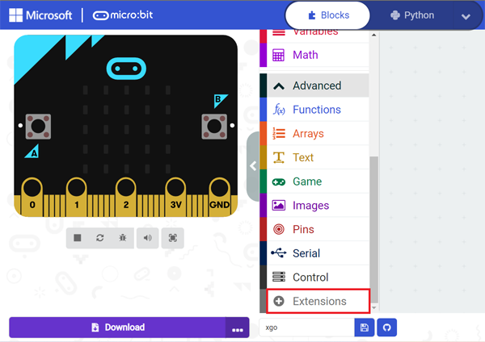
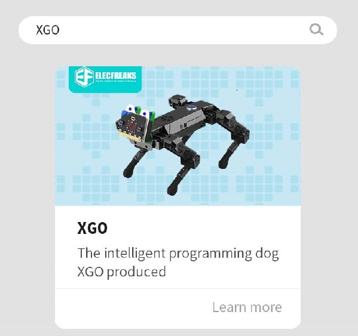
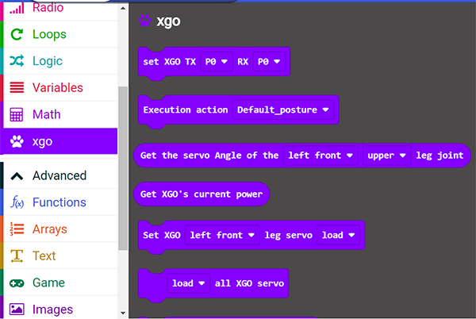
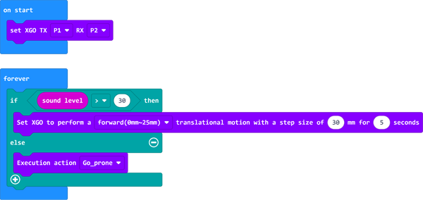

# Case 05 - A Touch-controlled Dog

## Purpose

Program to control the rotation of XGO through the touch logo on the micro:bit and the going backward and getting down through the sound level . 

## Materials Required

1 × micro:bit XGO Robot Kit 

*Note: A micro:bit V2.0 and above is required in this project*.

## Hardware Connections

Connect the micro:bit with the computer. 

## Software Platform

[Makecode](https://makecode.microbit.org/#)

## Program

Add the XGO extensions. 

## Program

#### Code

Link: [A Touch-controlled Dog](https://makecode.microbit.org/_hrj44ug5r42c)

You can also download it directly below:

<iframe style="position:absolute;top:0;left:0;width:100%;height:100%;" src="https://makecode.microbit.org/#pub:_hrj44ug5r42c" frameborder="0" sandbox="allow-popups allow-forms allow-scripts allow-same-origin"></iframe>
 

## FAQ

If XGO doesn't move, please try increasing the sound level. 

## Exploration

How to give more commands to XGO with different sound level ? 