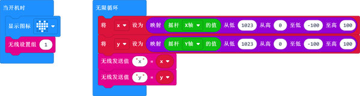
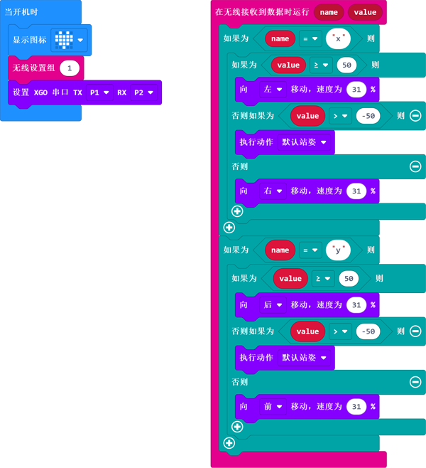

# Case 06 -Use Joystick:bit to Control the XGO

## Purpose

Control the XGO with the Joystick:bit, please visit [Joystick:bit]([14. Joystick:bit V2 — micro bit tutorial (elecfreaks.com)](https://www.elecfreaks.com/learn-en/microbitExtensionModule/joystick_bit_v2.html)) for more information. 

## Materials 

1 × micro:bit XGO Robot Kit 

1 × joystick:bit kit

## Hardware Connections

Connect the micro:bit with the computer through the USB cable. 

## Software Platform

[Makecode](https://makecode.microbit.org/#)

## Programming

Add the XGO extension:

## Code

#### Samples:

###### Program the Joystick:bit

###### Program XGO

Link: [Joystick program](https://makecode.microbit.org/_gPjJh9HEUYUm)

Or you can download it directly:

<iframe style="position:absolute;top:0;left:0;width:100%;height:100%;" src="https://makecode.microbit.org/#pub:_gPjJh9HEUYUm" frameborder="0" sandbox="allow-popups allow-forms allow-scripts allow-same-origin"></iframe>
 

Link: [XGO Program](https://makecode.microbit.org/_LhKY78KcAFHa)

Or you can download it directly:

<iframe style="position:absolute;top:0;left:0;width:100%;height:100%;" src="https://makecode.microbit.org/#pub:_LhKY78KcAFHa" frameborder="0" sandbox="allow-popups allow-forms allow-scripts allow-same-origin"></iframe>
 

## FAQ

If XGO doesn't walk, check the power status of the XGO and the Joystick:bit. 

## Exploration

Can we control the XGO with the C/D/E/F buttons on the Joysitck:bit? 