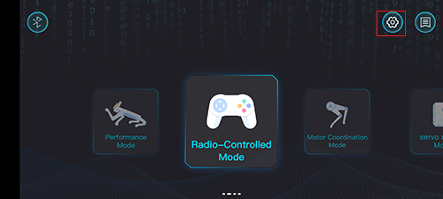
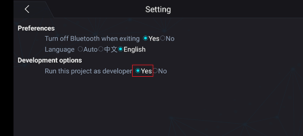
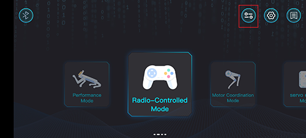
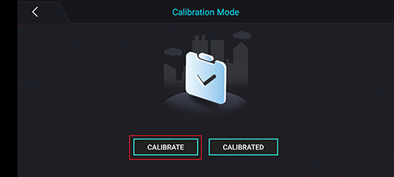
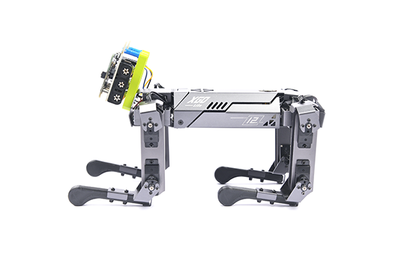
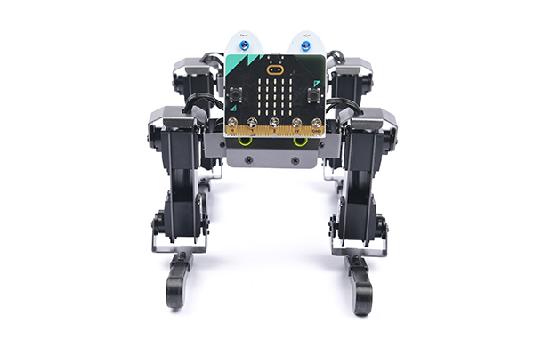
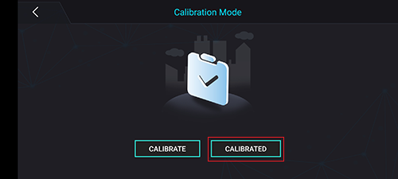
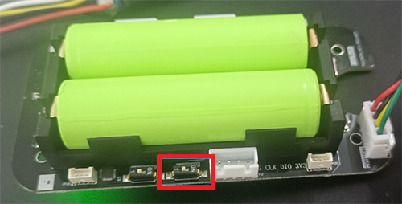

# Calibrate XGO with the Standards

Hello, you may find that XGO could deviate from the standard movements we have set. This is because the servos would be inaccurate after a long time of operation. Under such a circumstance, we need to calibrateit with the standards, now let's try with the following steps.

## Method A: Use XGO APP 
---
1. Open the software, connect it with XGO through the bluetooth, click the setting on the right upper side and select “run this project as a developer”. 

2. Select “Run this project as a developer”.

3. Go to the main interface, there would be a new button on there, click to go to the calibration page. 

4. Go to the calibration page, click “Calibrate“, and the servo stops working. 

Put the XGO as the picture shows, we recommend to put it on a plain paper to make the body be flush with the floor, and thighs at 90° angle to body, calves at 90° angle to thighs, calves to ground. 

The standard posture of XGO

Complete the calibration in APP, and XGO would be calibrated to its intial status. 

## Method B: Use the Driver Board to Calibrate
---
Remove the back cover with a hexagonal wrench, and then dial the calibration dial to the ON position. If it is already in the ON position, dial it back and then dial it to the ON position,the servo stops working.

Calibration Dial

Put the XGO as the picture shows, we recommend to put it on a plain paper to make the body be flush with the floor, and thighs at 90° angle to body, calves at 90° angle to thighs, calves to ground. 

The standard posture of XGO

Then dial the calibration dial back, and the calibration is completed in time, and the XGO returnS to the original position.
