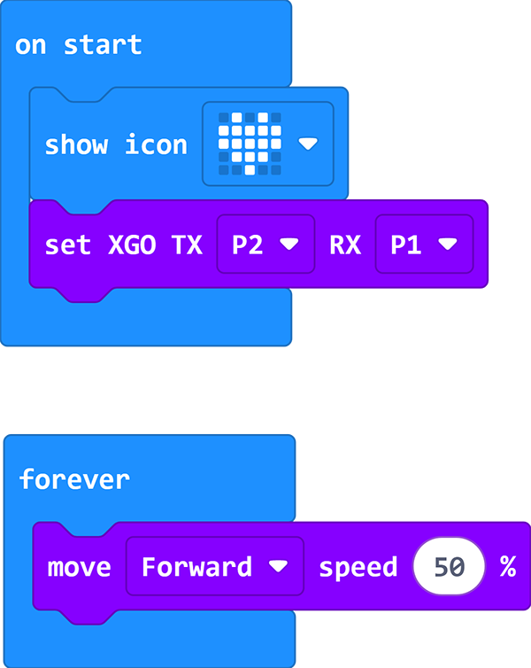

# Case 01 - Run in A Square Routine

## Purpose

Hello, in this class we are about to learn to program and control XGO, we will make XGO do more interesting things and make it our best friend. In this lesson, we programmed XGO to move forward quickly. Of course, if you want XGO to turn and adjust the code, let's start.

## Quick to Start

### Materials 

[micro:bit XGO Robot Kit ](https://www.elecfreaks.com/micro-bit-xgo-robot-kit.html) × 1

[micro:bit](https://www.elecfreaks.com/bbc-micro-bit-board-for-coding-programming-microbit.html) × 1

### Hardware Connections
---
Connect the micro:bit with the computer. Believe you are already very skilled.

## MakeCode programming
---
### Step 1

Click Advanced in MakeCode to see more options.

For programming, we need to add a package: click "Extensions" at the bottom of the MakeCode drawer, search for "XGO" in the dialog to download.

***Note:*** If you encounter a prompt that some codebases will be removed due to incompatibility, you can follow the prompt to continue or create a new project in the menu.

### Step 2

#### sample program

Link[Run in A Square Routine](https://makecode.microbit.org/_3WaJt82pkbqd)

You can also download it directly below:

<iframe style="position:absolute;top:0;left:0;width:100%;height:100%;" src="https://makecode.microbit.org/#pub:_D8Kc5E1z1Mya" frameborder="0" sandbox="allow-popups allow-forms allow-scripts allow-same-origin"></iframe>
 

## FAQ

If XGO doesn't run a perfect square, please try adjusting the time and speed. 

## Exploration

How to program it to run in circles?
