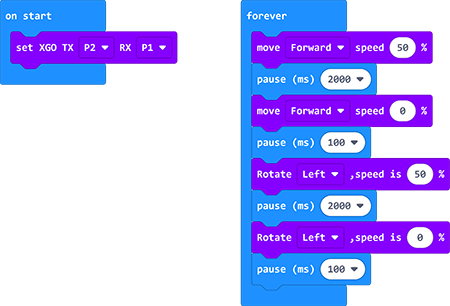

# Case 01 - Run in A Square Routine

## Purpose
---
Program to run it in a square routine. 

## Materials Required
---
1 × micro:bit XGO Robot Kit

## Hardware Connections
---
Connect the micro:bit with the computer. 

## Software Platform
---
[Makecode](https://makecode.microbit.org/#)

## Program
---

Add the XGO extensions. 

## Program
---
#### Code

Linkl [Run in A Square Routine](https://makecode.microbit.org/_CzaFWyEbeh6y)

You can also download it directly below:

<iframe style="position:absolute;top:0;left:0;width:100%;height:100%;" src="https://makecode.microbit.org/#pub:_CzaFWyEbeh6y" frameborder="0" sandbox="allow-popups allow-forms allow-scripts allow-same-origin"></iframe>
 

## FAQ
---
If XGO doesn't run a perfect square, please try adjusting the time and speed. 

## Exploration
---
How to program it to run in circles?
