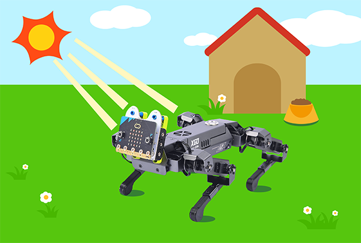
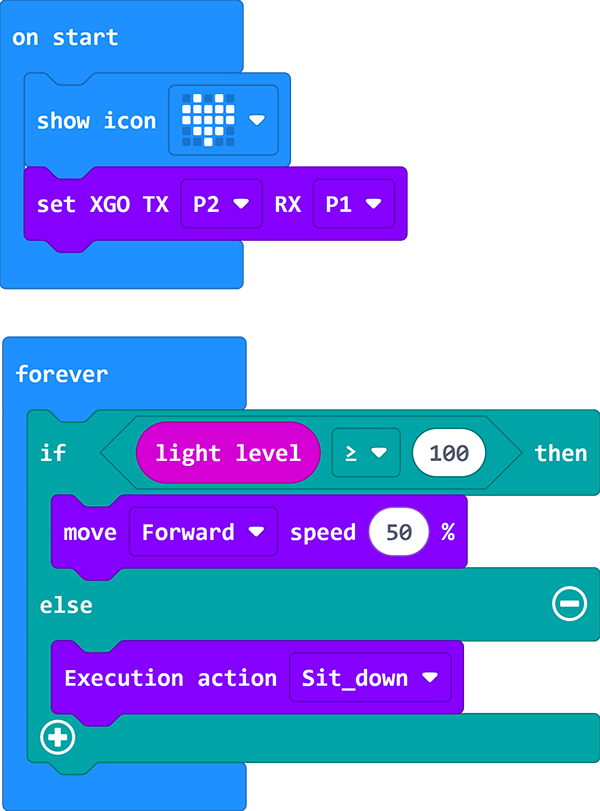

# Case 02 - A Light-controlled Dog

## Purpose 

Hello , after the last lesson, you must have learned to control XGO to make some actions. In this lesson, we will continue to use richer functions to do interesting things. In this class, we use the light sensor that comes with the micro: bit to let the XGO move forward or lie down according to the intensity of the light on the micro :bit.

## Quick to Start

### Materials 

[micro: bit XGO Robot Kit ](https://shop.elecfreaks.com/products/elecfreaks-micro-bit-xgo-robot-kit?_pos=1&_sid=c796ff3f3&_ss=r) × 1

[micro: bit](https://www.elecfreaks.com/bbc-micro-bit-board-for-coding-programming-microbit.html) × 1

### Working principle

1. The LEDs on the micro:bit motherboard can not only be used as output devices, but also as input devices. Light sensors measure the amount of light received by the device.
2. This means that the micro:bit program can react differently depending on the intensity of the light.
3. If the desired effect is not achieved, try lowering the numbers in the code to suit your brightness environment.

### Hardware Connections
---
We use a data cable (USB cable) to connect the computer with the micro:bit, I believe you are already very skilled.

## MakeCode programming
---
### Step 1

Click Advanced in MakeCode to see more options.

For programming, we need to add a package: click "Extensions" at the bottom of the MakeCode drawer, search for "XGO" in the dialog to download.

***Note:*** If you encounter a prompt that some codebases will be removed due to incompatibility, you can follow the prompt to continue or create a new project in the menu.

### Step 2

#### sample program

Link: [A Light-controlled Dog](https://makecode.microbit.org/_YVJe8eefmbqo)

You can also download it directly below:

<iframe style="position:absolute;top:0;left:0;width:100%;height:100%;" src="https://makecode.microbit.org/#pub:_Am1UcXJPoAr3" frameborder="0" sandbox="allow-popups allow-forms allow-scripts allow-same-origin"></iframe>
 

## FAQ

If XGO doesn't move, please try adjusting the light intensity. 

## Exploration

How to give more commands to XGO with light intensity? 
