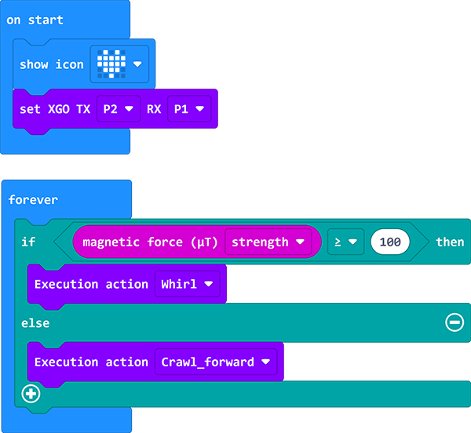

# Case 03 - A Magnetism-controlled Dog 

## Purpose

Hello, we let XGO exercise for a long time, it may also be "hungry", then we can let it find food by itself. In this lesson, we use the magnetic sensor that comes with the micro:bit to let XGO achieve the effect of crawling forward or spinning in place according to the magnetic strength.

## Quick to Start

### Materials 

[micro:bit XGO Robot Kit ](https://www.elecfreaks.com/micro-bit-xgo-robot-kit.html) × 1

[micro:bit](https://www.elecfreaks.com/bbc-micro-bit-board-for-coding-programming-microbit.html) × 1

### Working principle

1. The micro:bit has a built-in compass sensor called a magnetometer. Use it as a compass to measure the Earth's magnetic field, or to sense the magnetic field strength around you!
2. We programmed the XGO to act differently according to the strength of the surrounding magnetic field.
3. Please note that when using the compass sensor for the first time, it may be necessary to calibrate by playing a game with the screen fully lit

### Hardware Connections
---
We use a data cable (USB cable) to connect the computer with the micro:bit, I believe you are already very skilled.

## MakeCode programming
---
### Step 1

Click Advanced in MakeCode to see more options.

For programming, we need to add a package: click "Extensions" at the bottom of the MakeCode drawer, and search for "XGO" in the dialog to download.

***Note:*** If you encounter a prompt that some codebases will be removed due to incompatibility, you can follow the prompt to continue or create a new project in the menu.

### Step 2

#### sample program

Link: [A Light-controlled Dog](https://makecode.microbit.org/_YVJe8eefmbqo)

You can also download it directly below:

<iframe style="position:absolute;top:0;left:0;width:100%;height:100%;" src="https://makecode.microbit.org/#pub:_HEJdK6P8MY3X" frameborder="0" sandbox="allow-popups allow-forms allow-scripts allow-same-origin"></iframe>
 

## FAQ

If XGO doesn't move, please try adjusting the light intensity. 

## Exploration

How to give more commands to XGO with light intensity? 
