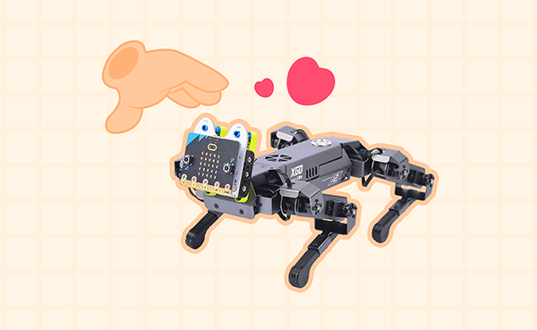
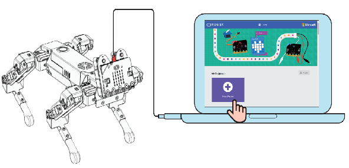
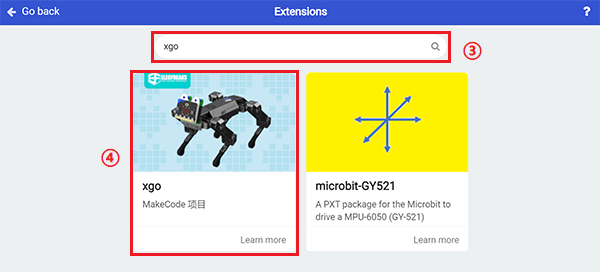
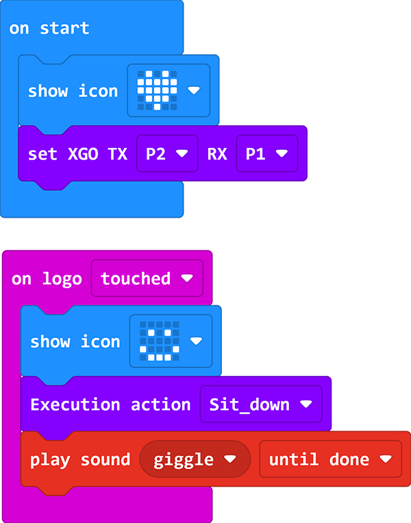

# Case 05 - A Touch-controlled Dog

## Purpose

Hi guys, after getting along with XGO for a period of time, I think your "feeling" with XGO is already very deep. Whenever we meet with XGO, we will stroke XGO, just like petting a real puppy, then In this lesson, we can realize that when we stroke XGO, XGO behaves like a real puppy, so let's start.

## Quick to Start

### Materials Required

[micro:bit XGO Robot Kit ](https://www.elecfreaks.com/micro-bit-xgo-robot-kit.html) × 1

[micro:bit](https://www.elecfreaks.com/bbc-micro-bit-board-for-coding-programming-microbit.html) × 1

### Working principle

1. The micro:bit has a built-in microphone sensor. It can detect the volume of the surrounding sound, so as to make different reactions according to different volumes!
2. The program we programmed is that XGO makes different actions according to the level of the surrounding sound.

### Hardware Connections
---
We use a data cable (USB cable) to connect the computer with the micro:bit, I believe you are already very skilled.

## MakeCode programming
---
### Step 1

Click Advanced in MakeCode to see more options.

For programming, we need to add a package: click "Extensions" at the bottom of the MakeCode drawer, and search for "XGO" in the dialog to download.

***Note:*** If you encounter a prompt that some codebases will be removed due to incompatibility, you can follow the prompt to continue or create a new project in the menu.

### Step 2

#### sample program

Link: [A Touch-controlled Dog](https://makecode.microbit.org/_DPCdXybUs7me)

You can also download it directly below:

<iframe style="position:absolute;top:0;left:0;width:100%;height:100%;" src="https://makecode.microbit.org/#pub:_2HAHWuHUg5hg" frameborder="0" sandbox="allow-popups allow-forms allow-scripts allow-same-origin"></iframe>
 

## FAQ

If XGO doesn't move, please try increasing the sound level. 

## Exploration

How to give more commands to XGO with different sound level ? 
