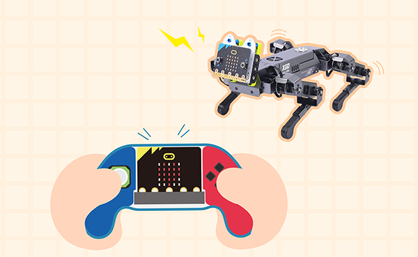
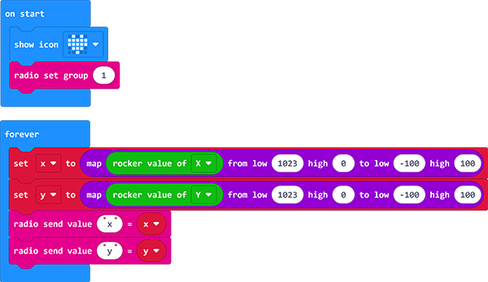
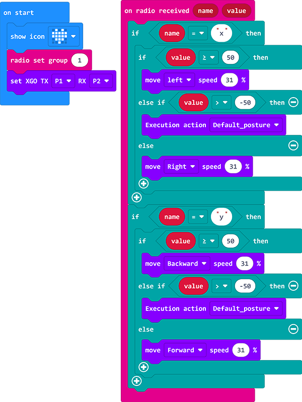

# Case 06 -Use Joystick:bit to Control the XGO

## Purpose

Hello, in the first few lessons, we basically programmed the program first and then controlled the XGO movement, so we cannot control the XGO in real time. Then, in this lesson, we will realize the real-time control of the XGO through the remote control. Therefore, in this lesson, we will Implement [Joystick:bit](https://www.elecfreaks.com/learn-en/microbitExtensionModule/joystick_bit_v2.html) to control XGO to make actions. For related documents of joystick:bit, please refer to: [Joystick:bit](https://www.elecfreaks.com/learn-en/microbitExtensionModule/joystick_bit_v2.html).

## Materials 

1 × [micro:bit XGO Robot Kit](https://www.elecfreaks.com/micro-bit-xgo-robot-kit.html)

1 × [Joystick:bit](https://www.elecfreaks.com/learn-en/microbitExtensionModule/joystick_bit_v2.html)

## Working principle

We use a data cable (USB cable) to connect the computer with the micro:bit

## Software Platform

[Makecode](https://makecode.microbit.org/#)

## MakeCode programming

---

### Step 1

Click Advanced in MakeCode to see more options.

For programming, we need to add a package: click "Extensions" at the bottom of the MakeCode drawer, and search for "XGO" in the dialog to download.

***Note:*** If you encounter a prompt that some codebases will be removed due to incompatibility, you can follow the prompt to continue or create a new project in the menu.

## Code

#### samples:

###### Program the Joystick:bit

###### Program XGO

Link: [Joystick program](https://makecode.microbit.org/_gPjJh9HEUYUm)

Or you can download it directly:

<iframe style="position:absolute;top:0;left:0;width:100%;height:100%;" src="https://makecode.microbit.org/#pub:_gPjJh9HEUYUm" frameborder="0" sandbox="allow-popups allow-forms allow-scripts allow-same-origin"></iframe>
 

Link: [XGO Program](https://makecode.microbit.org/_LhKY78KcAFHa)

Or you can download it directly:

<iframe style="position:absolute;top:0;left:0;width:100%;height:100%;" src="https://makecode.microbit.org/#pub:_LhKY78KcAFHa" frameborder="0" sandbox="allow-popups allow-forms allow-scripts allow-same-origin"></iframe>
 

## FAQ

If XGO doesn't walk, check the power status of the XGO and the Joystick:bit. 

## Exploration

Can we control the XGO with the C/D/E/F buttons on the Joysitck:bit? 
