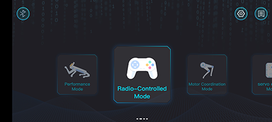
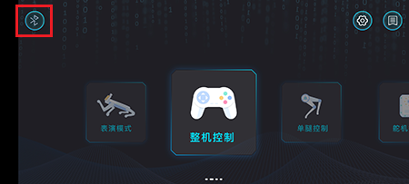
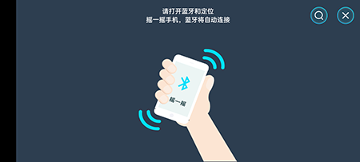
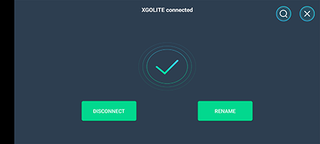
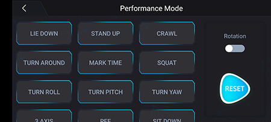
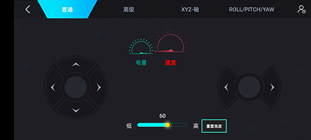
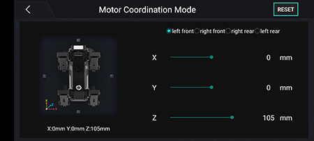
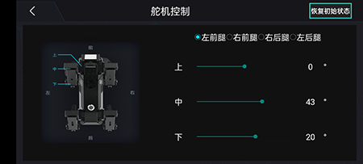

# Case 07: Remote Control XGO with the APP

## Purpose
Remote control the XGO with the app. 

## Materials 
1 × micro:bit XGO Robot Kit 

1 × Smart Phone

## Hardware Connection
### Download XGO APP
For Android users, search with "XGO" in Google Play; for IOS users, search with "XGO" in the IOS APP Store, after downloading, open it and you will see the interface below: 

### Connect XGO
Click the bluetooth icon on the left up side on the app interface(see picture 1), then you will see the interface as picture 2. 

Following the tips, shake your phone and the bluetooth will connect automatically(Notice: Turn on the XGO, the bluetooth and location of the phone beforehand, if it fails to connect, please check your settings of the phone to see if you have authorised to use such functions). 

## Control
There are four ways to control the XGO which include the **performance mode**, the **overall mode**, the **single-leg control** and the **servo control**. 

The  **performance mode** has all the preset commands which could control xgo with a low DOFs and a high operability. 

The **overall mode** is able to control the speed and directions with a high DOFs and senstive operation. 

Both the **single-leg control** and the **servo control** are able to control small granularity, they are able to control a single leg(the left front leg, the right front leg, the right hind leg and the left hind leg) and the top, middle and bottom servos. And they are also for a tiny adjustment for some spcial actions. 

## Project
This project uses XGO App in the  **overall mode** to make the XGO go forward/backward/right/left, you can see the reference video here. 

