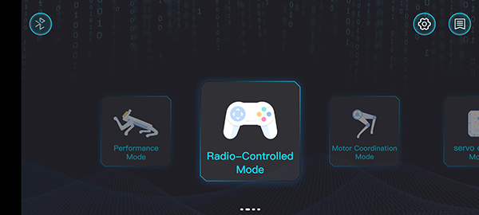

# Case 07: Remote Control XGO with the APP

## Purpose

Hello, in this class we are about to learn to program and control XGO, we will make XGO do more interesting things and make it our best friend. In this lesson, we programmed XGO to move forward quickly. Of course, if you want XGO to turn and adjust the code, let's start.

## Materials 
1 × [micro:bit XGO Robot Kit](https://www.elecfreaks.com/micro-bit-xgo-robot-kit.html)

1 ×  Smart Phone

## Hardware Connection
### Download XGO APP

For Android users, search with "XGO" in Google Play; for IOS users, search with "XGO" in the IOS APP Store, after downloading, open it and you will see the interface below: 

### Connect XGO

Click the bluetooth icon on the left up side on the app interface(see picture 1), then you will see the interface as picture 2. 

Following the tips, shake your phone and the bluetooth will connect automatically(Notice: Turn on the XGO, the bluetooth and location of the phone beforehand, if it fails to connect, please check your settings of the phone to see if you have authorised to use such functions). 

## Control
There are four ways to control the XGO which include the **performance mode**, the **overall mode**, the **single-leg control** and the **servo control**. 

The  **performance mode** has all the preset commands which could control xgo with a low DOFs and a high operability. 

The **overall mode** is able to control the speed and directions with a high DOFs and senstive operation. 

**Single-leg control** and **servo control** can be controlled with a much smaller granularity for a single leg (left front leg, right front leg, right rear leg, left rear leg), and adjustment of the upper and lower rudder for a single leg. Commonly used for minor adjustments to specific movements.

## Project
This project uses XGO App in the  **overall mode** to make the XGO go forward/backward/right/left, you can see the reference video here. 

