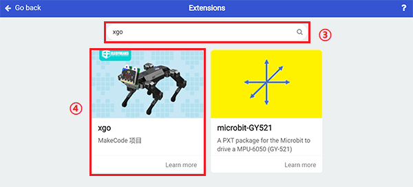

# Case 08: The "Trembling" XGO

## Introduction
Hi guys, you might know how to operate XGO already from the previous lessons. In this project, we will try programming XGO to give us the responses as a "real" pet dog, the dog would tremble if they feel cold, let's try making a "trembling" XGO! 

## Quick to Start

### Materials 

[micro:bit XGO Robot Kit ](https://shop.elecfreaks.com/products/elecfreaks-micro-bit-xgo-robot-kit?_pos=1&_sid=c796ff3f3&_ss=r) × 1

### Working principle
---
We use a data cable (USB cable) to connect the computer with the micro:bit, I believe you are already very skilled.

## MakeCode Programming
---
### Step 1

Click "Advanced" in the MakeCode to see more choices.

For programming, we need to add a package: click "Extensions" at the bottom of the MakeCode drawer, search for "XGO" in the dialog to download.

***Note:*** If you encounter a prompt that some codebases will be removed due to incompatibility, you can follow the prompt to continue or create a new project in the menu.

### Step 2

#### sample program

Link: [A Light-controlled Dog](https://makecode.microbit.org/_YVJe8eefmbqo)

You can also download it directly below:

<iframe style="position:absolute;top:0;left:0;width:100%;height:100%;" src="https://makecode.microbit.org/#pub:_9VyAsTMjsLH9" frameborder="0" sandbox="allow-popups allow-forms allow-scripts allow-same-origin"></iframe>
 

***Note：***The setting of the temperature value in the program depends on the current ambient temperature you are in. If there is no heating device, you can consider placing your palm on the micro:bit. After a minute or two, the micro:bit will The temperature will increase by 1-2 degrees.

### Projects Display

<iframe width="560" height="315" src="https://www.youtube.com/embed/GNkwoeDlZg4" title="YouTube video player" frameborder="0" allow="accelerometer; autoplay; clipboard-write; encrypted-media; gyroscope; picture-in-picture" allowfullscreen></iframe>

### FAQ

### Exploration

How to program to make the XGO walk away after lying down for a while? 
