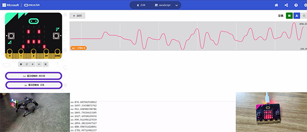
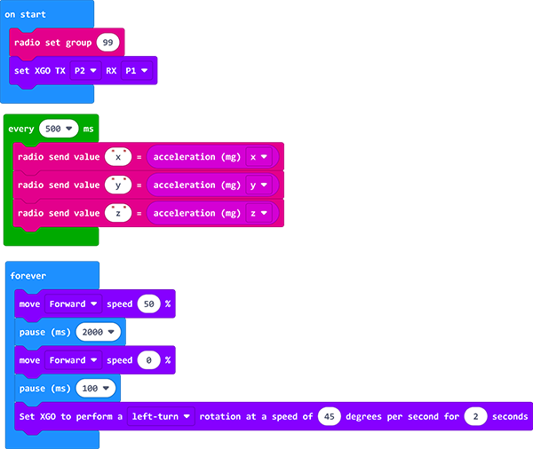
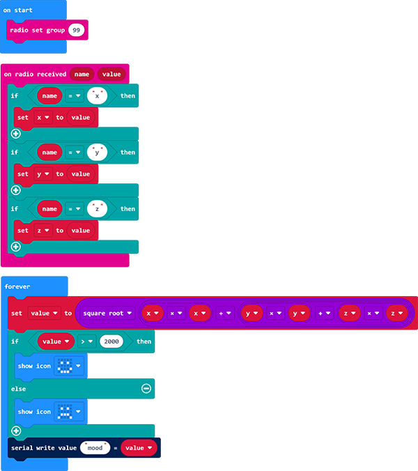

# Case 09: "Sense" the Feelings of XGO

## Introduction

Hi guys, while we play with a pet dog, it's possible for us to know if it is happy or sad, would it be possible to know the feelings of XGO? Let's see how could it be possible through this project and you can do more with your imaginaton! 

## Quick to Start
---
### Materials Required

[micro:bit XGO Robot Kit ](https://www.elecfreaks.com/micro-bit-xgo-robot-kit.html) × 1

[micro:bit](https://www.elecfreaks.com/bbc-micro-bit-board-for-coding-programming-microbit.html) × 1

### Working Principle

1. We will use the **accelerometer** on the micro:bit, an accelerometer sensor is a motion sensor that measures movement. Program to make the micro:bit on the XGO get constant readings of the force in 3 dimensions of the accelerometer (x, y and z axis) and send them over the radio.
2. Connect another micro:bit to the computer and program to receive the data from the radio. The micro:bit connected to the PC accepts the data sent by the micro:bit on the XGO and sends the data as serial data to your PC.
3. You should now see a "Show Console Device" button below the micro:bit emulator, click on it and you should see a graphical representation of the live data readings on the screen. 

4. Set different speeds and directions for the XGO and watch how the readings change on each axis. Press pause to download the numerical data as a CSV (comma separated value) file, you can then open in a spreadsheet for analysis. If you delete the second and third time columns and keep only the first time column, the data can be plotted on a spreadsheet scatter plot to show the change in force over time.

### Hardware Connections

We use a data cable (USB cable) to connect the computer with the micro:bit, I believe you are already very skilled.

## MakeCode programming
---
### Step 1

Click Advanced in MakeCode to see more options.

For programming, we need to add a package: click "Extensions" at the bottom of the MakeCode drawer, search for "XGO" in the dialog to download.

***Note:*** If you encounter a prompt that some codebases will be removed due to incompatibility, you can follow the prompt to continue or create a new project in the menu.

### Step 2

#### Sample code-The sender end 

Link: [The happy XGO](https://makecode.microbit.org/_JeRJmU3dj44r)

You may also download it directly below:

<iframe style="position:absolute;top:0;left:0;width:100%;height:100%;" src="https://makecode.microbit.org/#pub:_hf6ThW00tY5Y" frameborder="0" sandbox="allow-popups allow-forms allow-scripts allow-same-origin"></iframe>
 

#### Sample code-The recevier end

Link: [The program of the controller](https://makecode.microbit.org/_HFcRzH04KFv3)

You may also download it directly below:

<iframe style="position:absolute;top:0;left:0;width:100%;height:100%;" src="https://makecode.microbit.org/#pub:_73J1HtVK781c" frameborder="0" sandbox="allow-popups allow-forms allow-scripts allow-same-origin"></iframe>
 

**Notice**：The "value" value represents the value of the three-dimensional acceleration vector modulus of XGO, and you don't need to go into it. This value expresses the speed of XGO running in a certain direction.

### Projects Display
---
<iframe width="560" height="315" src="https://www.youtube.com/embed/mjwsvOtxut4" title="YouTube video player" frameborder="0" allow="accelerometer; autoplay; clipboard-write; encrypted-media; gyroscope; picture-in-picture" allowfullscreen></iframe>

### FAQ

### Exploration
---
How to get more "feelings" responses from XGO by setting the parameter of the speed and postures? 
