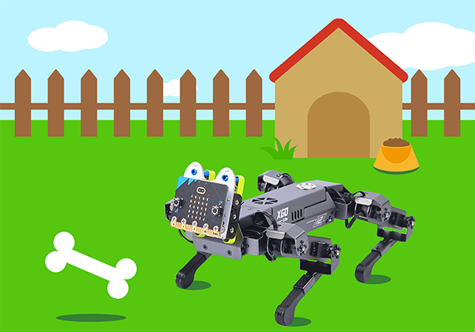
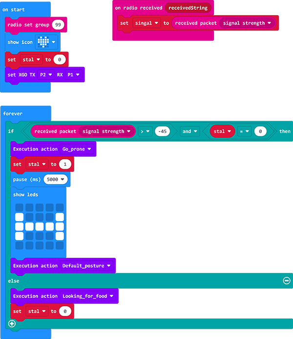
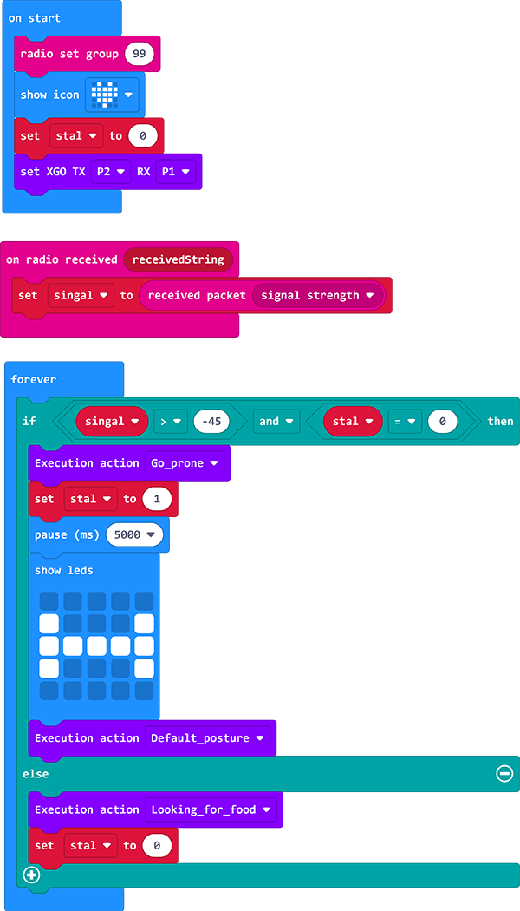

# Case 10: The XGO Eatting Bones

## Introduction

Hi guys, we know that dogs like bones very much, how can we program to achive a similar situation? We've put this idea into practice in this project, and you can do more projects with your ideas. 

## Quick to Start
---
### Materials Required

[micro:bit XGO Robot Kit ](https://www.elecfreaks.com/micro-bit-xgo-robot-kit.html) × 1

[micro:bit](https://www.elecfreaks.com/micro-bit/board.html) × 1

### Working Principle

1. Two micro:bits are required in this project, we will create to programs with one for radio transmitter and another for receiving the signal. 
2. The closer the receiving end is to the transmitter end, the stronger the radio signal will be, if the signal is strong, it means that another micro:bit may be very close.
   If the radio signal is weak, the other micro:bit is probably far away.

### Hardware Connections
---
Connect the micro:bit with the computer through the USB cable. 

## MakeCode  Programming
---
### Step 1

Click ” Advanced“ in the MakeCode drawer to see more choices. 

We need to add a package for programming. Click "Extensions" in the bottom of the drawer and search with "XGO" in the dialogue box to download it.  

***Note:***  If you met a tip indicating that some codebases would be deleted due to incompatibility, you may continue as the tips say or create a new project in the menu. 

### Step 2

#### Sample Code

##### XGO Code

Link: [xgo](https://makecode.microbit.org/_Lhrhbp7dDb1M)

You may download it directly below: 

<iframe style="position:absolute;top:0;left:0;width:100%;height:100%;" src="https://makecode.microbit.org/#pub:_Lhrhbp7dDb1M" frameborder="0" sandbox="allow-popups allow-forms allow-scripts allow-same-origin"></iframe>
 

##### “ Bones“ Code

Link: [Bones](https://makecode.microbit.org/_dLc2HV21M64H)

You may download it directly below: 

<iframe style="position:absolute;top:0;left:0;width:100%;height:100%;" src="https://makecode.microbit.org/#pub:_dLc2HV21M64H" frameborder="0" sandbox="allow-popups allow-forms allow-scripts allow-same-origin"></iframe>
 

### Projects Display

<iframe width="560" height="315" src="https://www.youtube.com/embed/BBky7V8xY_c" title="YouTube video player" frameborder="0" allow="accelerometer; autoplay; clipboard-write; encrypted-media; gyroscope; picture-in-picture" allowfullscreen></iframe>

### Relevant Files

### Exploration
