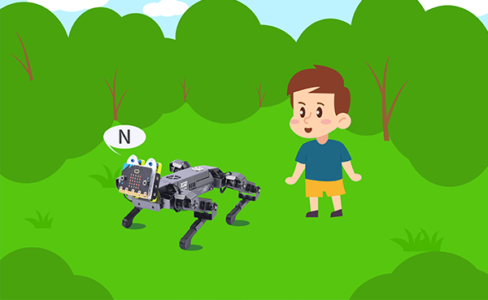
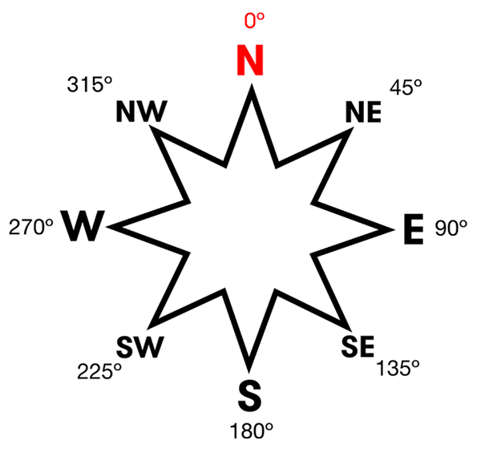
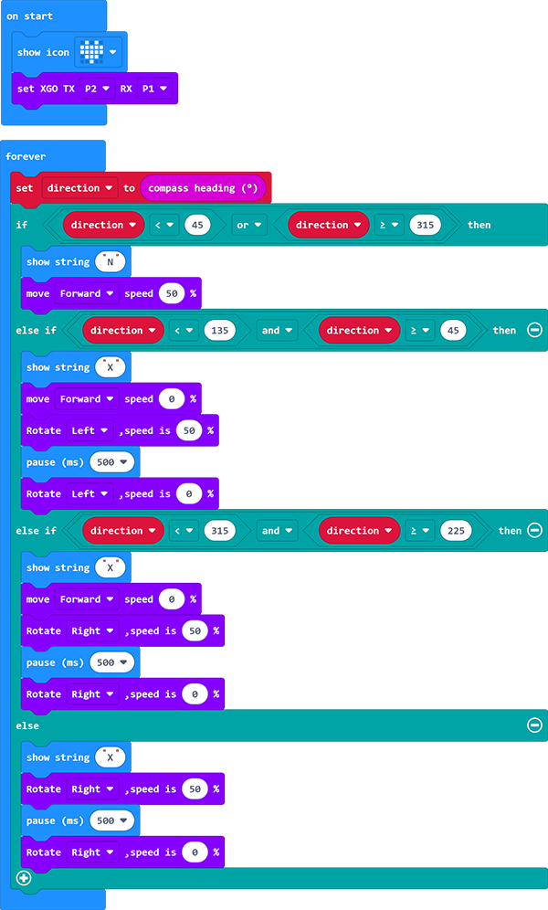

# Case 11-The Never Lost Directions XGO

## Introduction
Hi guys, when we get lost in some unfamiliar places, the XGO can guide us with the correct routine if you've learnt this project, let's see how it works in this project! 

## Quick to Start

---

### Materials Required

[micro:bit XGO Robot Kit ](https://shop.elecfreaks.com/products/elecfreaks-micro-bit-xgo-robot-kit?_pos=1&_sid=c796ff3f3&_ss=r) × 1

### Working Principle

1. The micro:bit has a compass sensor which is used to measure magnetic fields. It senses the earth's magnetic field, and you can use it as a compass. 
2. When using the micro:bit compass for the first time, it must be calibrated. A small game will appear on the screen where you have to tilt the micro:bit to light up each LED and it will be ready to use.

### Hardware Connections

---

Connect the micro:bit with the computer through the USB cable. I believe you are already very skilled.

## MakeCode  Programming

---

### Step 1

Click ” Advanced“ in the MakeCode drawer to see more choices.

We need to add a package for programming. Click "Extensions" in the bottom of the drawer and search with "XGO" in the dialogue box to download it.  

Note: If you met a tip indicating that some codebases would be deleted due to incompatibility, you may continue as the tips say or create a new project in the menu. 

### Step 2

The directions diagram 

#### Sample Code

Link: [The XGO Guide](https://makecode.microbit.org/_YYDh669TLXfp)

You may download it directly below: 

<iframe style="position:absolute;top:0;left:0;width:100%;height:100%;" src="https://makecode.microbit.org/#pub:_YYDh669TLXfp" frameborder="0" sandbox="allow-popups allow-forms allow-scripts allow-same-origin"></iframe>
 

### Projects Display

<iframe width="560" height="315" src="https://www.youtube.com/embed/5N7HXAw3j44" title="YouTube video player" frameborder="0" allow="accelerometer; autoplay; clipboard-write; encrypted-media; gyroscope; picture-in-picture" allowfullscreen></iframe>

### Relevant Questions

If the XGO does not travel in the correct north direction, recalibrate the magnetometer or calibrate the XGO

### Exploration

Is it possible to make the XGO wait us in a place when the XGO has gone too far?