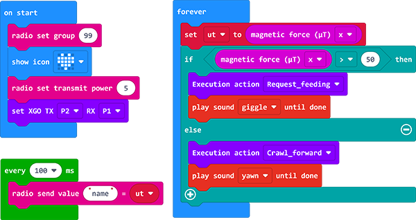
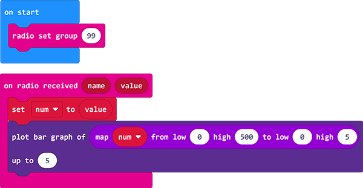

# Case 12-The precise treasure hunting XGO

## Introduction
---

Hi guys，We all know that dogs have a very sensitive sense of smell. If we let dogs help us find things when we lose things, can we let XGO help us find treasures? This article is our idea of implementing, and welcomes the elves to have better methods.

## Quick to Start
---

### Materials Required

[micro:bit XGO Robot Kit ](https://www.elecfreaks.com/micro-bit-xgo-robot-kit.html) × 1

magnet × 1

### Working Principle

1. The micro:bit has a compass sensor called a magnetometer that measures the magnetic field. It senses the Earth's magnetic field, so you can use it as a compass.
2. When using the micro:bit compass for the first time, it must be calibrated. A little game will appear on the screen, and you have to tilt the micro:bit to light up each LED, and it's ready to use.

### Hardware Connections
---

Connect the micro:bit with the computer through the USB cable. I believe you are already very skilled.

## MakeCode  Programming
---
### Step 1

Click ” Advanced“ in the MakeCode drawer to see more choices.

We need to add a package for programming. Click "Extensions" in the bottom of the drawer and search with "XGO" in the dialogue box to download it.  

Note: If you met a tip indicating that some codebases would be deleted due to incompatibility, you may continue as the tips say or create a new project in the menu. 

### Step 2

#### sample program

##### Treasure Hunt XGO Program 

Link：[Treasure Hunt XGO Program](https://makecode.microbit.org/_HHPLrvRbvWFM)

You may download it directly below: 

<iframe style="position:absolute;top:0;left:0;width:100%;height:100%;" src="https://makecode.microbit.org/#pub:_HHPLrvRbvWFM" frameborder="0" sandbox="allow-popups allow-forms allow-scripts allow-same-origin"></iframe>
 

##### monitor program

Link：[monitor program](https://makecode.microbit.org/_Y2b7w5iYTEz2)

You may download it directly below: 

<iframe style="position:absolute;top:0;left:0;width:100%;height:100%;" src="https://makecode.microbit.org/#pub:_Y2b7w5iYTEz2" frameborder="0" sandbox="allow-popups allow-forms allow-scripts allow-same-origin"></iframe>
 

### Projects Display

<iframe width="560" height="315" src="https://www.youtube.com/embed/5N7HXAw3j44" title="YouTube video player" frameborder="0" allow="accelerometer; autoplay; clipboard-write; encrypted-media; gyroscope; picture-in-picture" allowfullscreen></iframe>

### Relevant Questions

Because the magnetic strength of different magnets is different, the magnetic data size used by the program in this lesson is only for reference, and the data should be adjusted appropriately according to the magnet you get.

### Exploration

What if there are two magnets that affect the induction of the XGO?