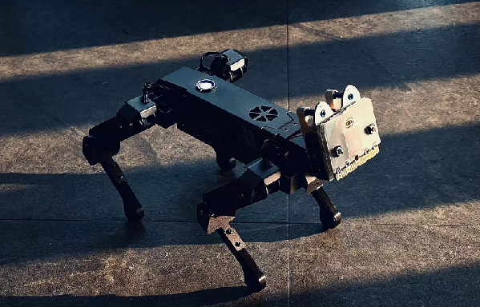
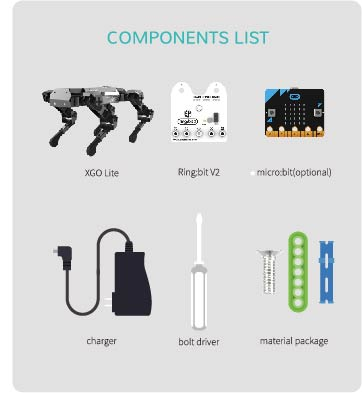

# micro:bit XGO Robot Kit Introduction

## Preface

This page gives the guidance information and learning references regarding XGO. 

The contents shall be updated in accordance with the possible updates of the products in the future, feel free to get us in touch through services@elecfreaks.com with any of your ideas. 

## Introduction

micro:bit XGO robot is an AI dog robot with 12 DOFs designed for the artificial intelligence education for teenagers. It supports omni-movement and is able to perform as a real pet dog. Students are able to get a good understanding of AI technology from the learning of the mechanism, the electronic knowledge, programming and the AI while playing it. 

## Picture(s)

## Characteristics

- In desktop size, XGO is as small as a book, kids can enjoy it even on the desk.
- All-metal Shell: All-aluminium alloy shell, the surface is covered with anodized coating with a comfort feeling.
- 12DOFs: Each foot has three servos, the high quality digital servos totally in 12 units allow a flexible and smooth movement.
- Build-in Actions: The build-in actions are 19+ kinds such as to get down, shake hands, pee and look for food, it is easy to operate via APP or program.
- micro:bit Program: It supports MakeCode and Python, Arduino and Raspberry Pi are also applicable to make secondary development.

## Parameters

| Name                  | micro:bit XGO Robot Kit                 |
| :-------------------- | :-------------------------------------- |
| Battery               | Build-in 7.4V 1500mAh lithium batteries |
| Input of the Charger  | 100-240V 50~60Hz                        |
| Output of the Charger | 8.4V 1A                                 |
| Battery Life          | 120min                                  |
| Materials of the Body | Aluminium alloy                         |
| Master Control IC     | STM32/ESP32                             |
| Program Methods       | STM32/ESP32                             |
| APP Control           | Makecode、Python                        |
| 2.4G Remote Control   | Support                                 |
| Dimensions(L/*W/*H)   | Support                                 |
| NW                    | 500g                                    |

## Packing List

## Preparation

### Start the XGO

Put the XGO in the prone position in case of any stuck problems happening on the joints, press the button on the back of the XGO, the ring light on the swtich will be turned on, and XGO stands up gradually. 

### Turn Off the XGO

Press the button on the back of the XGO, the ring lights starts flashing and the XGO gets down gradually. 

### Charging

When the battery runs out of the power, the ring light woud flash and the XGO gets down, it indicates that the battery needs to be charged. Connect the equipped charger on the bottom of XGO and it should be fully charged in 2 hours around, while charging, the power indicator lights on in red, and it lights on in green after fully charging. 

## FAQ

## Relevant File

About more info for micro:bit, please visit: https://www.microbit.org/

About more info for Ring:bit V2, please visit the [guide](https://www.elecfreaks.com/learn-en/microbitKit/ring_bit_v2/ring_bit_v2.html#expansion-board-of-ring-bit-car-2) and for more info on the extensions, please visit the [file](https://www.elecfreaks.com/learn-en/microbitKit/ring_bit_v2/ring_bit_car_v2_extensions.html)

