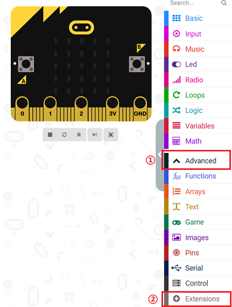
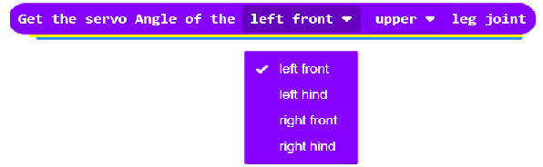

# Assemble the hardware

## Step 1

- Attach the micro:bit to the Ring:bit expansion board using the short flat head screws.

## Step 2

- Use the longer flat head screws to fasten the seven-hole beam to the corresponding screw holes on the XGO.

## Step 3

- Mount the Ring:bit expansion board with the micro:bit installed on the seven-hole beam using the long pins.

## Step 4

-  Connect the DuPont cable reserved by XGO to the corresponding port of the Ring:bit, among which the black DuPont cable is connected to the G port, and the yellow DuPont cable and the blue DuPont cable are connected to the No. 1 and No. 2 ports. Select the appropriate port number.

## Step 5

- Connect your computer to the micro:bit with a USB cable：

### Start Program

The programming of XGO is done on the [Makecode](https://makecode.microbit.org/#) platform; the Makecode platform can use graphical programming, as well as python code programming and JavaScript code programming;

## Add XGO extension library

### The steps are as follows:

- Create a new program, name the program name and click the Advanced button in the building block library, as follows:

## Programming Guide

Initialize XGO

Set XGO actions, a total of 12 actions, you can choose one action;

Get the servo angle of XGO's limb joints and get the current power of XGO;

Set XGO single leg servo loading and all leg servos to debug mode;

Turn on or off the performance mode of XGO;

Turn on or off the XGO's gyroscope;

Stop the XGO cycle reciprocating around the X, Y, Z axes;

Set the time and degree of XGO reciprocating rotation around X, Y, Z axes;

Set the time for XGO to pan or stop and move in the X, Y, Z directions;

Set the distance and time of the XGO leg raise;

Set the direction, speed and time of XGO's rotational motion;

Set the toe direction of the XGO quadruped;

Set the servo rotation of the XGO quadruped joint and set the servo speed or step frequency;

Set the XGO movement or rotation and the corresponding speed;

set XGO body height;

### Simple example

Link：[XGO](https://makecode.microbit.org/_Rs2MPv5uebYd)

At the same time, you can directly download the program below;

<iframe style="position:absolute;top:0;left:0;width:100%;height:100%;" src="https://makecode.microbit.org/#pub:_Rs2MPv5uebYd" frameborder="0" sandbox="allow-popups allow-forms allow-scripts allow-same-origin"></iframe>
 

##  FAQ

*Note: If you want to run the numbered code program, you need to turn on the switch of Ring:bit, and also pay attention to whether the power of XGO is sufficient*

## Related Documentation

