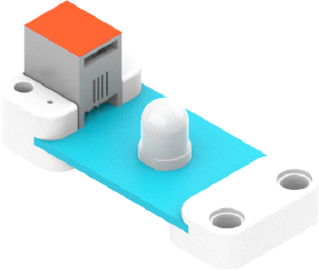
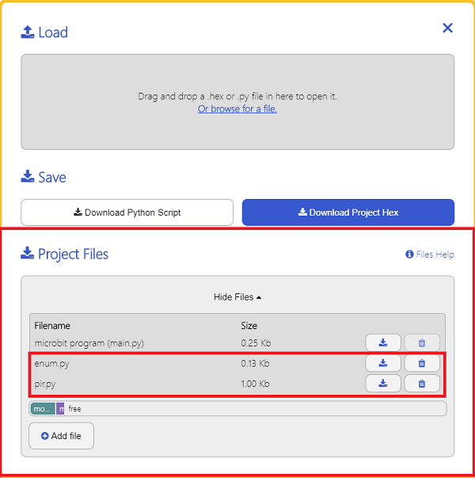

# PIR Sensor

## Introduction
PIR Sensor is a type of electronic building block based on AM412 pyroelectric digital smart sensor. It can be used in sensing and detection of human or animal motion, sensing distance is about 4-5 meters.



## Characteristic
---
- Designed in RJ11 connections, easy to plug. 
## Specification
---

Item | Parameter 
:-: | :-: 
SKU|EF05002
Connection|RJ11
Type of Connection|Digital Output
Working Voltage|3.3V
Size|55.8 x 23.8 mm


## Outlook
---


## Quick to Start
---

### Materials Required and Diagram
---

- Connect the PIR sensor to J1 port and the LED  to J2 port in the Nezha expansion board as the picture shows. 


## MakeCode Programming
---

### Step 1
Click "Advanced" in the MakeCode drawer to see more choices. 


We need to add a package for programming, . Click "Extensions" in the bottom of the drawer and search with "PlanetX" in the dialogue box to download it. 


Note: If you met a tip indicating that the codebase will be deleted due to incompatibility, you may continue as the tips say or build a new project in the menu. 
### Step 2

### Code as below:


### Link
Link: [https://makecode.microbit.org/_ea4TopJXiHRb](https://makecode.microbit.org/_ea4TopJXiHRb)

You may also download it directly below: 

<div style="position:relative;height:0;padding-bottom:70%;overflow:hidden;"><iframe style="position:absolute;top:0;left:0;width:100%;height:100%;" src="https://makecode.microbit.org/#pub:_ea4TopJXiHRb" frameborder="0" sandbox="allow-popups allow-forms allow-scripts allow-same-origin"></iframe></div>  
---

### Result
- The LED lights on while the motion being detected by the PIR sensor or the LED lights off. 
## Python Programming 
---


### Step 1
Download the package and unzip it: [PlanetX_MicroPython](https://github.com/lionyhw/PlanetX_MicroPython/archive/master.zip)

Go to  [Python editor](https://python.microbit.org/v/2.0)


We need to add enum.py and pir.py for programming. Click "Load/Save" and then click "Show Files (1)" to see more choices, click "Add file" to add enum.py and pir.py from the unzipped package of PlanetX_MicroPython. 




### Step 2

### Reference

```

from microbit import *
from enum import *
from pir import *

while True:
    pir = PIR(J1)
    pir_value = pir.PIR_is_decection()
    if(pir_value == True):
        display.show(Image.HAPPY)
    else:
        display.show(Image.SAD)
        
```


### Result
- A smile face displays on the micro:bit while the motion being detected by the PIR sensor or the micro:bit displays a sad face.
## Relevant File

---

## Technique File

---
