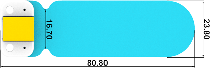
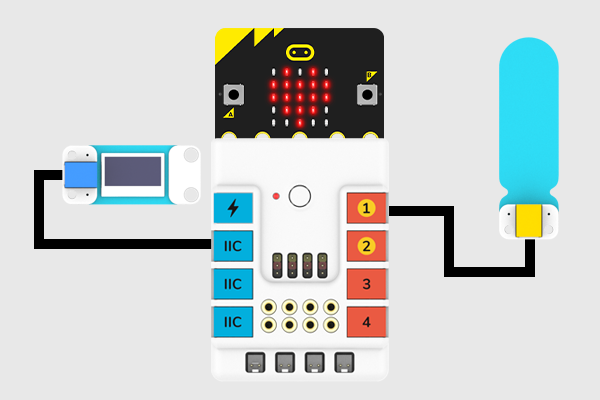
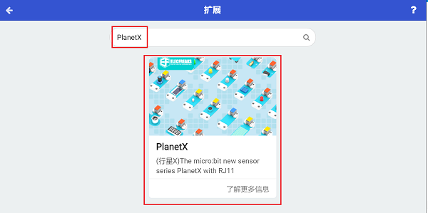

# Soil Moisture Sensor

## Introduction
Soil Moisture Sensor aims to detect the amount of the moisture in its surrounding soil.


## Characteristic
---
- Designed in RJ11 connections, easy to plug.
## Specification
---

Item | Parameter 
:-: | :-: 
SKU|EF05005
Connection|RJ11
Type of Connection|Analog output
Working Voltage|3.3V


## Outlook
---




## Quick to Start

---

### Materials Required and Diagram

---

- Connect the Soil moisture sensor to J1 port and the OLED module to IIC port in the Nezha expansion board as the picture shows. 




## MakeCode Programming
---

### Step 1

Click "Advanced" in the MakeCode drawer to see more choices. 


We need to add a package for programming, . Click "Extensions" in the bottom of the drawer and search with "PlanetX" in the dialogue box to download it. 




Note: If you met a tip indicating that the codebase will be deleted due to incompatibility, you may continue as the tips say or build a new project in the menu. 

### Step 2

### Code as below:


### Link
Link: [https://makecode.microbit.org/_91HWRxe2T5De](https://makecode.microbit.org/_91HWRxe2T5De)

You may also download it directly below: 

<div style="position:relative;height:0;padding-bottom:70%;overflow:hidden;"><iframe style="position:absolute;top:0;left:0;width:100%;height:100%;" src="https://makecode.microbit.org/#pub:_91HWRxe2T5De" frameborder="0" sandbox="allow-popups allow-forms allow-scripts allow-same-origin"></iframe></div>  
---

### Result
- The value of the current soil moisture display on the OLED module. 

## Python Programming 
---


### Step 1
Download the package and unzip it: [PlanetX_MicroPython](https://github.com/lionyhw/PlanetX_MicroPython/archive/master.zip)

Go to   [Python editor](https://python.microbit.org/v/2.0)


We need to add enum.py and soilhumidity.py for programming. Click "Load/Save" and then click "Show Files (1)" to see more choices, click "Add file" to add enum.py and soilhumidity.py from the unzipped package of PlanetX_MicroPython. 


### Step 2

### Reference

```

from microbit import *
from enum import *
from soilhumidity import *

while True:
    soilhumidity = SOILHUMIDITY(J1)
    soilhumidity_value = int(soilhumidity.get_soilhumidity())
    display.scroll(str(soilhumidity_value))        
```


### Result
- The value of the current soil moisture display on the micro:bit. 
## Relevant File

---

## Technique File

---
