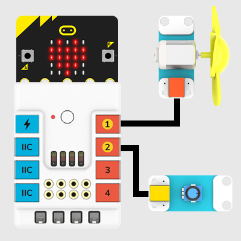
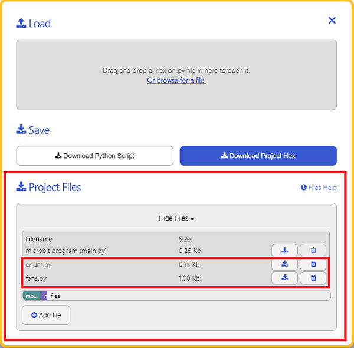

# Motor Fan Module

## Introduction
It is a simple motor-drived fan module.


## Characteristic

---

- Designed in RJ11 connections, easy to plug.

## Specification
---

Item | 参数 
:-: | :-: 
SKU|EF05014
Connection|RJ11
Type of Connection|Analog input
Working Voltage|3.3V


## Outlook
---


## Quick to Start

---

### Materials Required and Diagram

---

- Connect the Motor fan module to J1 port and the potentiaometer to J2 port in the Nezha expansion board as the picture shows.




## MakeCode Programming

---

### Step 1

Click "Advanced" in the MakeCode drawer to see more choices.


We need to add a package for programming, . Click "Extensions" in the bottom of the drawer and search with "PlanetX" in the dialogue box to download it. 


Note: If you met a tip indicating that the codebase will be deleted due to incompatibility, you may continue as the tips say or build a new project in the menu. 

### Step 2

### Code as below:


### Link
Link: [https://makecode.microbit.org/_A8ma6p0s7bR7](https://makecode.microbit.org/_A8ma6p0s7bR7)

You may also download it directly below: 

<div style="position:relative;height:0;padding-bottom:70%;overflow:hidden;"><iframe style="position:absolute;top:0;left:0;width:100%;height:100%;" src="https://makecode.microbit.org/#pub:_A8ma6p0s7bR7" frameborder="0" sandbox="allow-popups allow-forms allow-scripts allow-same-origin"></iframe></div>  
---

### Result
- The rotation speed of the fan is adjusted by the potentiometer. 

## Python Programming 

---

### Step 1

Download the package and unzip it: [PlanetX_MicroPython](https://github.com/lionyhw/PlanetX_MicroPython/archive/master.zip)

Go to   [Python editor](https://python.microbit.org/v/2.0)


We need to add enum.py and fans.py for programming. Click "Load/Save" and then click "Show Files (1)" to see more choices, click "Add file" to add enum.py and fans.py from the unzipped package of PlanetX_MicroPython. 




### Step 2

### Reference

```
from microbit import *
from enum import *
from fans import *
fans = FANS(J1)
while True:
    fans.set_fans(1,100)
    sleep(3000)
    fans.set_fans(1,50)
    sleep(3000)
    fans.set_fans(0)
    sleep(3000)
```


### Result
- After powering on, the Motor fan module rotates for 3 seconds at the speed of 100% first and then at the speed of 50% for another 3 seconds, and finally stops for 3 seconds. 
## Relevant File

---

## Technique File

---
