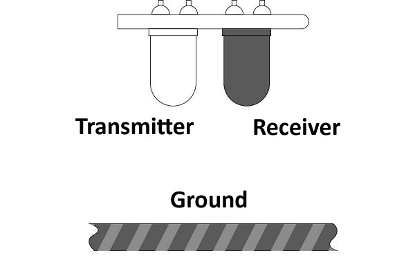
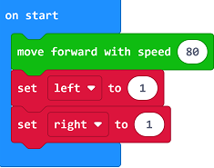
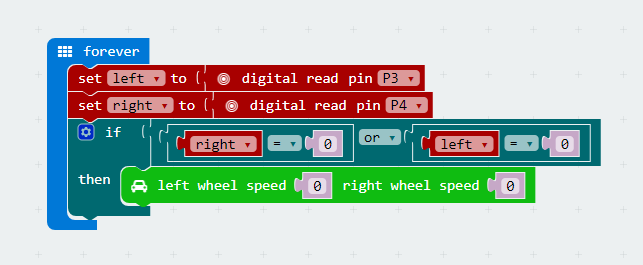

# case 01 Fixed Parking

## Our Goal
---
- Make motor:bit smart car realize fixed parking function.

## Material
---
- 1 x motor:bit smart car kit

## Background Knowledge
---
### Principle of Line Tracking

- The line tracking module in this kit has adopted an infrared sensor. It consists of a **transmitter** and a **receiver**. The transmitter emits infrared light, while the receiver collects the infrared light reflected by the ground. 
- When contacting with black ground or other infrared light absorbing materials, the receiver can't receive the infrared light, then the light tracking module returns to 1. 

## Hardware Connection
---

Connect the left sensor(S1) on line tracking module to the 4th pin on motor:bit.
And connect the right sensor(S2) to 3rd pin. See picture below.

## Software
---
[Microsoft MakeCode](https://makecode.microbit.org/#)

## Programming
---
### Step 1
Click **Advanced** in the code drawer of MakeCode to see more options. 

To program for motor:bit, we have to add a package. Find **Add Package** in the bottom of code drawer and click it. This will pop up a dialogue box. Search for "motorbit" and then click to download this package.

Note: If you get a hint that some packages will be deleted due to the problem of incompatibility, you can either follow the prompts, or create a new project in the project menu. 

### Step 2

- Insert a `move forward with speed` block below `on start`. Set the speed parameter to 80, which means the car will move forward at the speed of 80 when being powered on.
- Create two variables: `left` and `right`. They are used to collect the return values of the left or right sensor. set their initial value to 1. 

### Step 3

- Within forever block, read digital pin P3 and P4, which are correspond to the left or right sensor on line tracking module separately. 
- Assign value to`left`and `right` variable.
- Judge if `left` or `right` is 0, which means one of the two sensors has detected black line. 
- If `left` or `right` is 0, set the motor speed to 0 and stop the car. 

### Program

Link of the whole program: [https://makecode.microbit.org/_1gXfr9fdA6LH](https://makecode.microbit.org/_1gXfr9fdA6LH)

You can also download it from the page below.

<iframe style="position:absolute;top:0;left:0;width:100%;height:100%;" src="https://makecode.microbit.org/#pub:_1gXfr9fdA6LH" frameborder="0" sandbox="allow-popups allow-forms allow-scripts allow-same-origin"></iframe>
  
---

**Note:** Due to the effect of inertia, the car will rush out a certain distance before stop when a black line is detected.

## Result
---
- Once powered on, the car moves forward at the speed of 80. When a black line is detected by the line tracking module, the car stops immediately. 

## Think 
---
- Create more black lines to allow the car complete fixed turning and slow down speed. How can we program? 

## FAQ
---

## Relative Readings
---
