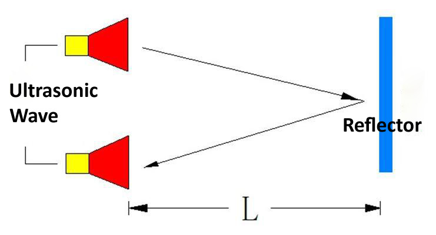
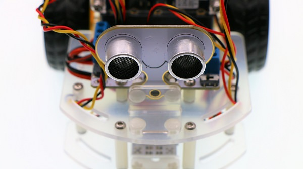
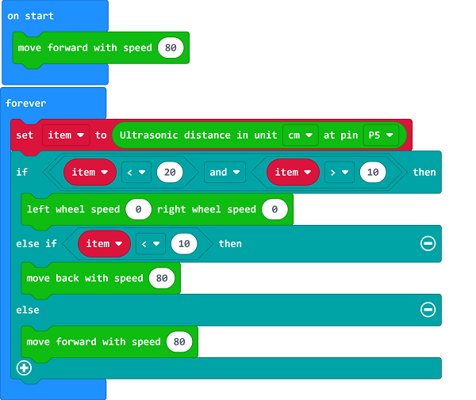

# case 02 Keep Distance

## Our Goal
---
- Make motor:bit smart car keeps distance with another car. 

## Material
---
- 1 x motor:bit smart car kit

## Background Knowledge
---
### What is ultrasonic wave?
- [Ultrasonic Wave](https://zh.wikipedia.org/wiki/%E8%B6%85%E8%81%B2%E6%B3%A2) is a kind of sound wave with frequency higher than 20,000 Hz. It has good direction sense and strong penetration. It is easy to obtain comparatively concentrated sound energy and travel long distance underwater. It can be used to measure distance or speed, rinse, weld, break stones, or sterilize, etc.. Ultrasonic wave is named for its lower frequency limit is higher than the upper limit of human audible sound. 

### Principle of Ultrasonic Distance Measurement

- The transmitter emits ultrasonic wave to a certain direction. At the same time, it starts timing when emitting. Once encountered with a barrier, the ultrasonic wave spread in the air will be reflected back immediately. When the receiver has received the reflected wave, it will stop timing immediately. We can calculate the distance according to the time since the receiver has received the reflected wave, which is similar to radar ranging principle.

## Hardware Connection
---

Connect sonar:bit to P10 on motor:bit.

## Software
---
[Microsoft MakeCode](https://makecode.microbit.org/#)

## Programming
---
### Step 1

Click **Advanced** in the code drawer of MakeCode to see more options. 

To program for motor:bit, we have to add a package. Find **Add Package** in the bottom of code drawer and click it. This will pop up a dialogue box. Search for "motorbit" and then click to download this package.

Note: If you get a hint that some packages will be deleted due to the problem of incompatibility, you can either follow the prompts, or create a new project in the project menu.

### Step 2

- Insert a `move forward with speed` block below `on start`, and set its parameter to 80, which means the car moves forward at the speed of 80 once powered on. 
- The unit of ultrasonic wave is centimeter(cm). Read the value of P10 and assign its return value to variable `item`.
- If the return value is above 5 but under 10, set the speed of motors to 0 and stop the car.
- If the return value is under 5, set the motor speed to 80 and make the car reverse. 
- If none of these values meet, set the motor speed to 80 and make the car move forward. 

### Program

Link of the whole program: [https://makecode.microbit.org/_bW1ThbRWsdMP](https://makecode.microbit.org/_bW1ThbRWsdMP)

You can also download it from the page below.

<iframe style="position:absolute;top:0;left:0;width:100%;height:100%;" src="https://makecode.microbit.org/#pub:_bW1ThbRWsdMP" frameborder="0" sandbox="allow-popups allow-forms allow-scripts allow-same-origin"></iframe>
  
---

## Result
---
- Once powered on, the car moves forward at the speed of 80. Place your hand in front of the car at a distance among 5~10cm, the car stops moving forward. Again, place your hand closer to the car but at a distance less than 5 cm, the car will move back and then stop when the distance is beyond 5 cm. 

## Think 
---

## FAQ
---

## Relative Readings
---

