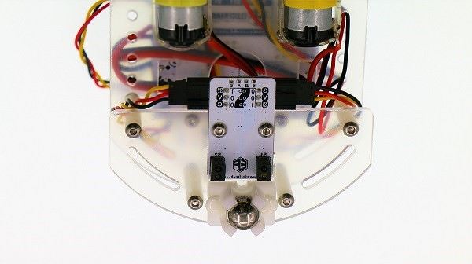
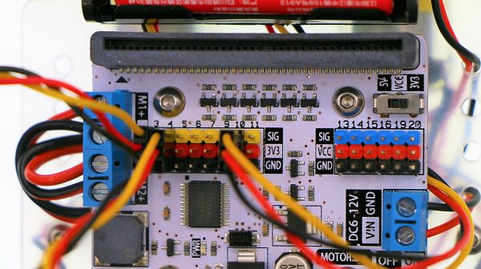
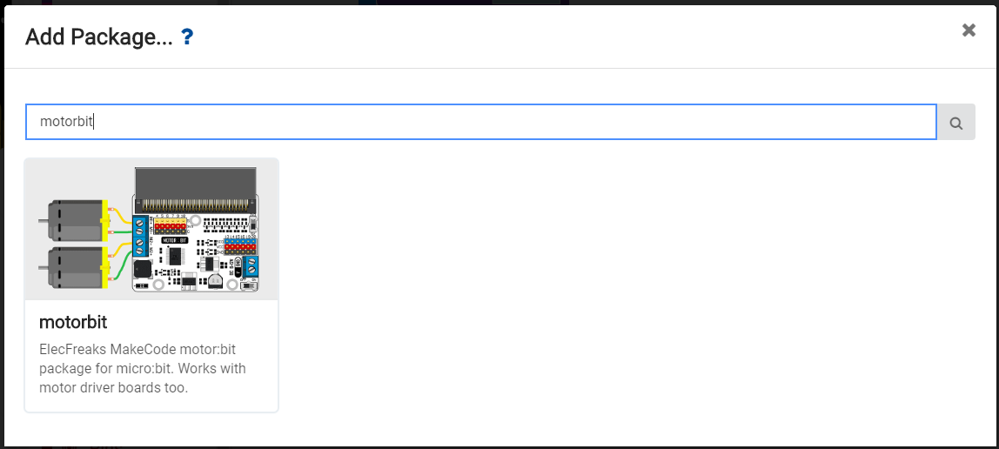
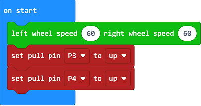
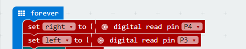
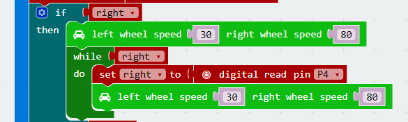
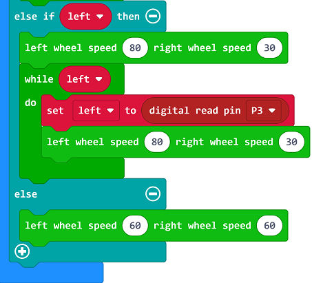

# case 03 Line Tracking

## Our Goal
---
- Make motor:bit smart car track lines. 

## Material
---
- 1 x motor:bit smart car kit

## Background Knowledge
---
### Principle of Line Tracking

- The line tracking module in this kit has adopted an infrared sensor. It consists of a **transmitter** and a **receiver**. The transmitter emits infrared light, while the receiver collects the infrared light reflected by the ground. 
- When contacting with black ground or other infrared light absorbing materials, the receiver can't receive the infrared light, then the light tracking module returns to 0. 

## Hardware Connection
---

Connect the left sensor(S1) on line tracking module to the 4th pin on motor:bit.
And connect the right sensor(S2) to the 3rd pin. See picture below.

## Software
---
[Microsoft MakeCode](https://makecode.microbit.org/#)

- If the line tracking module has detected a black line, its value will return to 0. If no black line detected, then it will return to 1.

## Programming
---

### Step 1

Click **Advanced** in the code drawer of MakeCode to see more options. 

To program for motor:bit, we have to add a package. Find **Add Package** in the bottom of code drawer and click it. This will pop up a dialogue box. Search for "motorbit" and then click to download this package.

Note: If you get a hint that some packages will be deleted due to the problem of incompatibility, you can either follow the prompts, or create a new project in the project menu. 

### Step 2

When start, set the motor speed to 60. At the same time, set a pull-up to both P3 and P4. 

Create two variable `left` and `right` to store the return value of the left or right infared sensor. Read the return value of the left or right infared sensor in digital way, i.e. digital read the return value of P3 and P4 port. 

If the right infrared sensor has detected derail, then set the speed of the left wheel to 30 and the right to 80. This will make the car turn left. Next, create a loop to check if the car has returned back to the black line. If not, the car will continue to turn left until it back to the track.  

That is same to the right wheel. If the left infrared sensor has detected a derail, then make the car turn right until it come back to the black line. 

If both the left and right infrared sensor have detected derail, then set the motor speed to 60 and make the car continue to move forward.

## Program
---

Link of the whole program: [https://makecode.microbit.org/_ibXcm1M5UY3A](https://makecode.microbit.org/_ibXcm1M5UY3A)

You can also download the program from the page below.

<iframe style="position:absolute;top:0;left:0;width:100%;height:100%;" src="https://makecode.microbit.org/#pub:_ibXcm1M5UY3A)" frameborder="0" sandbox="allow-popups allow-forms allow-scripts allow-same-origin"></iframe>
  
---

**Note:** Objects that can absorb infrared light can be regarded as black line. 

## Result
---
Motor:bit car moves along the scheduled black line.

## Think
---

## FAQ
---

## Relative Readings  
---

