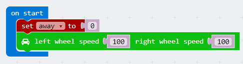
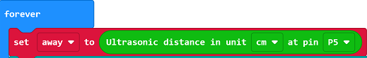
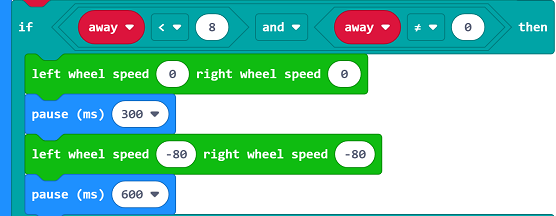
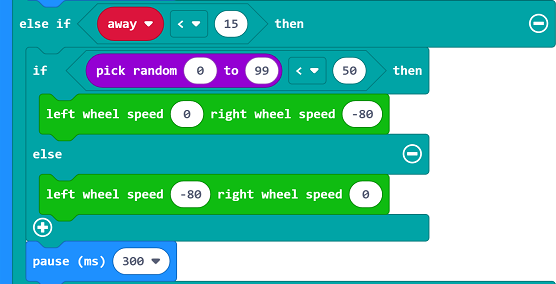
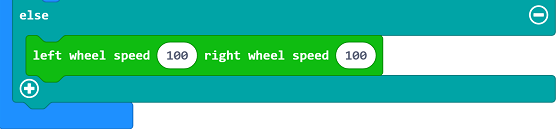

# case 04 Avoid Barrier 

## Our Goal
---
- Make our motor:bit car avoid barriers using ultrasonic wave. 

## Material
---
- 1 x motor:bit

## Background Knowledge
---

### What is ultrasonic wave?

- Ultrasonic Wave is a kind of sound wave with frequency higher than 20,000 Hz. It has good direction sense and strong penetration. It is easy to obtain comparatively concentrated sound energy and travel long distance underwater. It can be used to measure distance or speed, rinse, weld, break stones, or sterilize, etc.. Ultrasonic wave is named for its lower frequency limit is higher than the upper limit of human audible sound. 

### Principle of Ultrasonic Distance Measurement

- The transmitter emits ultrasonic wave to a certain direction. At the same time, it starts timing when emitting. Once encountered with a barrier, the ultrasonic wave spread in the air will be reflected back immediately. When the receiver has received the reflected wave, it will stop timing immediately. We can calculate the distance according to the time since the receiver has received the reflected wave, which is similar to radar ranging principle.

## Hardware Connection
---

Connect sonar:bit to P10 on motor:bit. See picture below. 

## Software
---
[Microsoft MakeCode](https://makecode.microbit.org/#)

## Programming
---

### Step 1
Click **Advanced** in the code drawer of MakeCode to see more options. 

To program for motor:bit, we have to add a package. Find **Add Package** in the bottom of code drawer and click it. This will pop up a dialogue box. Search for "motorbit" and then click to download this package.

Note: If you get a hint that some packages will be deleted due to the problem of incompatibility, you can either follow the prompts, or create a new project in the project menu.

### Step 2

At the beginning of our program, we need to create a variable named `away`, which means the distance between  our motor:bit car and the barrier detected. We set it to 0. 

Set the speed of both motors to 100. 

### Step 3

create a `forever` loop to read the return value of sonar:bit in real time and assign its value to `away`.

#### Stop to Prevent Crash

When the distance detected (i.e. `away`) is under 8 cm, stop the car and delay time for 300 ms. After that, set the speed of both motors to a negative value(like -80) and delay time for 600 ms. 

#### Steer to Avoid Barrier

When `away` is under 15 cm, then generate a random number among 0 to 99. 

If the random number is under 50, assign a negative value to the right wheel. So the right wheel will reverse and the car will turn right. 

If the random number is beyond 50, assign a negative value to the left wheel. So the left wheel will reverse and the car will turn left. 

If `away` is beyond 15 cm, set the speed of both motors to 100 and the car will move forward. 

### Program

Link of the whole program: [https://makecode.microbit.org/_J6h7CtDfj6mo](https://makecode.microbit.org/_J6h7CtDfj6mo)

You can also download it from the page below.

<iframe style="position:absolute;top:0;left:0;width:100%;height:100%;" src="https://makecode.microbit.org/#pub:_J6h7CtDfj6mo" frameborder="0" sandbox="allow-popups allow-forms allow-scripts allow-same-origin"></iframe>
  
---

## Result
---
- After powered on, the car will move forward at the speed of 100. 
- When the barrier distance(i.e. `away`) is under 8 cm but not equal to 0 cm, the car will stop for 0.3 second and then start reversing. 
- When the barrier distance is under 15 cm, the car will turn left or right randomly to avoid barrier. 
- For other situations, the car will move forward at the speed of 100. 

## Think 
---

## FAQ
---

## Relative Readings
---

