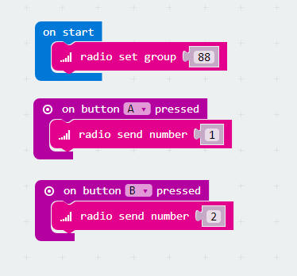
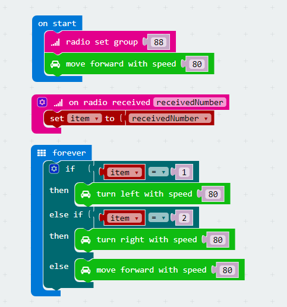

# case 05 Remote Control 

## Our Goal
---
- Use another micro:bit control our motor:bit car.    

## Material
---

- 1 x motor:bit smart car kit
- 1 x micro:bit

## Background Knowledge
---

### What is radio?

- [Radio](https://en.wikipedia.org/wiki/Radio) is the technology of using radio waves to carry information, such as sound, by systematically modulating properties of electromagnetic energy waves transmitted through space, such as their amplitude, frequency, phase, or pulse width. When radio waves strike an electrical conductor, the oscillating fields induce an alternating current in the conductor. The information in the waves can be extracted and transformed back into its original form.

## Software
---
[Microsoft MakeCode](https://makecode.microbit.org/#)

## Programming
---

### Step 1

Click **Advanced** in the code drawer of MakeCode to see more options. 

To program for motor:bit, we have to add a package. Find **Add Package** in the bottom of code drawer and click it. This will pop up a dialogue box. Search for "motorbit" and then click to download this package.

***Note:*** If you get a hint that some packages will be deleted due to the problem of incompatibility, you can either follow the prompts, or create a new project in the project menu. 

### Step 2

- Let's start by coding our remote controller (i.e. our transmitter).  
- At the beginning, set radio group to 88.(Same group with the receiver.)  
- Press button A, radio send number 1.   
- Press button B, radio send number 2.   

### Step 3

- Now, let's write the receiver program for our motor:bit car.   
- When start, set radio group to 88. (Same group with the transmitter.)   
- Make the car move forward by a default speed of 80.   
- When radio signal is received, assign the received number to variable `item`.  
- Create a loop to check the value of `item`. 
- If it is 1, the car will turn left at the speed of 80 and delay time for 0.5s.   
- If it is 2, the car will turn right at the speed of 80 and delay time for 0.5s.  
- If not both of them, the car just move forward at the speed of 80.  
 
  

## Program
---

#### Code of Remote Controller  

Link of the whole program: [https://makecode.microbit.org/_5yyHJoJsjcH4](https://makecode.microbit.org/_5yyHJoJsjcH4)

You can also download the program from the page below.  

<iframe style="position:absolute;top:0;left:0;width:100%;height:100%;" src="https://makecode.microbit.org/#pub:_5yyHJoJsjcH4" frameborder="0" sandbox="allow-popups allow-forms allow-scripts allow-same-origin"></iframe>

#### Code of Motor:bit Car  

Link of the whole program: [https://makecode.microbit.org/_8Dp0WMEDwMad](https://makecode.microbit.org/_8Dp0WMEDwMad)

You can also download the program from the page below.  

<iframe style="position:absolute;top:0;left:0;width:100%;height:100%;" src="https://makecode.microbit.org/#pub:_8Dp0WMEDwMad" frameborder="0" sandbox="allow-popups allow-forms allow-scripts allow-same-origin"></iframe>

## Result  
---

- Once powered on, the car moves forward at the speed of 80. Press button A on the remote controller, the car turns left. Press button B, the car turns right. 

## Think  
---

## FAQ
---

## Relative Readings  
---

