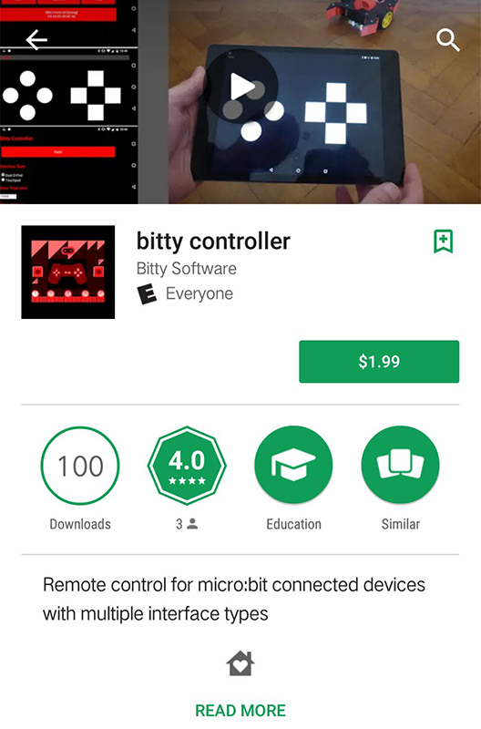
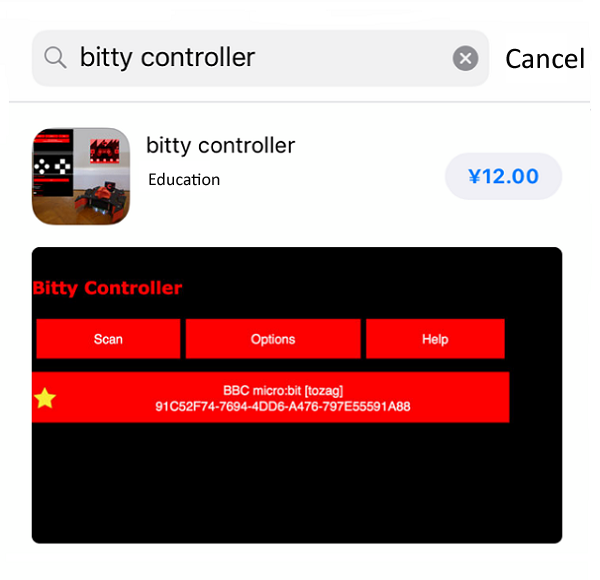
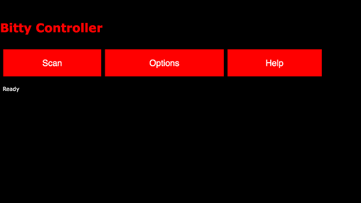
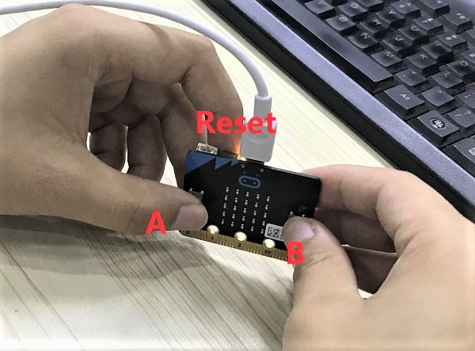
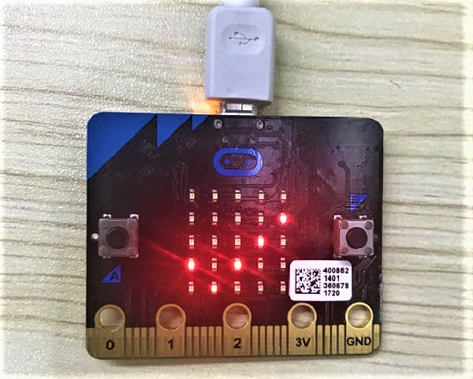
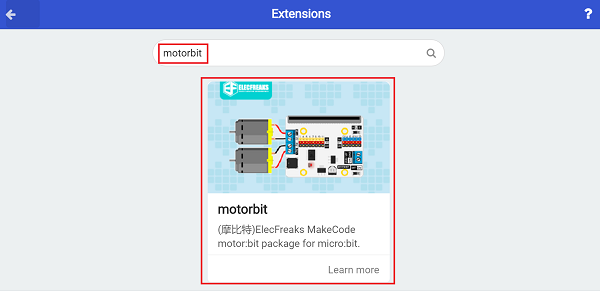
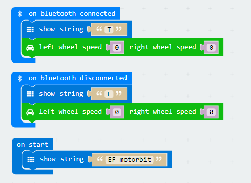
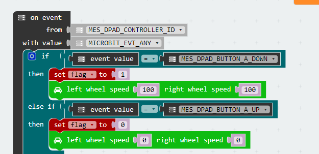
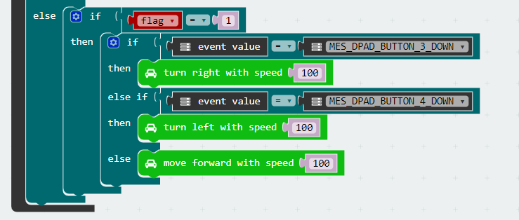
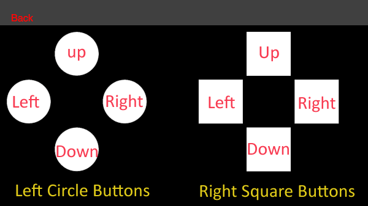

# case 06 Bluetooth Control

## Our Goal
---
Control the movement of our motor:bit car via Bluetooth. 

## Material
---
- 1 x motor:bit
- 1 x bitty controller

## Background Knowledge
---
- [Bluetooth](https://en.wikipedia.org/wiki/Bluetooth) is a wireless technology standard for exchanging data over short distances (using short-wavelength UHF radio waves in the ISM band from 2.4 to 2.485 GHz[3]) from fixed and mobile devices, and building personal area networks (PANs). We can use Bluettoth to connect multiple devices which resolves the difficulty of simultanuous data transmission. 

- [Bittysoftware](http://www.bittysoftware.com/index.html) provides mobile apps and tools for devices like BBC micro:bit.

### Bluetooth Event

Each time when we received a data via Bluetooth, it will trigger an event. Then the receiver will handle the happened event according to an event table. 

An event can be divided into a source and an event value. The receiver will obtain the event from its source and judge what's happened according to the event value. 

Picture below is an event table for D-pad controlling joystick. 

## Software
---
[Microsoft MakeCode](https://makecode.microbit.org/#)

## Operation Steps
---
### Step 1: APP Download

1. Android Device: Download bitty controller app from Google play.

2. IOS Device: Download bitty controller app from APP store.

-  Below is the interface of this APP:

***Note:*** Due to the limitation of IOS system, we need to download other software for Bluetooth connection.   

For more information, please refer to [micro:bit IOS Bluetooth Connection User Guide](http://www.bittysoftware.com/apps/bitty_blue.html).

### Step 2: Set Bluetooth Mode

To activate the Bluetooth mode of micro:bit, we need to press button "A+B" simultaneously and then press reset button. Later, micro:bit screen will display **PAIRING MODE！** and a special character. This character is unique to each micro:bit. It is the special indentifier for Bluetooth. 

Once paired successfully with your Android or IOS device, your micro:bit screen will display a "√"(a tick).

### Step 3: Add Package

Click **Advanced** in the code drawer of MakeCode to see more options. 

To program for Bluetooth and motor:bit, we have to add two packages. Find **Add Package** in the bottom of code drawer and click it. This will pop up a dialogue box. Search for "Bluetooth" and "motorbit" and then click to download these packages.

***Note:*** If you get a hint that some packages will be deleted due to the problem of incompatibility, you can either follow the prompts, or create a new project in the project menu.

### Step 4: Write Blocks Program

When startup, micro:bit will display a string "EF-motorbit". Once connected Bluetooth, micro:bit screen will display a "T". Disconnect Bluetooth, then it will display an "F".   

To prevent bad result caused by error operations, we need to set the motor speed to 0 when Bluetooth is connected or disconnected. 

Set event source block and name it `MES_DPAD_CONTROLLER_ID`, which is the joystick controlling panel of the APP. 

Name the event value `MICROBIT_EVT_ANY` so that it can obtain all event information. 

If the event value is `MES_DPAD_BUTTON_A_DOWN`, we can know from the event table above that the event is the left top circle button is pressed. Thus, the operation status is 1 (move forward). At the same time, set both motors run at its full speed to make the car move forward. 

If the event value is `MES_DPAD_BUTTON_A_UP`, we know from the event table above that the left top circle button is released. Thus, the operation status is 0 (stop). At the same time, set the speed of both motors to 0 and the car stops.  

Create a variable and name is `flag`, which stands for the car movement status. When `flage` is 1, it means the car is moving forward. 

If the event value is `MES_DPAD_BUTTON_3_DOWN`, we can known from the table above that the right square button is pressed. Thus, the car will turn right. 

If the event value is `MES_DPAD_BUTTON_4_DOWN` when `flag` is 1, we can know from the table above that the left square button is pressed. Thus, the car will turn left. 

If none of the above two situations happened when `flag` is 1, then set the speed of both motors to 100 and the car will move forward at its full speed.  

### Step 5: Bluetooth Connection 

Once micro:bit Bluetooth mode is activated, let's start to pair. Click scan in the APP interface to search for micro:bit signal.

Click on the micro:bit obtained to enter into joystick mode. See picture below. 

Enjoy yourself!

***Warm Tips:*** For more detailed operations about bitty controller, please refer to [bitty controller](http://www.bittysoftware.com/apps/bitty_controller.html). 

### Program

Link of the whole program: [https://makecode.microbit.org/_V4YJ2i9LkYoi](https://makecode.microbit.org/_V4YJ2i9LkYoi)

You can also download it from the page below.

<iframe style="position:absolute;top:0;left:0;width:100%;height:100%;" src="https://makecode.microbit.org/#pub:_V4YJ2i9LkYoi" frameborder="0" sandbox="allow-popups allow-forms allow-scripts allow-same-origin"></iframe>

***Note:*** Low motor speed will affect its rotation. 

## Result
---
Once Bluetooth paired successfully, micro:bit screen will display a "T". Disconnect the Bluetooth, it will display an "F". 

Press the left top button on the joystick interface, the car will move forward. 
Press the left or right button in the right side of joystick, the car will reverse to the left or right. 

## Think 
---
How to write our code if we want to reverse our car or even make it turn left ot right ?

## FAQ
---

