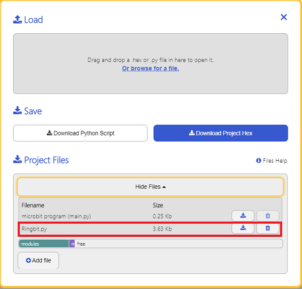

# Ring:bit Python Samples


## Add Python Documents
---

Download and unzip the package: [EF_Produce_MicroPython-master](https://github.com/lionyhw/EF_Produce_MicroPython/archive/master.zip)
Go to [Python editor](https://python.microbit.org/v/2.0)


For programming, we need to add the file of Ringbit.py. Click Load/Save first and again with Show Files(1), choose “add file” to get to the download page to find the file folder of EF_Produce_MicroPython-master, then add Ringbit.py.




## Sample Code
---
### Project 01:  Drive at full speed
```
from microbit import *
from Ringbit import *

RB = RINGBIT(pin1,pin2)
RB.set_motors_speed(100,100)
# Set the speed of both motors

```
### Result
- The speed of both wheels is 100, the car drives at full speed. 


### Project 02: Obstacle-avoidance car
```
from microbit import *
from Ringbit import *

RB = RINGBIT(pin1,pin2)
while True:
    i = RB.get_distance(0)
    if i>3 and i<30:
        RB.set_motors_speed(-100, 100)
        sleep(500)
    else:
        RB.set_motors_speed(100, 100)
```
### Result
- The car changes its direction immediately if the ultrasonic sound sensor detects any obstacles. 

### Project 03: Line following
```
from microbit import *
from Ringbit import *

RB = RINGBIT(pin1,pin2)
while True:
    
    i = RB.get_tracking()
    if i == 10:
        RB.set_motors_speed(10, 100)
    if i == 1:
        RB.set_motors_speed(100, 10)   
    if i == 11:
        RB.set_motors_speed(100, 100) 
```
### Result
- The car runs along with the black line. 

## Relevant Projects
---

## Technical Files
---
