# Rainbow LED module

## Introduction
---
- Ring:bit car V2 lights-bar module is the dedicated module which designed for Ring:Bit Car V2. It brings you beautiful mutiple color with simple assemble.
- Come with 8 Rainbow full color LEDs. You can update your ring:bit car to a car with headlights and rainbow lights.

 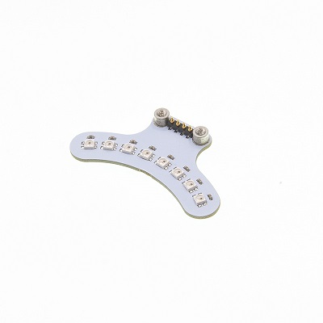 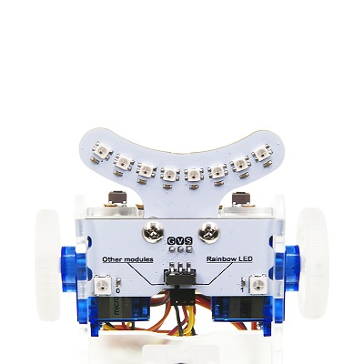

## Features
---
- Input voltage 3V~5V，and directly drived by micro:bit.

- Standard 3 line GVS port, only occupy one I/O port.

- 8 small LEDs, power saving and energy saving.

- Each leds can be code independently and show RGB color.

## Parameter
---

 Items | Parameter | Remark 
 :-: | :-: |:-:
 Name |Ring:bit car v2 light bar|-
 SKU|EF03425|-
 Working Voltage |DC 3-5V|-
 Port |Ring:bit car dedicated pin ports|-
 Output Signal |Simulation|-
 LEDs |8 pcs|-
 Dimension |60.8 x 33.20mm|-
 Net Weight |5.7g|-

## Dimensions:
---

 

## Quick to Start

---
### Hardware Connection 

---

- First, insert this module to the baseboard of the Ring:bit car V2.

 

- Then, screw up the screws.

 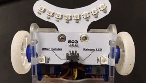 

- Completed.

 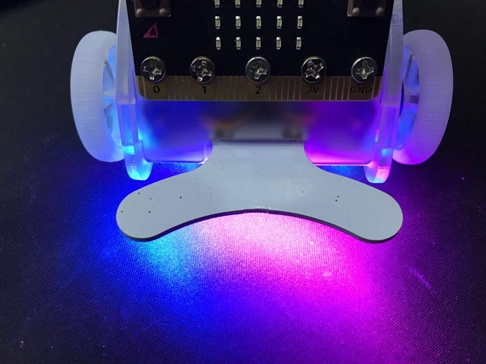

- You have to turn the switch to the side named "Rainbow LED" if you want to use the Rainbow function.

 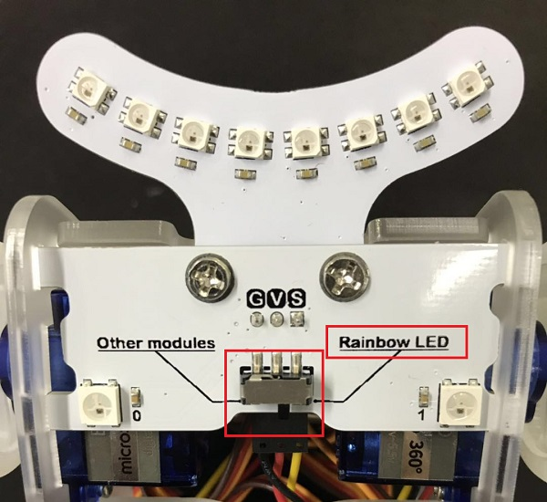

### Software Programming
---

- Program a simple light-bar code in the [makecode](https://makecode.microbit.org/) .

 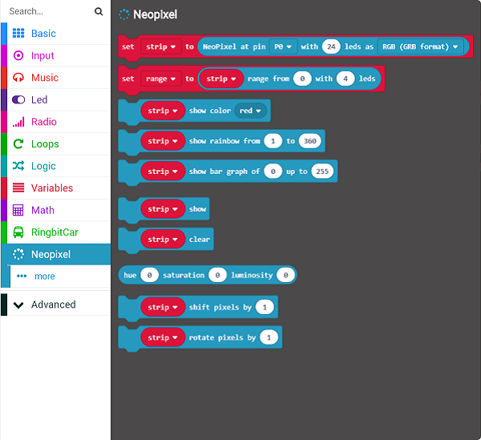

- Choose `NeoPixel at pin……` from the Neopixel brick to the "On Start" brick.
- Save the data collected by the 10pcs Rainbow LEDs connected to P2 port to `all_led` variable.

 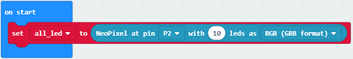

- Set the variable `Single` to the first LED from `choice` for all LEDs `all_led` in `forever` block.
- Add one for the variable `choice` in turns and choose the 10  LEDs in turns also.

 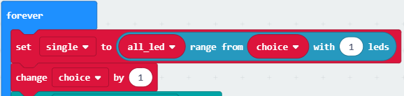

- When the variable `choice` is over 9, it means there is only one LED left can be chosen, now set the variable `choice` to 0, then it loops.

 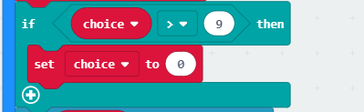

- Set the `single` LED to `red` , and turn off the LED after 200 ms.

 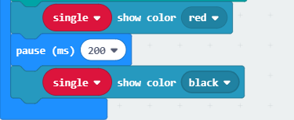

 Links: [https://makecode.microbit.org/_cg0JCtE5HHET](https://makecode.microbit.org/_cg0JCtE5HHET)

You can download it directly below:

 
<iframe style="position:absolute;top:0;left:0;width:100%;height:100%;" src="https://makecode.microbit.org/#pub:_cg0JCtE5HHET" frameborder="0" sandbox="allow-popups allow-forms allow-scripts allow-same-origin"></iframe>

### Result
---
- Turn on the Rainbow LED in turns.

 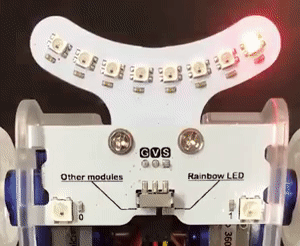

## Files
---
[WIKI](https://github.com/elecfreaks/learn-cn)

## FAQ
---
