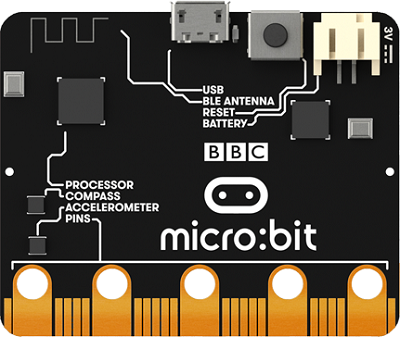
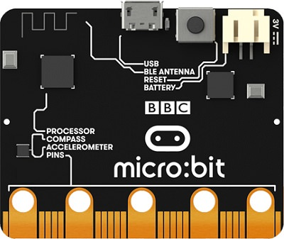
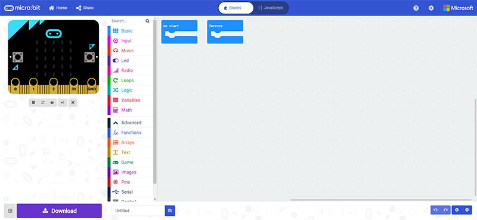
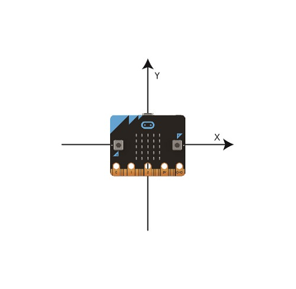
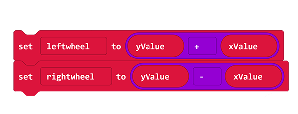
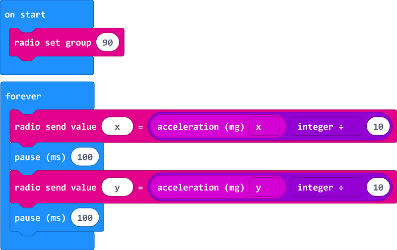
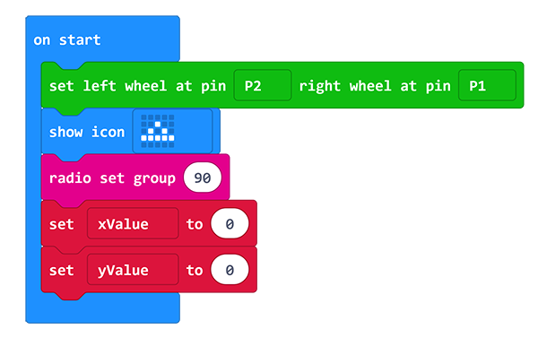
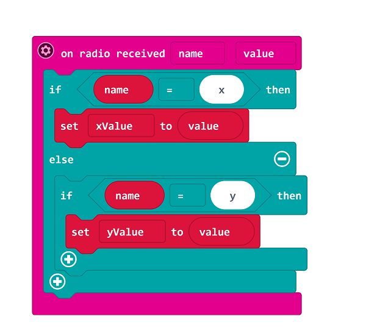
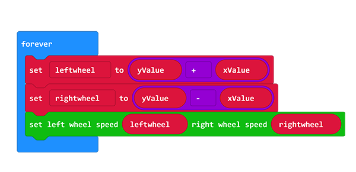

# ring:bit car v2 accelerometer arithmetic 

- Accelerometer arithmetic of the Ring:bit car 

## Required Materials

- 1 x Micro:bit
- 1 x [Ring:bit Car](https://shop.elecfreaks.com/products/elecfreaks-micro-bit-ring-bit-v2-car-kit-without-micro-bit-board?_pos=4&_sid=66ba68dec&_ss=r)

## Background

- [Micro:bit](http://microbit.org/) is a small coding computer which was given by the BBC. It is specially designed for adolescent programming education and to male programming more easy and interesting.

- [ELECFREAKS Ring:bit car 2](https://www.elecfreaks.com/](https://www.elecfreaks.com/ring-bit-car-v2-for-micro-bit.html) is a small DIY smart car driven by the BBC micro:bit and the ELECFREAKS Ring:bit. The Ring:bit extends the micro:bit's 3 GPIO ports and allow for different sensors and components to be easily attached to the micro:bit. A basic Ring:bit Car can be easily programmed to run autonomously, with a remote control, and even create rainbow beacons of light. Just add one of the many extensions available and your Ring:bit Car can do even more things like line and light following, obstacle avoiding, drawing and more!

- Wireless Technology Wireless technology sends message by radio wave because changes of electricity will generate waves. We can use this to load the message to the wave. Variation of electromagnetic field will generate the electricity when the electromagnetic is arrving the receiver. Then, to extract the message from wave by demodulation to send the message.

- Acceleration Sensor The accelerometer is a kind of sensor to measure the accelerated speed. It has included mass block, damper, elastic component, sensitive element and optimal tuning circuit. The sensor is measuring the inertia force and getting the acceleration magnitude by newton's second law  during its accelerating. According to the difference of sensitive element, the common used accelerometer has included capacitance, strain, piezoresistive and piezoelectric.

 *The new version accelerometer chip of micro:bit is different from the old version. The new version has combined the electronic compass and the accelerometer. No change for usage.*

   

## Software

[makecode](https://makecode.microbit.org/#) Online block coding [https://makecode.microbit.org/#](https://makecode.microbit.org/#)

 

## Coding

### Step 1：Add Coding Package
- Click on "Advanced" in the MakeCode Drawer to see more code sections.

- Search for “ringbitcar” and click on the ring:bit car package to add it to your project. (As below picture)

***Note：*** If you get a warning telling you some packages will be removed because of incompatibility issues, either follow the prompts or create a new project in the Project file menu.

### Step 2：Principle of arithmetic 

- The accelerometer has 2 directions: x-axis and Y-axis. It is easy to understand when you put the micro:bit and the Ring:bit Car to a same three dimensional coordinate axis in a top view.

 Move direction and speed of the car is controlling by micro:bit's direction.

- Move forward to the right, the value of x-axis and Y-axis are positive number. The speed of the left wheel should be greater than the right wheel and complete turn right.
- Others in the same way.
- Result: The value of Y-axis plus the x-axis is the value of the left wheel; the value of Y-axis minus the x-axis is the value of the right wheel.

### Step 3：Code Interpretation(The controlling end) ###

- On start, set wireless to `90`, same with the car.
- In the forever loop, send the acceleration magnitude of the X-axis. The scope of the acceleration magnitude is `-1024~+1024`, the car speed is `-100~+100`, so we need to divided by ten.
- In the forever loop, send the acceleration magnitude of the Y-axis and divided by ten.

### Step 4：Code Interpretation(The car)

- On start, set the left wheel to P1 and the right wheel to P2 (subject to the actual) and show an icon. Set wireless value to 90 (same with the sending side), to set variable XValue and variable yValue to save the value of X-axis and Y-axis.

- On radio received the value, if it is X, save the data to `xValue`, if it is Y, save the data to `yValue`.

- Then, calculating the speed value of the right and left wheel, set them to corresponding value.

## Reference Program

### Remote Control Coding
Program Link：[https://makecode.microbit.org/_AT4PoHKdVi6L](https://makecode.microbit.org/_AT4PoHKdVi6L)

If you don't want to type these code by yourself, you can directly download the whole program from the link below:

<iframe style="position:absolute;top:0;left:0;width:100%;height:100%;" src="https://makecode.microbit.org/#pub:_AT4PoHKdVi6L" frameborder="0" sandbox="allow-popups allow-forms allow-scripts allow-same-origin"></iframe>
  

### Ring:bit car Coding
Program Link：[https://makecode.microbit.org/_e5t6XPHoTiHy](https://makecode.microbit.org/_e5t6XPHoTiHy)

If you don't want to type these code by yourself, you can directly download the whole program from the link below:

<iframe style="position:absolute;top:0;left:0;width:100%;height:100%;" src="https://makecode.microbit.org/#pub:_e5t6XPHoTiHy" frameborder="0" sandbox="allow-popups allow-forms allow-scripts allow-same-origin"></iframe>
  

## Result 

- The Ring:bit car moves as direction of the gyroscope and oblique angle controls its speed.
- 
