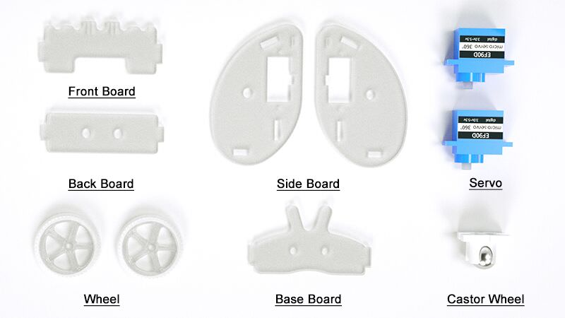
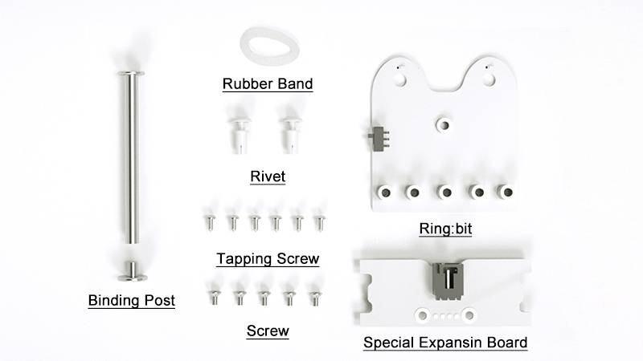
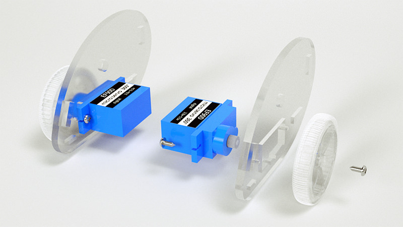
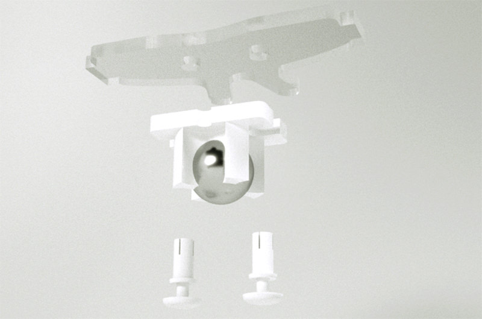
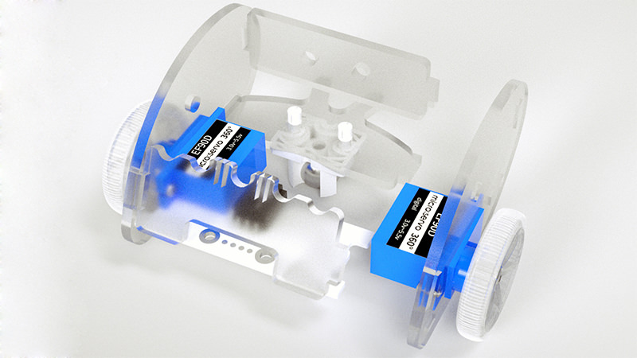
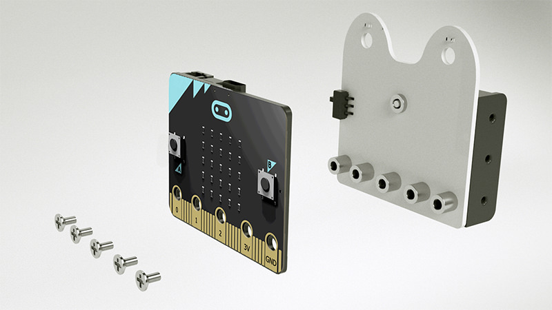
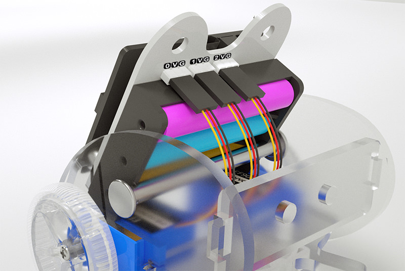
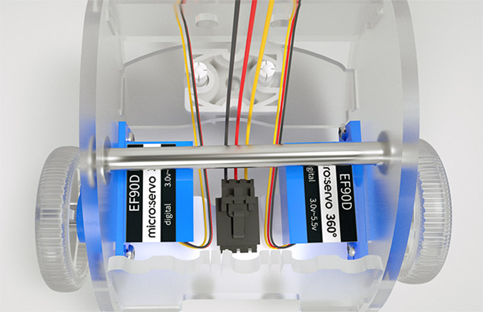
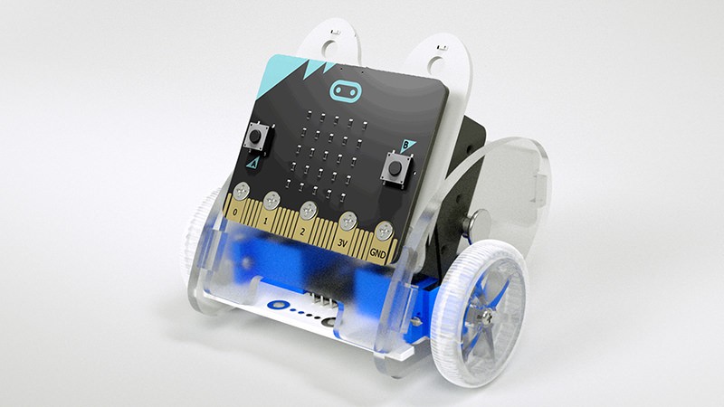

# Ring:bit Car Assembly Step

## Ring:bit car 2 Components Lists
---

## Assembly Step
---
### Step-1 ###

- Fisrt, use the tapping screw to fix the servo to the side board.(as below pictures)
- Then, use the screw to fix the wheel to the servo.(as below pictures)

### Step-2 ###

- Use the rivet to install the castor wheel on the chassis.

### Step-3 ###

- Assemble the front board, the back board and the base board to the side board as below picture.

### Step-4 ###

- Use the binding post to fix all installed components.

### Step-5 ###

- Use the screw to fix the ring:bit to the micro:bit board.
 

### Step-6 ###

- Connecting wire as below pictures.

### Completed ###

- Fix the assembled ring:bit to the front board.

