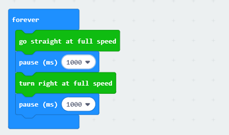
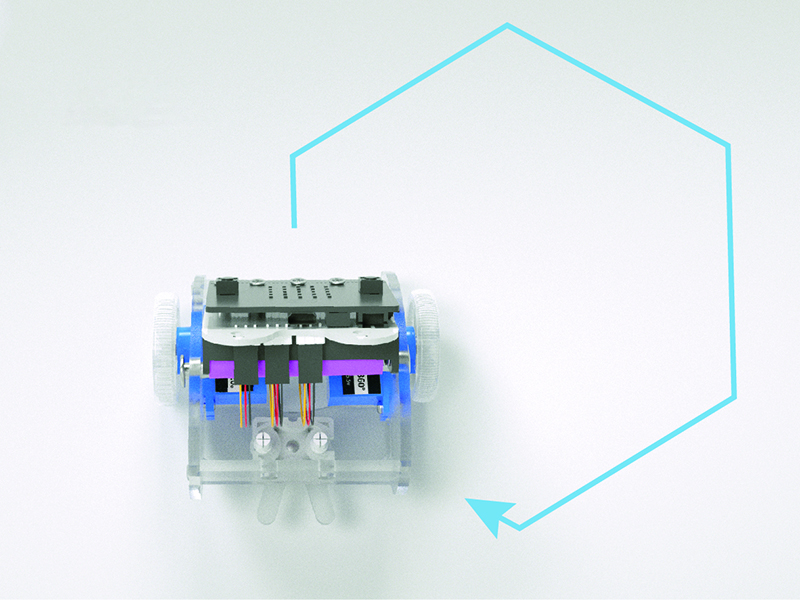

# case 02 Make a shape 

## Our Goal

- To make the Ring:bit Car turn at an angle.

## Requiered Materials

- 1 x [Ring:bit Car](https://www.elecfreaks.com/ring-bit-car-v2-for-micro-bit.html)

## Hardware Connect

- Connect the left wheel servo to P1 of the Ring:bit expansion board and the right wheel servo to P2.

## Software

[makecode](https://makecode.microbit.org/#)

## Coding

### Step 1
- Click on "Advanced" in the MakeCode Drawer to see more code sections.

- Search for “ringbitcar” and click on the ring:bit car package to add it to your project. (As below picture)

Note：If you get a warning telling you some packages will be removed because of incompatibility issues, either follow the prompts or create a new project in the Project file menu.

### Step 2

- Snap the block "set left wheel at pin P1 right wheel at pin P2" into the on start block.
- The port number is based on the actual servo connection port.

### Step 3

- Within the `forever` block, snap below blocks in line:
- `go straight at full speed` block
- `pause` block
- `turn right at full speed` block
- `pause` block

### Program

Program Link：[https://makecode.microbit.org/_iPWL19C26CYe](https://makecode.microbit.org/_iPWL19C26CYe)

If you don't want to type these code by yourself, you can directly download the whole program from the link below:

<iframe style="position:absolute;top:0;left:0;width:100%;height:100%;" src="https://makecode.microbit.org/#pub:_iPWL19C26CYe" frameborder="0" sandbox="allow-popups allow-forms allow-scripts allow-same-origin"></iframe>
  

## Result

- The car goes straight and turns right, then goes straight.

## Think

- How can you make your car dance?

## Questions

## More Information   

