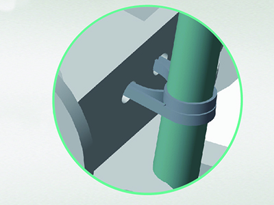
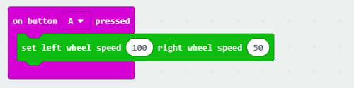
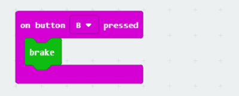
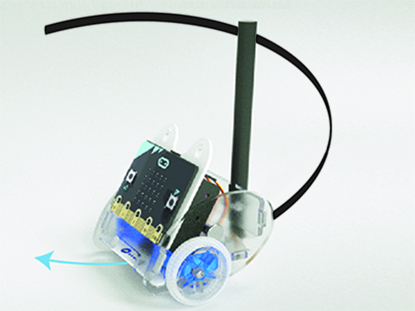

# case 03 Turn at an angle

## Our Goal

- To make the Ring:bit Car draw a circle in the clockwise direction.

## Requiered Materials

- 1 x [Ring:bit Car](https://www.elecfreaks.com/ring-bit-car-v2-for-micro-bit.html)

## Hardware Connect

- Connect the left wheel servo to P1 of the Ring:bit expansion board and the right wheel servo to P2.

- Use a rubber band to fix a pencil on the base board of the Ring:bit car.

## Software

[makecode](https://makecode.microbit.org/#)

## Coding

### Step 1
- Click on "Advanced" in the MakeCode Drawer to see more code sections.

- Search for “ringbitcar” and click on the ring:bit car package to add it to your project. (As below picture)

***Note：*** If you get a warning telling you some packages will be removed because of incompatibility issues, either follow the prompts or create a new project in the Project file menu.

### Step 2

- Snap the block `set left wheel at pin P1 right wheel at pin P2` into the on start block.
- The port number is based on the actual servo connection port.

### Step 3

- Snap the `set left wheel speed right wheel speed` block into the `on button A pressed` block.
- Set the left wheel's speed to 10 and the right to 50. 

### Step 4

- Snap the `brake` block into the `on button B pressed` block.

### Program

Program Link：[https://makecode.microbit.org/_YejCA2AJDDVV](https://makecode.microbit.org/_YejCA2AJDDVV)

If you don't want to type these code by yourself, you can directly download the whole program from the link below:

<iframe style="position:absolute;top:0;left:0;width:100%;height:100%;" src="https://makecode.microbit.org/#pub:_YejCA2AJDDVV" frameborder="0" sandbox="allow-popups allow-forms allow-scripts allow-same-origin"></iframe>
  

## Result

- On button A pressed, the car draws a circle.
- On button B pressed, stop car.

## Think

- How can you make your car draw an eight?

## Questions

## More Information  

