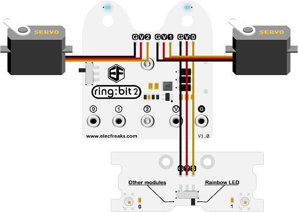
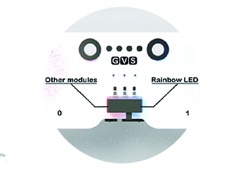
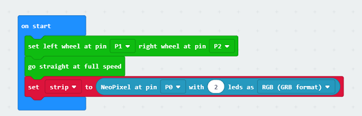
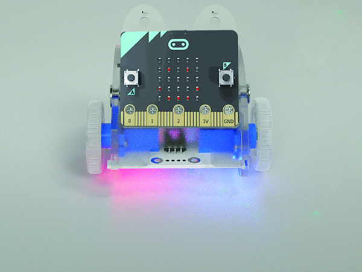

# case 04 Here comes the police 

## Our Goal

- To change the Ring:bit car to a police car.

## Requiered Materials

- 1 x [Ring:bit Car](https://shop.elecfreaks.com/products/elecfreaks-micro-bit-ring-bit-v2-car-kit-without-micro-bit-board?_pos=4&_sid=66ba68dec&_ss=r)

## Hardware Connect

- Connect the left wheel servo to P1 of the Ring:bit expansion board and the right wheel servo to P2.
- Connect the ring:bit car special expansion board to the P0.

- Slide the clip switch of the special expansion board to the Rainbow LED.

## Software

[makecode](https://makecode.microbit.org/#)

## Coding

### Step 1
- Click on "Advanced" in the MakeCode Drawer to see more code sections.

- Search for “ringbitcar” and click on the ring:bit car package to add it to your project. (As below picture)

***Note：*** If you get a warning telling you some packages will be removed because of incompatibility issues, either follow the prompts or create a new project in the Project file menu.

### Step 2

- Snap the block `set left wheel at pin P1 right wheel at pin P2` to the `On start` block. The port number is based on the actual servo connection port.
- Go straight at full speed.
- Set the `2` Rainbow LED of the `P0` to `RGB` color.

### Step 3

- Within the `forever` block, snap below blocks in line:
- `show color red` block.
- `pause(ms) 100` block.
- `show color blue` block.
- `pause(ms) 100` block.

### Program

Program Link：[https://makecode.microbit.org/_AvMC6j86A5ym](https://makecode.microbit.org/_AvMC6j86A5ym)

If you don't want to type these code by yourself, you can directly download the whole program from the link below:

<iframe style="position:absolute;top:0;left:0;width:100%;height:100%;" src="https://makecode.microbit.org/#pub:_AvMC6j86A5ym" frameborder="0" sandbox="allow-popups allow-forms allow-scripts allow-same-origin"></iframe>
  

## Result

- The car goes straigt at full speed at red and blue flash.

## Think

- How can you make youe car at yellow and white flash? 

## Questions

## More Information  

