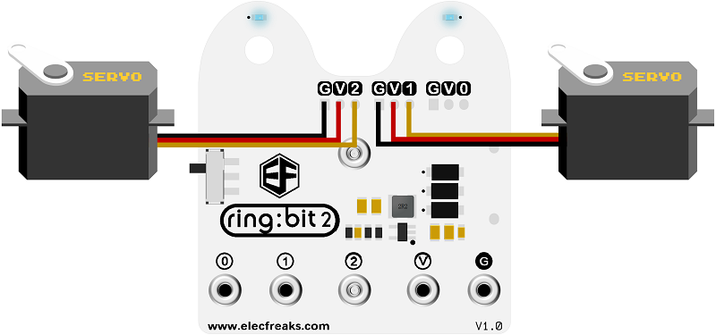
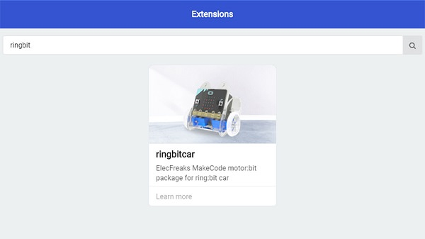
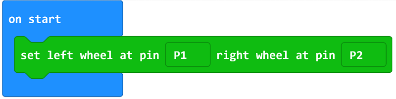
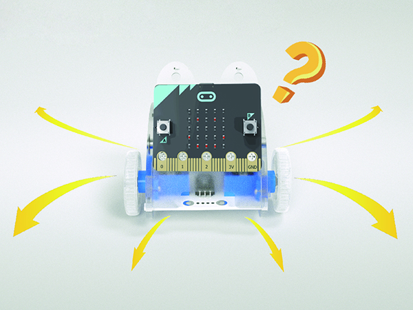

# case 05 Crazy dance 

## Our Goal
---
- To make the Ring:bit car to dance in free style. 

## Requiered Materials
---
- 1 x Ring:bit Car

## Hardware Connect
---
- Connect the left wheel servo to P1 of the Ring:bit expansion board and the right wheel servo to P2.

## Software
---
[makecode](https://makecode.microbit.org/#)

## Coding
---
### Step 1
- Click on "Advanced" in the MakeCode Drawer to see more code sections.

- Search for “ringbitcar” and click on the ring:bit car package to add it to your project. (As below picture)

Note：If you get a warning telling you some packages will be removed because of incompatibility issues, either follow the prompts or create a new project in the Project file menu.

### Step 2

- Snap the block `set left wheel at pin P1 right wheel at pin P2` to the `On start` block. 
- The port number is based on the actual servo connection port.

### Step 3
- Snap blocks into `forever` block.
- Set an varieble to `left` and an variable to `right`.
- Generate a random number and assinment to the `left` and the `right`.

### Step 4

- Set the left wheel speed to the variable left abd the right wheel speed to the variable right.
- Pause for one second.

### Program

Program Link：[https://makecode.microbit.org/_PXXfa8FF5MWs](https://makecode.microbit.org/_PXXfa8FF5MWs)

If you don't want to type these code by yourself, you can directly download the whole program from the link below:

<iframe style="position:absolute;top:0;left:0;width:100%;height:100%;" src="https://makecode.microbit.org/#pub:_PXXfa8FF5MWs" frameborder="0" sandbox="allow-popups allow-forms allow-scripts allow-same-origin"></iframe>
  
---

## Result
---
- The car runs at different speed.

## Think
---
- How do you ensure the car moves at a slower speed constantly?

## Questions
---

## More Information 
---

