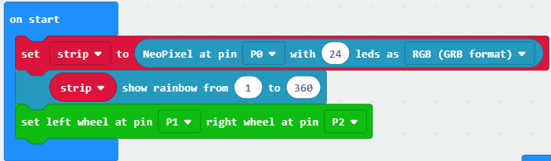
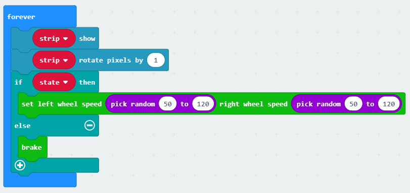
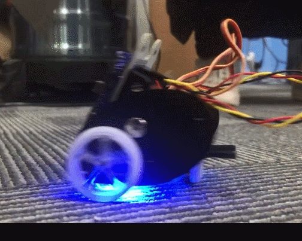

# case 07 Turns over Detection 

## Our Goal
---

- Make the car to stop when it turns over.

## Requiered Materials
---

- 1 x Ring:bit Car

## Hardware Connect
---
- Connect the left wheel servo to P1 of the Ring:bit expansion board and the right wheel servo to P2.

## Software
---
[makecode](https://makecode.microbit.org/#)
 

## Coding
---
### Step 1
- Click on "Advanced" in the MakeCode Drawer to see more code sections.

- Search for “ringbitcar” and click on the ring:bit car package to add it to your project. (As below picture)

Note：If you get a warning telling you some packages will be removed because of incompatibility issues, either follow the prompts or create a new project in the Project file menu.

### Step 2
---
- Snap the `on start` block from the Basic. Set Neopixel with 24 leds in RGB format for colorful light and show rainbow from 1 to 360.
Then, initialize the P1 port to left wheel and the P2 port to right wheel.

!

### Step 3
---
- Set a variable to state for controlling car's running. Then set state variable unber the logo up block to true and the other to false.

### Step 4
---
- Set the rainblw led to colorful lights under the `forever` loop in gradual change.
Use the variable state to control car's running.

### Program

Program Link：[https://makecode.microbit.org/_VYoiAuFJ23kc](https://makecode.microbit.org/_VYoiAuFJ23kc)

If you don't want to type these code by yourself, you can directly download the whole program from the link below:

<iframe style="position:absolute;top:0;left:0;width:100%;height:100%;" src="https://makecode.microbit.org/#pub:_VYoiAuFJ23kc" frameborder="0" sandbox="allow-popups allow-forms allow-scripts allow-same-origin"></iframe>
  
---

## Result
---

- The car runs normally，when it turns over, it stops.

## Think
---

- How can you design more funny project using other kits?

## Questions
---

## More Information 
---

