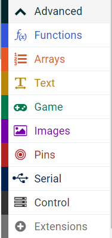
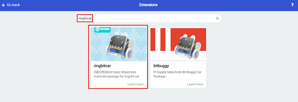
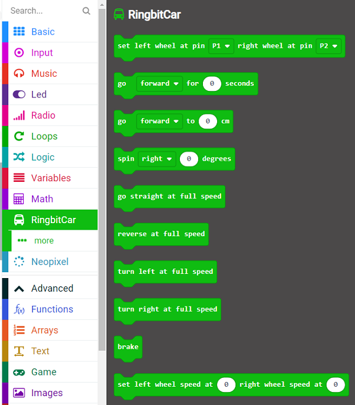

# Ring:bit Blocks Info

## Add Packages

- The extension of the Ring:bit requires to be added if yuo want to use the Ring:bit blocks. 
- Following the steps below to add it. 

### Step 1

- Click "Advanced" in thte MakeCode drawer to see more choices. 

### Step 2

- Search "ringbitcar" in the dialogue box and click the circled part for downloading. 

### Step 3

- Extension sucessfully gets loaded. 

## Blocks Info

Before programming, the pins must be connected correctly with the equivalent wheels in this block. 

To drive the car forward or backward for a certain time in seconds. 

To drive the car forward or backward to a certain distance(For reference operation only).

To turn the directions of the car to right or left at a certain angle(For reference operation only). 

To drive the car forward at the full speed. 

To drive the car backward at the full speed. 

To turn the car to the left at the full speed. 

 To turn the car to the right at the full speed. 
 

To stop the car. 

To define the speed of the left wheel or the right wheel. 

To detect the status of the detector with the line-tracking sensor. 

To get the distance detected from the ultrasonic sound sensor. 

## Program

- Link: [https://makecode.microbit.org/_AgF9MT0sWAF2](https://makecode.microbit.org/_AgF9MT0sWAF2)

- Or to download it directly:

<iframe style="position:absolute;top:0;left:0;width:100%;height:100%;" src="https://makecode.microbit.org/#pub:_AgF9MT0sWAF2" frameborder="0" sandbox="allow-popups allow-forms allow-scripts allow-same-origin"></iframe>
  

## FAQ

## Relevant File

