# line flow module

## Introduction
---
- Ring:bit car V2 line following module is a dedicated module designed for the Ring:bit car V2, it is easy to be installed to achieve the line following function for the Ring:bit car V2. 
- Equipped with double infrared probes, it can detect the distance between 2~12mm accurately that can achieve the function of line following around the circles, the detection of the black lines and the detection of the edge.

 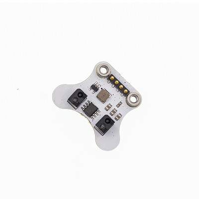 

## Features
---
- The micro:bit can drive it directly with the input voltage of this module is 3V~5V.
- It only needs one IO port in the Ring:bit with standard 3-pin GVS ports.
- It uses the infrared light to detect with a strong anti-interference capability.

## Parameter
---

 Items | Parameter | Notes 
 :-: | :-: |:-:
 Name |Ring:bit car V2 line following module|-
 SKU|EF03424|-
 Working Voltage |DC 3-5V|-
 Port |Ring:bit car dedicated pin ports|Fixed by screws
 Types of Output Signal |Simulation|-
 Effective Distance |2~12mm|-
 Dimension |34.15 x 27.20mm|-
 Net Weight |4.7g|-

## Dimensions:
---

 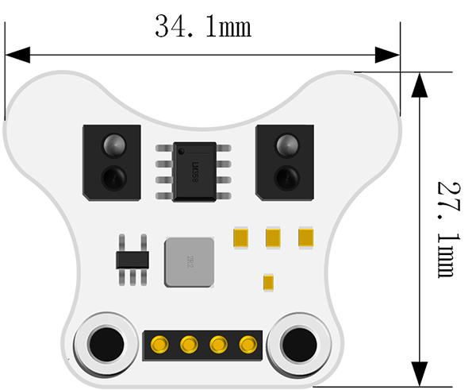

## Quick to Start
---
### Hardware Connection  
---
- The first step is to insert this module to the baseboard of the Ring:bit car V2.

 

- The next step is to fix the module with the two screws.

 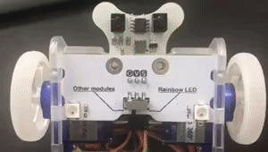 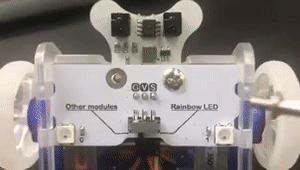

- Extension is completed.

 
- You have to turn the switch to the side named `other modules` on the baseboard if you want to use other functions except for the Rainbow LED.

 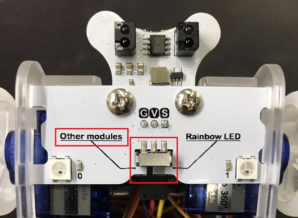

### Software Programming  
---

- Program a simple line-following code in the [makecode](https://makecode.microbit.org/) .

 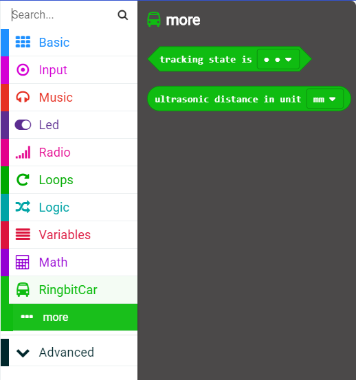

- The equivalent connection port for the left and right wheels is P1 and P2 when on start.
- Then the car would go forward in the speed of 100.

 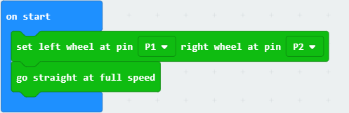

- When the left detection probe deviates from the black line, the right wheel would stop moving and the left wheel would adjust to go back to the black line in the speed of 50.

 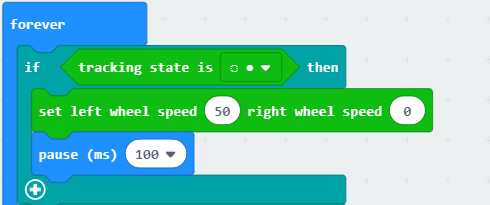

- The right detection probe would work the same as the way of the left detection probe works.

 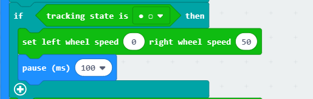

- When both of the detection probes detects the black line, the car would go forward in the speed of 100.

 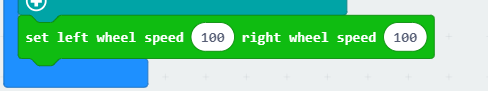

 Links:[https://makecode.microbit.org/_Jh2RVDMRwDz1](https://makecode.microbit.org/_Jh2RVDMRwDz1)

You can also download the code directly below:

 
<iframe style="position:absolute;top:0;left:0;width:100%;height:100%;" src="https://makecode.microbit.org/#pub:_Jh2RVDMRwDz1" frameborder="0" sandbox="allow-popups allow-forms allow-scripts allow-same-origin"></iframe>

### Result
---
- The Ring:bit car runs around the circle slowly.

 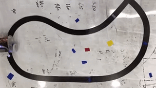

## Files
---
[WIKI](https://github.com/elecfreaks/learn-cn)

## FAQ
---
