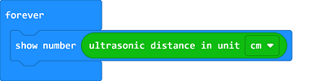

# Sonar:bit

## Introduction
---
- Sonar:bit is a 3-wire ultrasonic module with the working voltage between 3-5V.  It is available to be used to 3.3V or 5V micro-controller system. With only one 3-wire(GVS) cable, it can work properly. Compared to the normal 4-wire ultrasonic module, it has saved one IO port. The measurement range of sonar:bit is 4cm-400cm. It can output stable and accurate measurement data with ±1cm tolerance only. 
- It can connect to the Ring:bit with an expansion board.

## Characteristics
---
- Input voltage:3V~5V  and can be driven by micro:bit directly.
- Standard 3-wire GVS connecotr, which occupies 1 IO port only.

## Parameter
---

 Item | Parameter | Remark 
 :-: | :-: |:-:
 Name |Ring:bit car v2 sonar:bit|-
 SKU|EF04089|-
 Working Voltage |DC 3-5V|-
 Connection |3pin GVS connection|-
 Output Signal |Simulation|-
 Measuring Distance |4-400cm|-
 Dimmension |40.60mm * 51.60mm|-
 Net Weight |12g|-

## Outlook
---

## Quick to Start
---
### Hardware Connection

- Connect the acrylic transition board to the back board with the rivets.

- Connect the Sonar:bit to the other side of the acrylic transition board with rivets.

- Connect the Sonar:bit to the Ring:bit breakout board with a 3-pin wire.

### Software Programming 

- Choose `sonar:bit` in makecode.
- Search `ringbit` in the dialogue box and click it to download it. 
- Programme to measure the distance with ultrasonic in [makecode](https://makecode.microbit.org/) on-line editor.

Links: [https://makecode.microbit.org/_RVrYuDaT9acp](https://makecode.microbit.org/_RVrYuDaT9acp)

You can download it directly below: 

 
<iframe style="position:absolute;top:0;left:0;width:100%;height:100%;" src="https://makecode.microbit.org/#pub:_RVrYuDaT9acp" frameborder="0" sandbox="allow-popups allow-forms allow-scripts allow-same-origin"></iframe>

### Result

- The value measured by Sonar:bit is showing on the micro:bit.

## About
---

[case 10](http://www.elecfreaks.com/learn-en/microbitKit/ring_bit_v2/ring_bit_car_v2_case_10.html)
