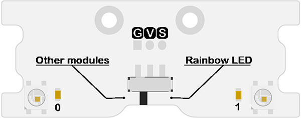
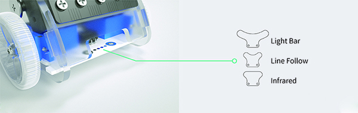

# Ring:bit Introduction 

## Expansion Board of Ring:bit car 2 
---

- The Ring:bit expansion board is a simple PCB for the micro:bit. The Ring:bit extends the micro:bit's 3 GPIO ports. We will use this module to convert the P0/P1/P2 port to the common GVS port. It can be loaded 3 AAA batteries to drive the car or other components. 

## The Special Expansion Board of Ring:bit car 2 

- The Special Expansion Board of Ring:bit car 2 is for adding extendibility of Ring:bit car. With two Rainbow LEDs and a special expanded port for special expansion module connection.
- There is a slide switch on the board, slide it to “Rainbow LED” for using of two Rainbow LEDs; slide the switch to the “Other modules” for using other modules. Please note that these can not be operated at the same time.

*Please note that the Ring:bit car version 2 has been upgraded. It is diffrent from the Ring:bit car version 1. All related documents refers to the Ring:bit car version 2.*
*Information of the Ring:bit car version 1 