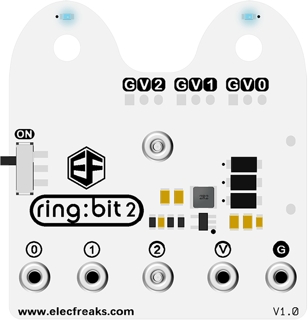

# Ring:bit V2（v2.0）

## Ring:bit V2

The [Ring:bit expansion board](https://www.elecfreaks.com/ring-bit-v2-for-micro-bit.html) is a simple PCB for the micro:bit. The Ring:bit extends the micro:bit's 3 GPIO ports. We will use this module to convert the P0/P1/P2 port to the common GVS port. It can be loaded with 3 pieces AAA batteries to drive the car or other accessories.

