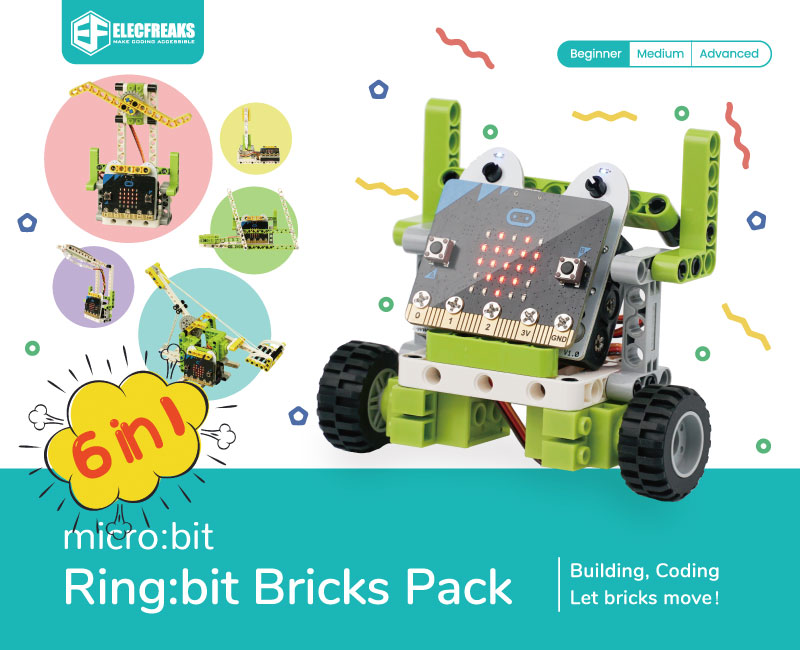

# Ring:bit Bricks Pack

## Introduction

Based on the Ring:bit V2 from Elecfreaks, the micro:bit Ring:bit Bricks Pack contains 360 degrees servos, the LED strips and almost 200 pieces bricks. Together with the well-designed assembly instructions and courses, it makes the kids learn the coding easily as well as how to build blocks in an interesting way. Let's start building our kits with the tips!

## Products Link

[ELECFREAKS micro:bit 6 IN 1 Ring:bit Kit](https://www.elecfreaks.com/ring-bit-bricks-pack.html)

## Components

Ring:bit V2 * 1

360 degrees servos * 2

Rainbow LED Strip * 1

Rubber Bands * 6

Bricks * 200+

Screwdriver * 1

