# Case 02: Bricks Car

## Purpose
---

- To build a car with the bricks in the kit. 

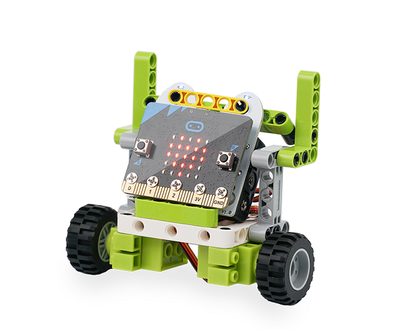

## Materials
---

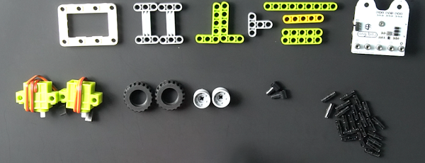

## Background Knowledge
---

## Bricks build-up
---

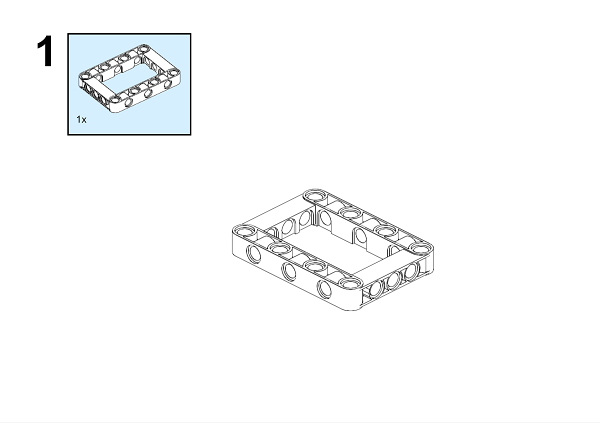

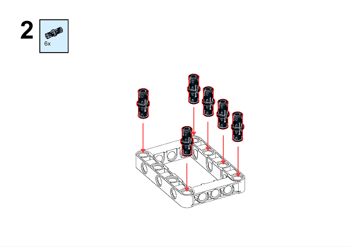

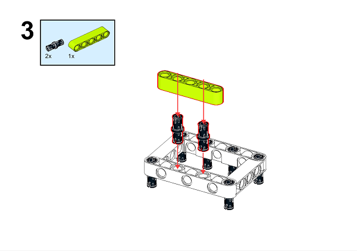

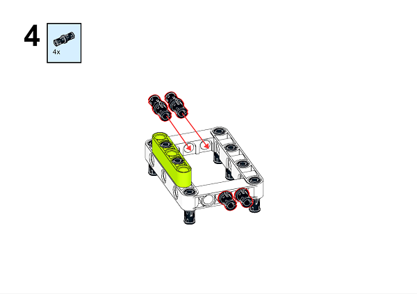

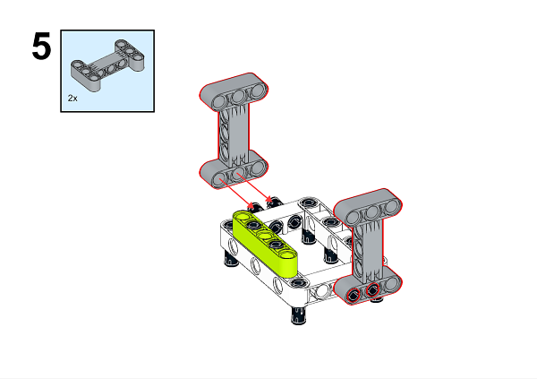

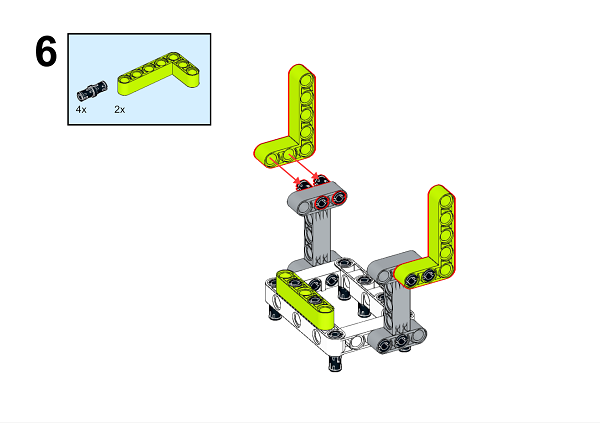

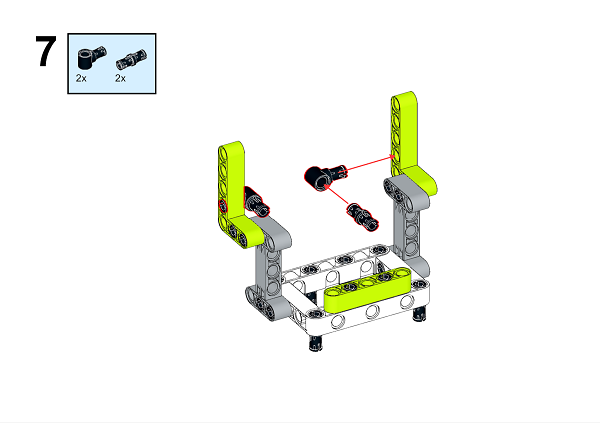

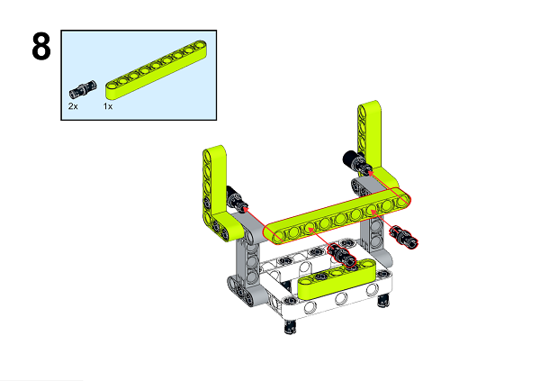

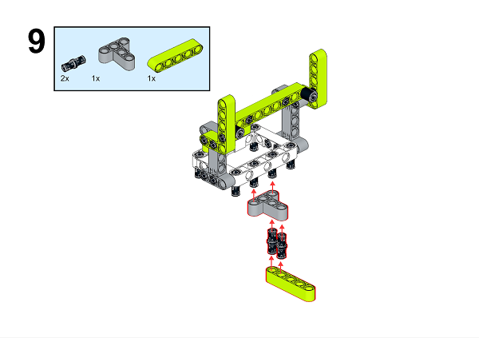

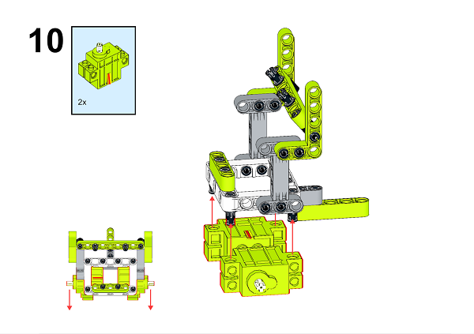

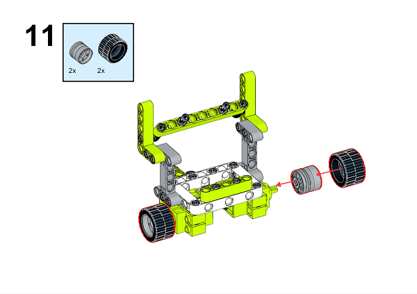

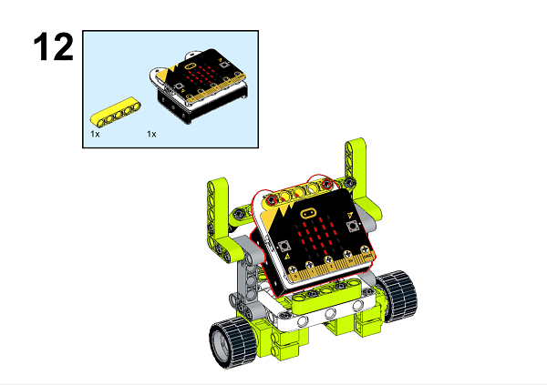

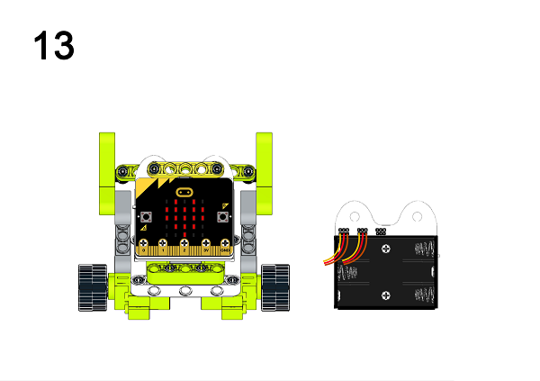

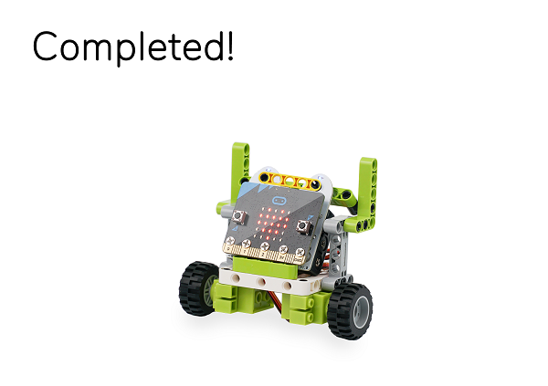

A detailed assembly instruction can be downloaded via the below links:
[Githubdownload ](https://github.com/elecfreaks/learn-cn/raw/master/microbitKit/ring_bit_bricks_pack/files/Ringbit_Bricks_Pack_step_02_v1.1.pdf)

## Software
---

[MicroSoft makecode](https://makecode.microbit.org/#)

## Programming

---

### Step 1

 Click "Advanced" in the MakeCode drawer to see more choices.

In order to programme for the Ring:bit Bricks Pack, we need to add an extension. Click  "Extensions" at the bottom of the drawer. Search "Ringbit" in the dialogue box to download it. 

***Note:*** If you met a tip indicating codebase will be deleted due to incompatibility, you may continue as the tips tell or build a new project. 

### Step 2

Drag "Set left wheel connects to P1 and right wheel connects to P2" brick in "on start", set the left wheel in connection with P1 and the right in connection with P2. 

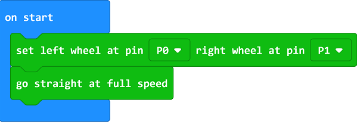

### Step 3

Programme as the picture shows: while pressing button A+B, the car moves at the full speed; button A for turning to the right side at the full speed; button B for turning to the left side at its full speed; the screen faces downside for moving back at the full speed; and shake the car for stopping.

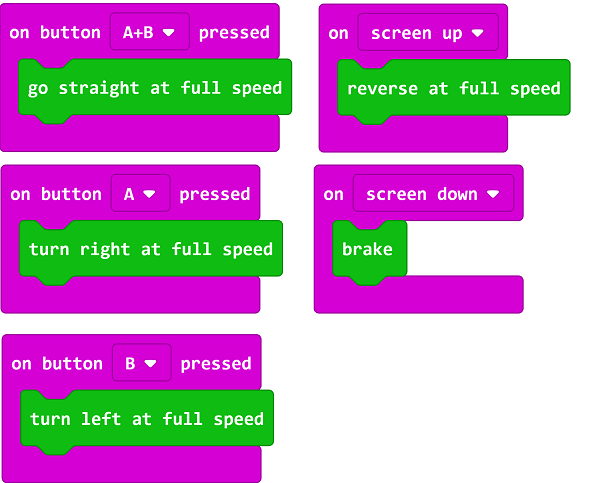

### Code

Link: [https://makecode.microbit.org/_4vHR21E92J0J](https://makecode.microbit.org/_4vHR21E92J0J)

You can also download it directly below:

<iframe style="position:absolute;top:0;left:0;width:100%;height:100%;" src="https://makecode.microbit.org/#pub:_4vHR21E92J0J]" frameborder="0" sandbox="allow-popups allow-forms allow-scripts allow-same-origin"></iframe>
  

### Result

While pressing button A+B, the car moves at the full speed; button A for turning to the right side at the full speed; button B for turning to the left side at its full speed; the screen faces downside for moving back at the full speed; and shake the car for stopping.

## Exploration
---

## FAQ
---
## Relevant File
---
In 1769, the Frenchman N.J. Guinou built the world's first steam-powered three-wheeler, which was named "Capo Oré".The world's first car was successfully developed by the German Carl Benz in October 1885. It gives a basic structure for the cars, and even the present cars can't jump out of this box. He applied to the German Patent Office for a patent for an automobile invention on January 29th, 1886, and was officially approved for publication on November 2rd of the same year. Therefore, January 29th, 1886 is recognized as the world's auto birthday, that patent certificate also becomes the world's first automobile patent. In 1885, the German Gottlieb Daimler invented the first four-wheeler. Benz and Daimler are people recognized as the inventor of an internal combustion engine-powered car, their inventions were the most important milestone in the history of the car, both of them are therefore world known as the "father of the automobile."
