# Case 03：Temperature-controlled Fans

## Purpose
---

To build a fan that is controlled by the temperature. 

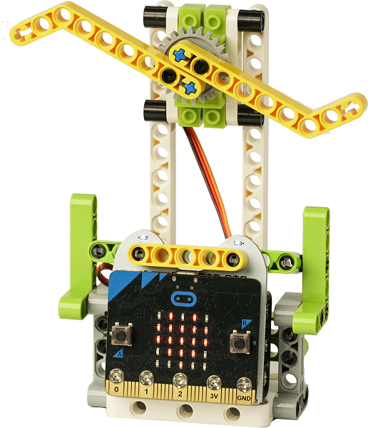

## Materials
---

## Background Knowledge 
---

## Bricks build-up
---

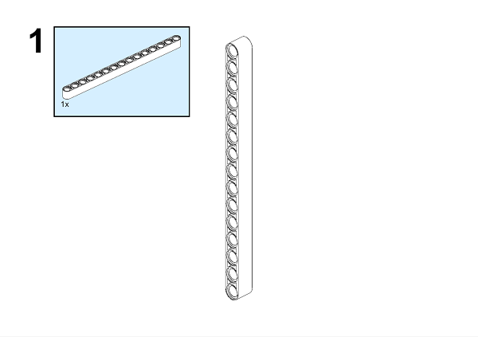

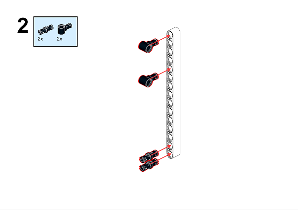

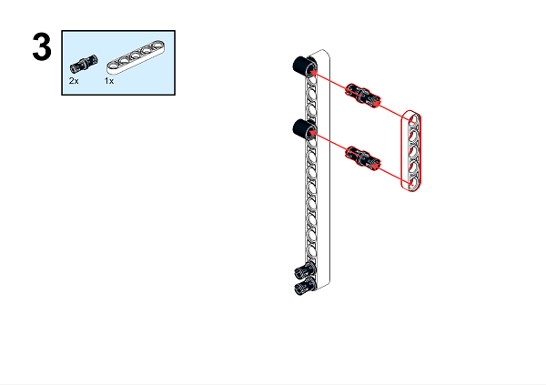

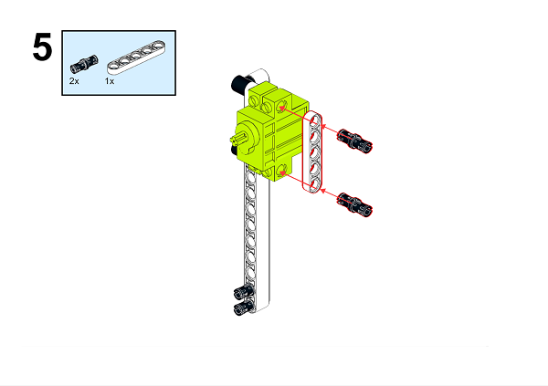

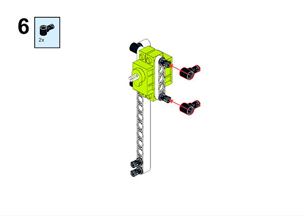

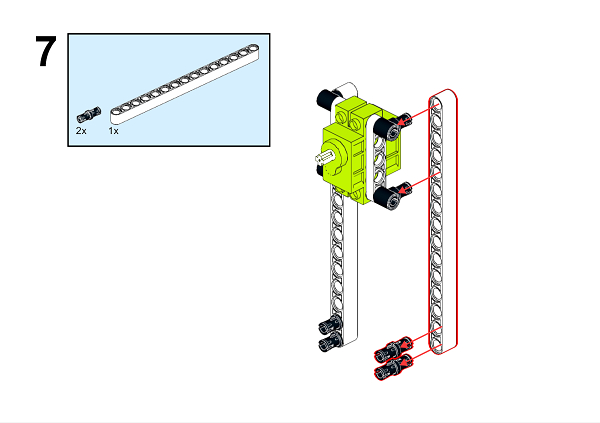

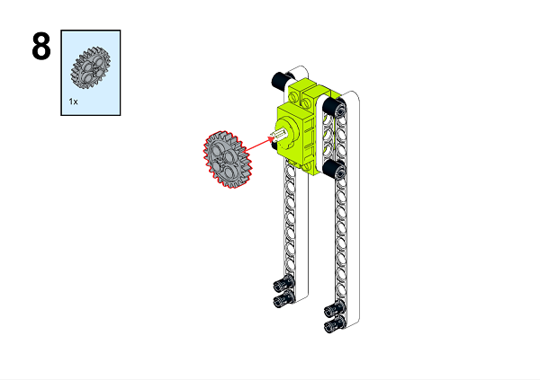

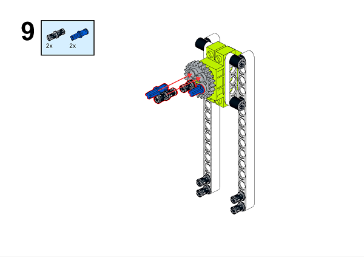

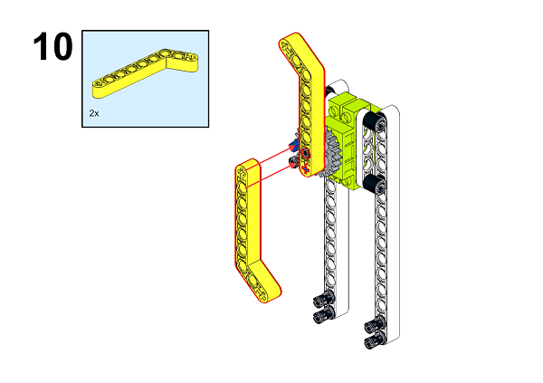

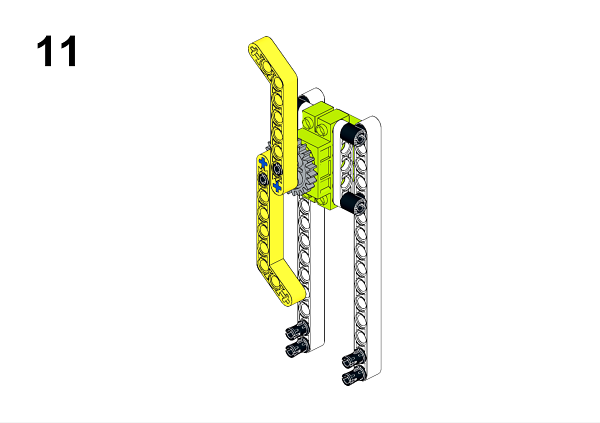

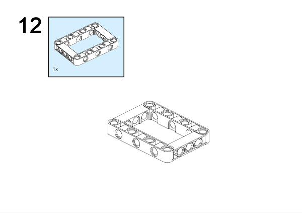

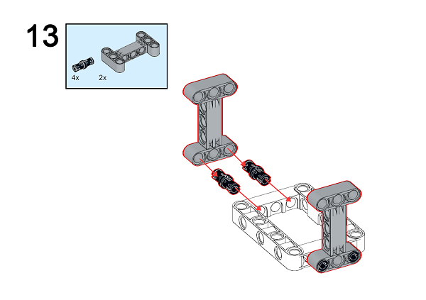

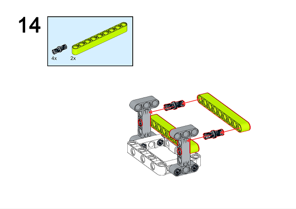

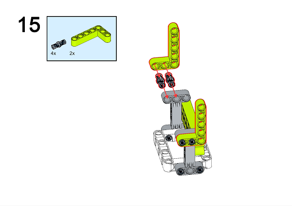

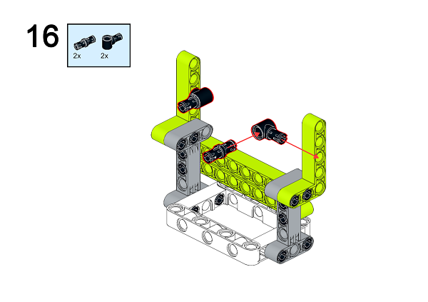

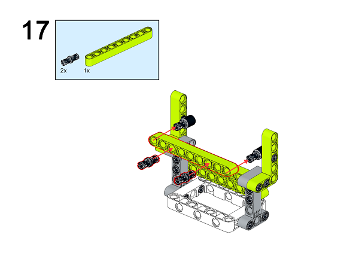

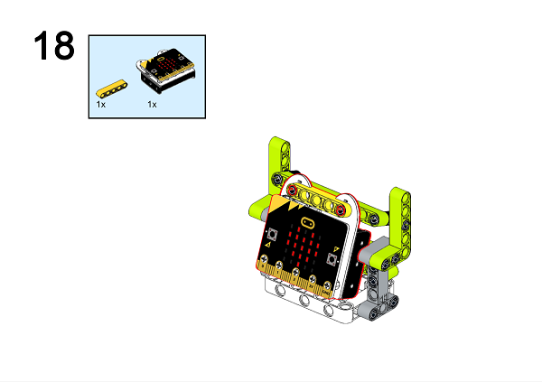

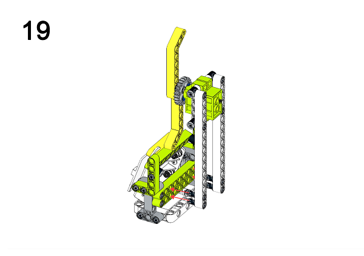

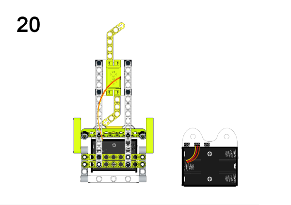

A detailed assembly instruction can be downloaded via the below links:
[Githubdownload ](https://github.com/elecfreaks/learn-cn/raw/master/microbitKit/ring_bit_bricks_pack/files/Ringbit_Bricks_Pack_step_03_v1.1.pdf)

## Software
---

[MicroSoftmakecode](https://makecode.microbit.org/#)

## Programming
---

### Step 1

 Click "Advanced" in the MakeCode drawer to see more choices.

In order to programme for the Ring:bit Bricks Pack, we need to add an extension. Click  "Extensions" at the bottom of the drawer. Search "servo" in the dialogue box to download it. 

Note: If you met a tip indicating codebase will be deleted due to incompatibility, you may continue as the tips tell or build a new project.

### Step 2

Judge the returned value from the temperature sensor in "Forever" block, if the value is over 28 degrees, set the servos connected to P0 port turning;  while less than 26 degrees, set the servos connected to P1 stopping turning. 

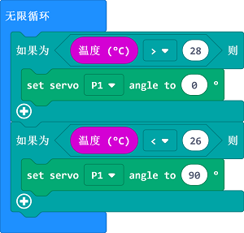

Note: As the servo we used is in 360 degrees, the "servo" extension in MakeCode is suitable for servos in 180 degrees, therefore, setting the turning angle to 0 degree or 180 degrees will lead to the servo turning clockwisely or anti-clockwisely, and 90 degrees means to stop turning.

### Code

Link: [https://makecode.microbit.org/_d04JoJDzj6aX](https://makecode.microbit.org/_d04JoJDzj6aX)

You can also download it directly below:

<iframe style="position:absolute;top:0;left:0;width:100%;height:100%;" src="https://makecode.microbit.org/#pub:_d04JoJDzj6aX]" frameborder="0" sandbox="allow-popups allow-forms allow-scripts allow-same-origin"></iframe>
  
### Result
---
When the value is over 28 degrees, the fan turns;  while less than 26 degrees, the fan stops turning. 

## Exploration

---

## FAQ

---

## Relevant File  

---
The mechanical fan originates on the roof. In 1829, an American named James Byron was inspired by the structure of the clock and invented a mechanical fan that can be fixed to the ceiling and driven by a clockwork. The cool breeze brought by the fan makes people happy, but it is troublesome to climb up the ladder to wind up. 

In 1872, a Frenchman named Joseph developed a mechanical fan that was started by a wind turbine and driven by a gear and chain device. This fan was much more refined than the mechanical fan invented by Byron and was more convenient to use.

In 1880, the American Shule first mounted the blade directly on the electric motor, and then connected to the power supply. The blade turned rapidly, and a wave of cool wind rushed out. This was the first electric fan in the world.