# Case 04：Smart Desk Lamp
## Purpose

 To build a desk lamp.

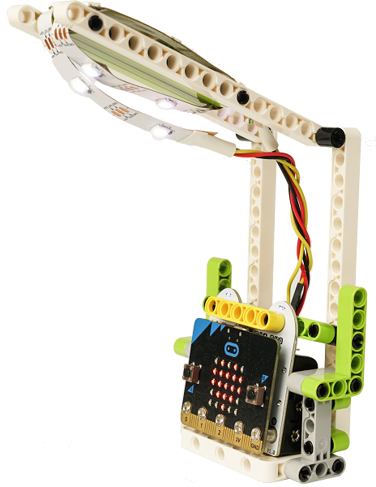

## Products Link

[ELECFREAKS micro:bit 6 IN 1 Ring:bit Kit](https://shop.elecfreaks.com/products/elecfreaks-micro-bit-6-in-1-ring-bit-kit-without-micro-bit-board?_pos=5&_sid=66ba68dec&_ss=r)

## Materials

## Background Knowledge 

## Bricks build-up

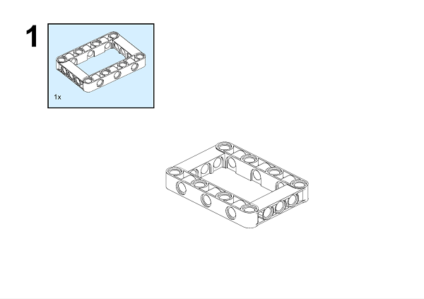

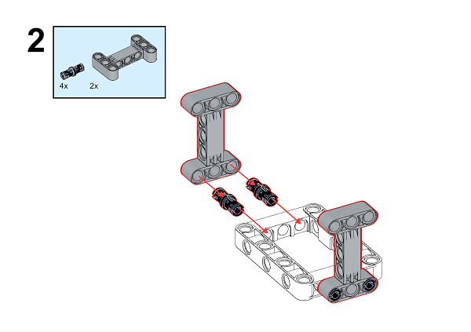

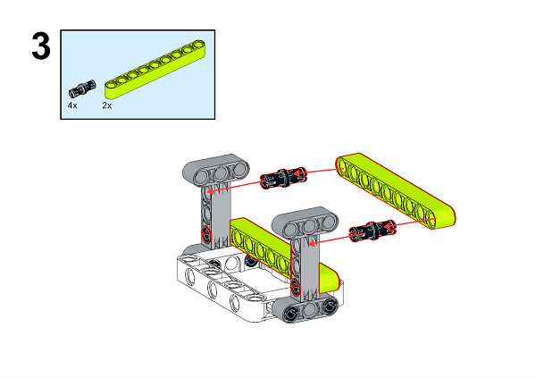

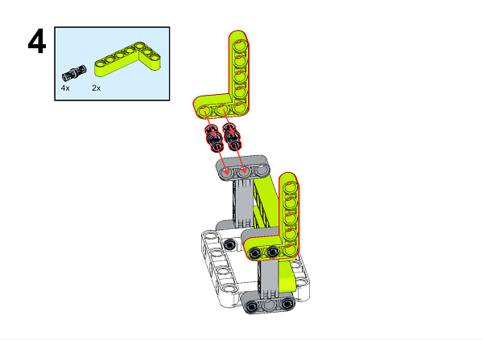

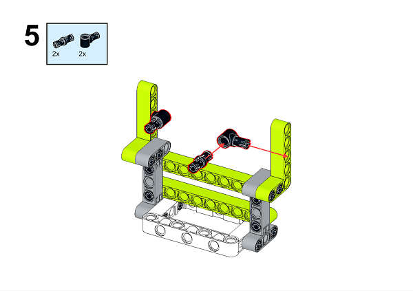

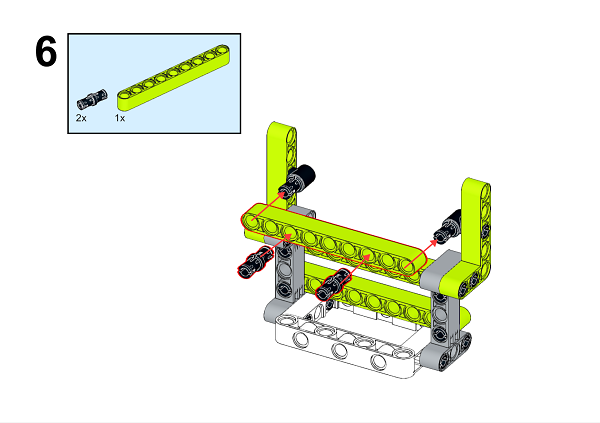

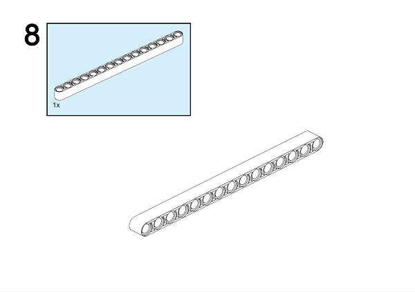

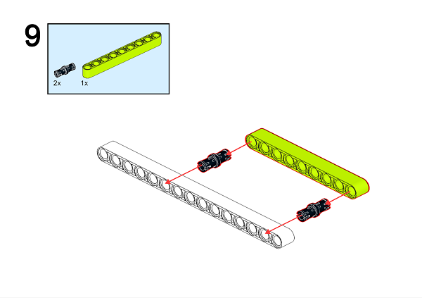

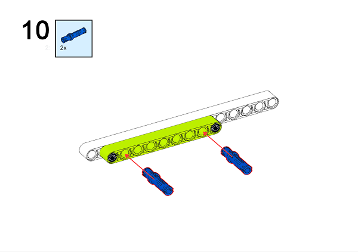

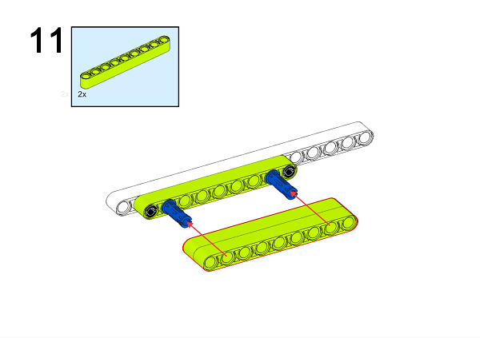

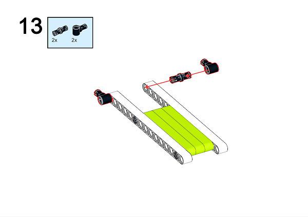

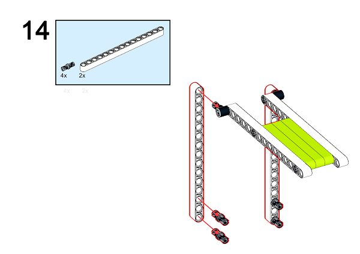

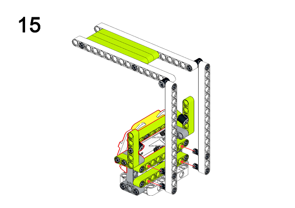

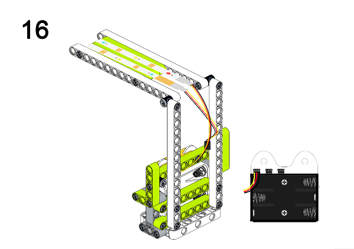

A detailed assembly instruction can be downloaded via the below links:
[Githubdownload ](https://github.com/elecfreaks/learn-cn/raw/master/microbitKit/ring_bit_bricks_pack/files/Ringbit_Bricks_Pack_step_04_v1.1.pdf)

## Software

[MicroSoftmakecode](https://makecode.microbit.org/#)

## Code

### Step 1
  Click "Advanced" in the MakeCode drawer to see more choices.

In order to programme for the Ring:bit Bricks Pack, we need to add an extension. Click  "Extensions" at the bottom of the drawer. Search "Ringbit" in the dialogue box to download it. 

***Note:*** If you met a tip indicating codebase will be deleted due to incompatibility, you may continue as the tips tell or build a new project. 

### Step 2

Drag the `set strip to NeoPixel at pin with led as` to `on start`, set the pin at P0 port. Initialize the strip in 10 LEDs and in RGB(GRB format).

### Step 3

Judge the returned value from "light level" in "forever" block, if the value is less than 10, set the strip color in white; if the value is over 15, set the strip color in black.

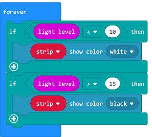

### Code

Link: [https://makecode.microbit.org/_3972aULrT1Dz](https://makecode.microbit.org/_3972aULrT1Dz)

You can also download it directly below:

<iframe style="position:absolute;top:0;left:0;width:100%;height:100%;" src="https://makecode.microbit.org/#pub:_3972aULrT1Dz]" frameborder="0" sandbox="allow-popups allow-forms allow-scripts allow-same-origin"></iframe>
  

### Result

It lights on automatically while the surrounding light is low and lights off when the returned value is higher than your set point.

## Exploration

## FAQ

## Relevant File 

In 1854, the German watchmaker Henry Gobert immigrated to the United States made the first practical electric lamp with a carbonized bamboo wire placed in a vacuum glass bottle, which lasted for 400 hours. But he didn't apply for a patent in time. 

In 1860, the Englishman Joseph Swan also made a carbon wire electric lamp, but he failed to obtain a good vacuum environment to keep the carbon wire working for a long time. It was not until 1878 that vacuum technology in the United Kingdom developed to a desirable level, and he invented a light bulb powered by carbon wire under vacuum, and obtained a British patent. Swan's own house was Britain's first private house with electric lighting.

In 1874, two Canadian electrical technicians applied for a patent for an electric lamp: nitrogen was filled under a glass bulb to emit light with a powered carbon rod, but they did not have enough financial resources to continue to perfect the invention.  After they sold the patent to Edison,  he tried to improve the filament, in 1880, a carbonized bamboo filament lamp that could last for 1,200 hours was finally manufactured.

However, the US Patent Office ruled that Edison's carbon filament incandescent invention fell behind, and the patent was invalid. After years of litigation, Henry Goebbels won the patent, and Edison finally bought the patent from Goebbels' widow. In the United Kingdom, Swan sued Edison for patent infringement, and later settled out of court, setting up a joint company in the United Kingdom in 1883. 

Swan later sold his equity and patents to Edison.In the early 20th century, carbonized filaments were replaced by tungsten filaments, and tungsten filament incandescent lamps are still in use at present. In 1938, fluorescent lights were born. In 1998, white LED lights came out. 
