# Case 05: Wipers

## Purpose 

 To build a wiper.

## Products Link

[ELECFREAKS micro:bit 6 IN 1 Ring:bit Kit](https://www.elecfreaks.com/ring-bit-bricks-pack.html)

## Materials 

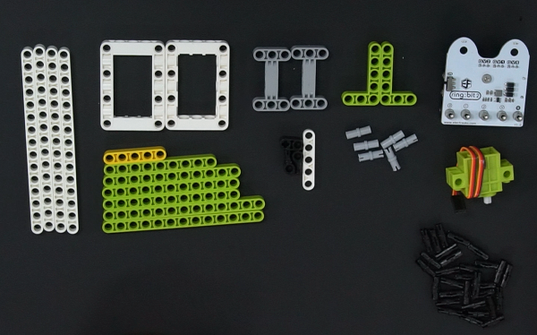

## Background Knowledge

## Bricks build-up

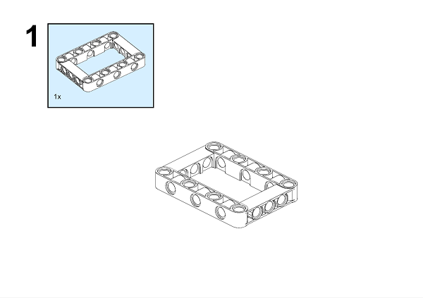

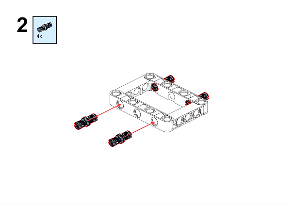

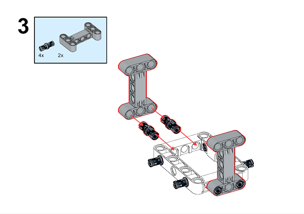

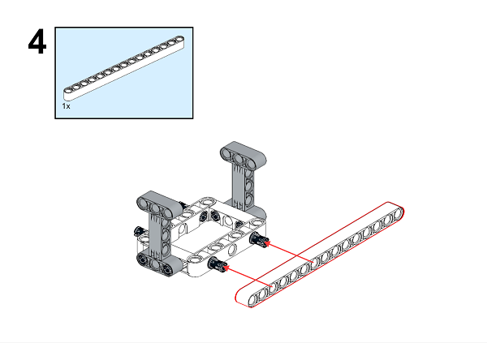

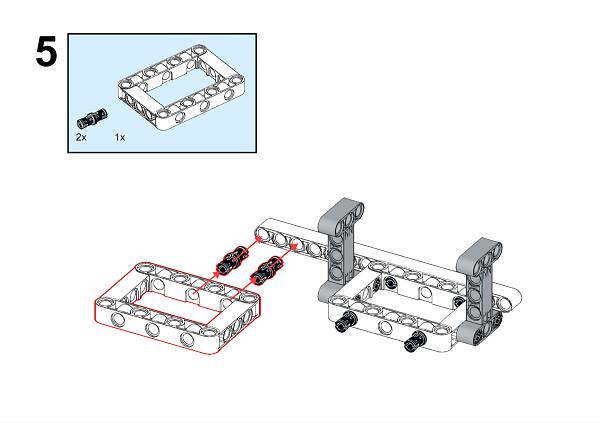

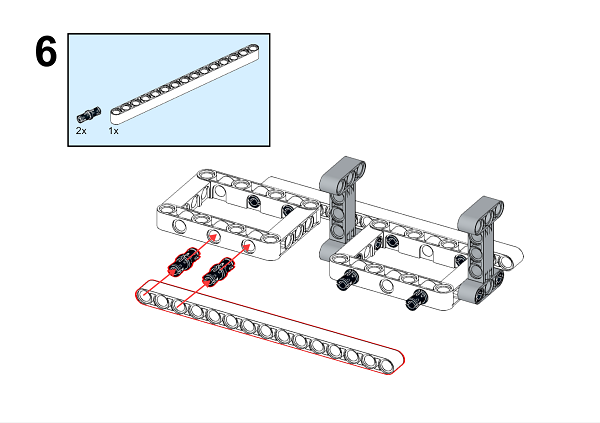

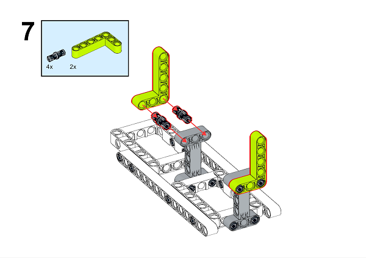

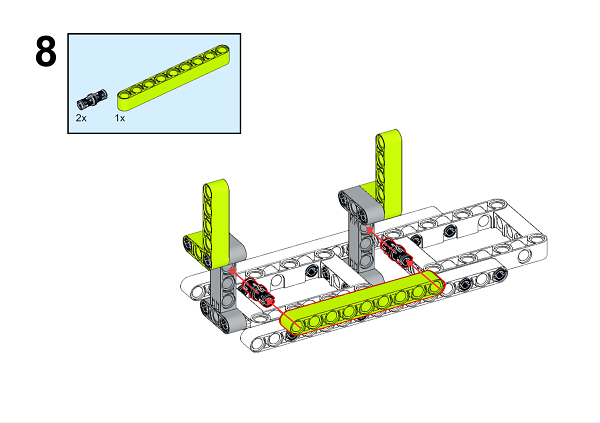

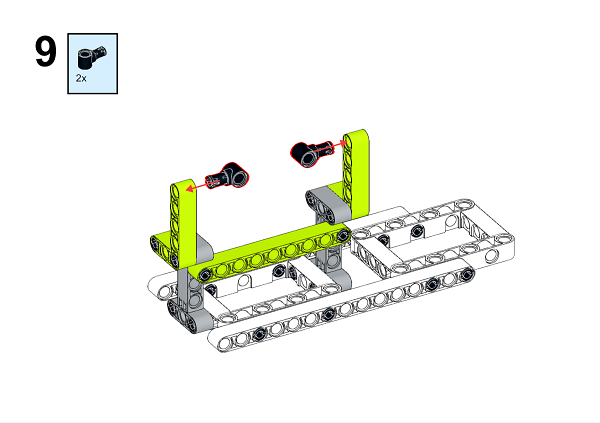

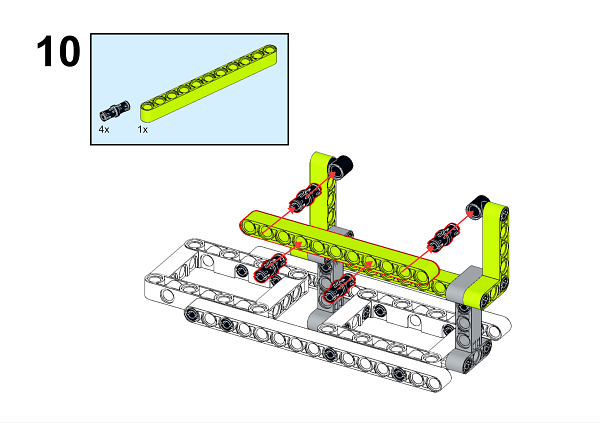

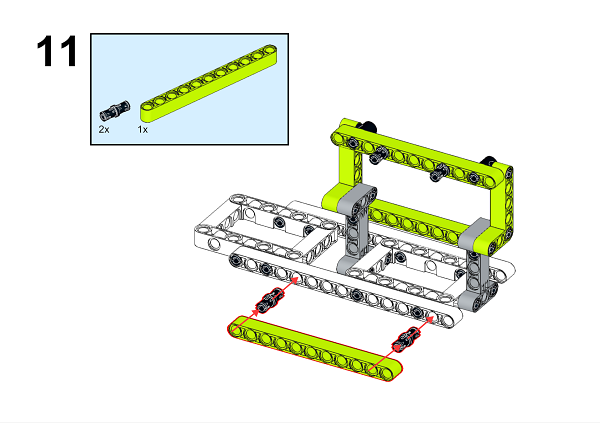

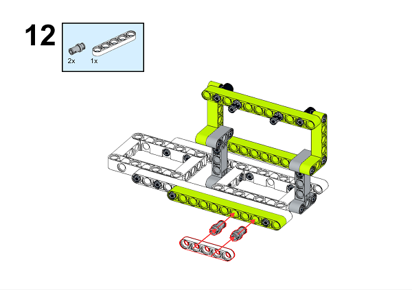

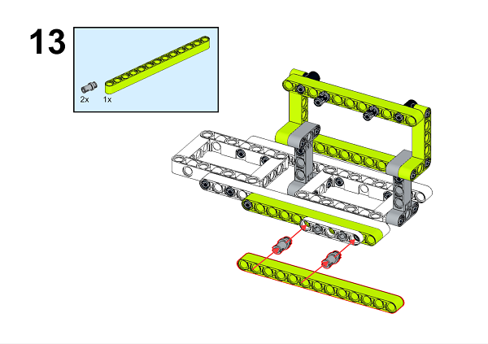

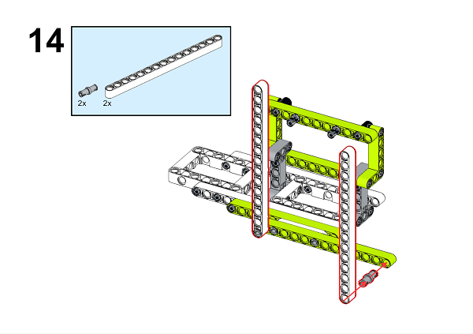

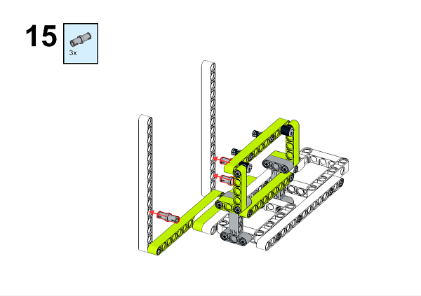

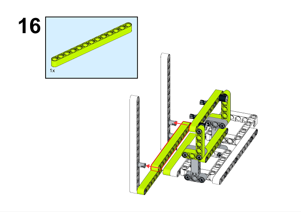

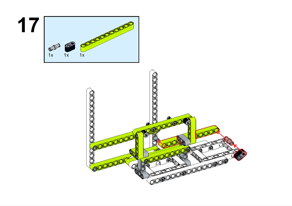

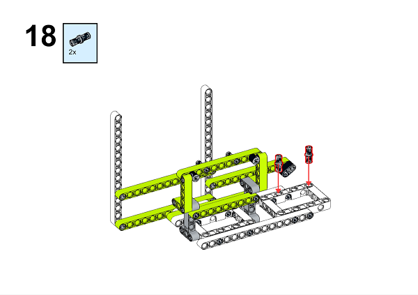

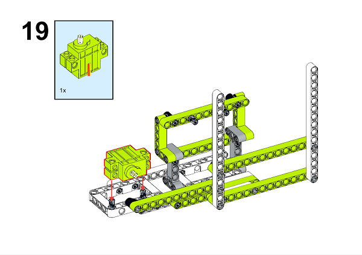

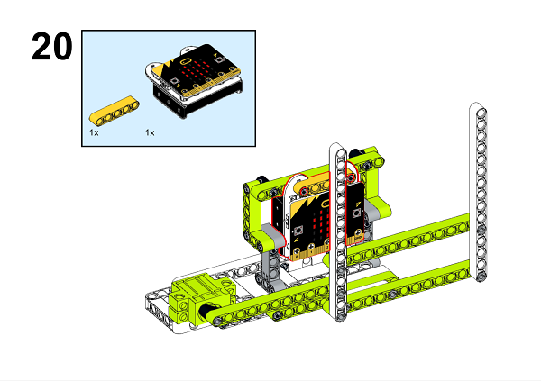

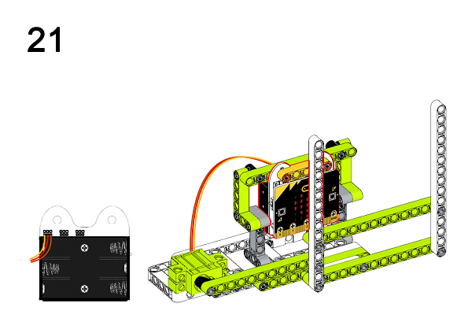

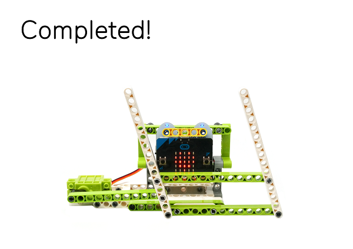

A detailed assembly instruction can be downloaded via the below links:
[Githubdownload ](https://github.com/elecfreaks/learn-cn/raw/master/microbitKit/ring_bit_bricks_pack/files/Ringbit_Bricks_Pack_step_05_v1.1.pdf)

## Software

[MicroSoftmakecode](https://makecode.microbit.org/#)

## Code

### Step 1
Click "Advanced" in the MakeCode drawer to see more choices.

In order to programme for the Ring:bit Bricks Pack, we need to add an extension. Click  "Extensions" at the bottom of the drawer. Search "servo" in the dialogue box to download it. 

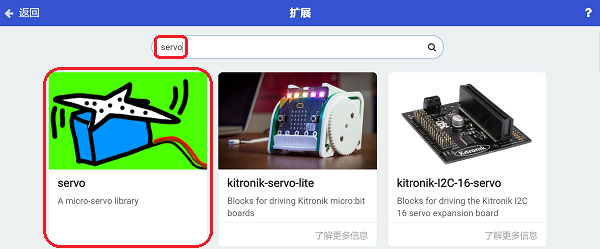

***Note:*** If you met a tip indicating codebase will be deleted due to incompatibility, you may continue as the tips tell or build a new project. 

### Step 2

While button A being pressed, set the servo connected to P0 port turning 180 degrees; while buttom B being pressed, set the servo connected to P0 port turning 90 degrees.

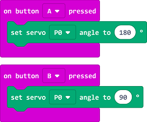

***Note:*** As the servo we used is in 360 degrees, the "servo" extension in MakeCode is suitable for servos in 180 degrees, therefore, setting the turning angle to 0 degree or 180 degrees will lead to the servo turning clockwisely or anti-clockwisely, and 90 degrees means to stop turning.

### Code

Link: [https://makecode.microbit.org/_6Pvbj1fPt33f](https://makecode.microbit.org/_6Pvbj1fPt33f)

You can also download it directly below:

<iframe style="position:absolute;top:0;left:0;width:100%;height:100%;" src="https://makecode.microbit.org/#pub:_6Pvbj1fPt33f]" frameborder="0" sandbox="allow-popups allow-forms allow-scripts allow-same-origin"></iframe>
  

### Result 

When button A being pressed, the wiper begins working; while buton B being pressed, the wiper stops working.

## Exploration

## FAQ

## Relevant File 

Parallelogram mechanism: the two cranks as well as the connecting rod and frame are equal in length, their rotation speed and direction are in consistent. 

Reciprocating motion: back and forth on both sides near a certain position.

The displacement of the reciprocating motion is equal to 0 because it is a positive stroke and a negative stroke. Mostly used in mechanical movements, such as pendulum, piston movement, etc.
