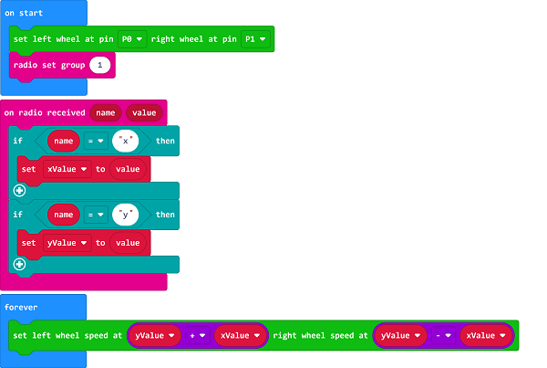
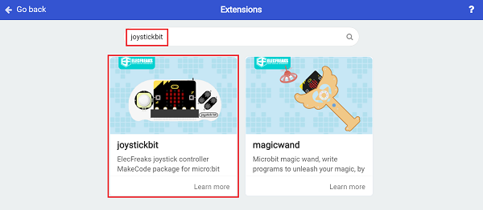
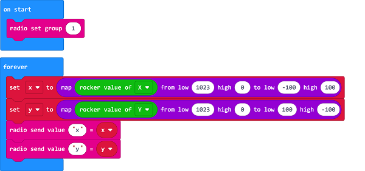

# Case 07: Use Joystick:bit to Control the Car

## Purpose
---

- Build a car with the ring:bit bricks pack and control it via the Joystick:bit. 

##  Material
---

Ring:bit Bricks pack × 1

Joystick:bit × 1

## Bricks build-up
---

Please refer to [Case 02 for Ring:bit bricks pack wiki](https://www.elecfreaks.com/learn-cn/microbitKit/ring_bit_bricks_pack/ringbit_bricks_pack_case_02.html#ring-bit02/#)

## Software
---

[MicroSoft makecode](https://makecode.microbit.org/#)

## Programming 

---

### Step 1

Click "Advanced" in the MakeCode drawer to see more choices. 

### Step 2    Coding the Car

We need to add a package for programming. Click "Extensions" in the bottom of the drawer and search with "Ringbit" in the dialogue box to download it.  

*Note: If you met a tip indicating it might be deleted due to incompatibility, you may continue as it indicates or create a new project in the menu. 

In the on start brick, set the servos connect with P0 and P1; set the radio group as 1, please make sure it is in the same radio group with the remote controlling end so they can match. 

Drag two "if...else..." bricks into the on radio data received brick, judge if the recevied value "name" is X or Y. 

If "name" is x, set it as the data of xValue. 

If "name" is y, set it as the data of yValue. 

In forever brick, set the speed of the left wheel as  yValue+xValue and the speed of the right wheel as yValue-xValue.

### Link

Link:  [https://makecode.microbit.org/_1vAgLo3Ky5Rm](https://makecode.microbit.org/_1vAgLo3Ky5Rm)

You may download it directly below:

<iframe style="position:absolute;top:0;left:0;width:100%;height:100%;" src="https://makecode.microbit.org/#pub:_1vAgLo3Ky5Rm]" frameborder="0" sandbox="allow-popups allow-forms allow-scripts allow-same-origin"></iframe>
  

### Step 3    Coding the Joystick:bit 

We need to add a package for programming. Click "Extensions" in the bottom of the drawer and search with "joystickbit" in the dialogue box to download it.  

Note: If you met a tip indicating it might be deleted due to incompatibility, you may continue as it indicates or create a new project in the menu. 

In the on start brick, set the radio group as 1

The value of X and Y ranges from 0~1023, the theoretical value is 512 while the Joystick is placed in the middle position, thus we need to map that range to -100~100. 

In forever brick, set the value of x is among -100~100 mapping from x-axis. 

In forever brick, set the value of y is among -100~100 mapping from y-axis. 

Send the value of x and y via radio. 

### Link

Link：[https://makecode.microbit.org/_Ct3UpWKx3eb0](https://makecode.microbit.org/_Ct3UpWKx3eb0)

You may also download it directly below: 

<iframe style="position:absolute;top:0;left:0;width:100%;height:100%;" src="https://makecode.microbit.org/#pub:_Ct3UpWKx3eb0]" frameborder="0" sandbox="allow-popups allow-forms allow-scripts allow-same-origin"></iframe>
  
### Result
---
The Joystick:bit is able to control the movement of the car. 

## Exploration
---

## FAQ
---
## Relevant File
---
