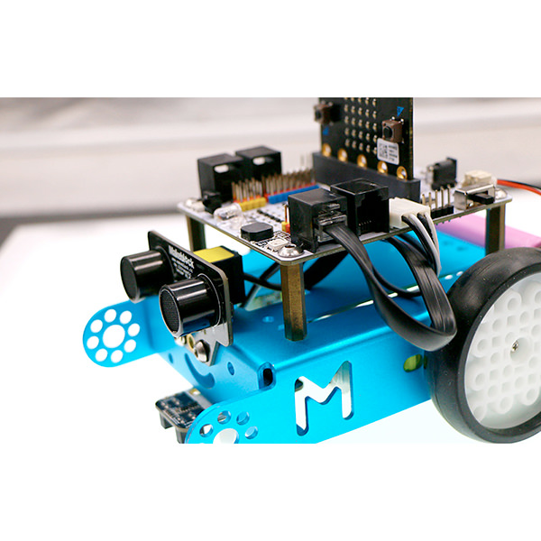
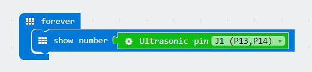

# case 01 Ultrasonic Distance Measurement 

## Our Goal
---

- Get to know ultrasonic wave and how to use it to measure distance. 
- Achieve distance measurement with the ultrasonic module on mBot(controlled by robit). 

## Material Needed
---

- 1 x Robit
- 1 x Mbot Car

## Background Knowledge
---

### What is ultrasonic wave?

[Ultrasonic Wave](https://en.wikipedia.org/wiki/Ultrasound) (or ultrasound) is a kind of sound wave with frequencies beyond 20,000 Hertz. It has good direction sense and strong penetration ability. It can easily acquire comparatively centrallized sound power, and spread to far distance underwater. We can use it to measure distance, test speed, rinse, weld, break stones, kill bacteria and disinfect, etc.. Ultrasonic is named because its lower frequency limit is greater than the upper limit of human hearing .  

### Distance Measure Principle 

When the transmitter emit ultrasonic wave in a certain direction, it starts time record simultaneously. The wave spreading in the air will be reflected back when encountering a barrier. Once the receiver has received the returned wave, it will stop time record immediately. You can calculate the distance according to the time when the reflected ultrasonic wave is received by the receiver. It is similar to the radar ranging principle.   

## Hardware Assembly
---

Connect ultrasonic module to J1 port on Robit with RJ25 wire, just as the following picture showed. 

## Software
---

[Microsoft Makecode](https://makecode.microbit.org/#)

## Study Case
---

### Step 1

Click **Advanced** in the code drawer to see more code options. 

In order to program for the ultrasonic module, we have to add a package. Find **Add Package** at the bottom of code drawer, and click on it. This will pop up a dialogue box. Search for **Robit**, and then click to download this package. 

**Note:** 
If you get a hint  that some packages will be deleted due to the problem of incompatibility, you can either follow the prompts, or create a new project in the project menue.

### Step 2

Drag out a **forever** brick from **Basic**, and embed it into brick **show number**.

Drag out the brick **ultrasonic pin** from Robit, and choose J1(P13,P14). This statement will read the return parameter of the ultrasonic module.

### Programming 

Please refer to the link here: [https://makecode.microbit.org/_3ktFD2gabF7J](https://makecode.microbit.org/_3ktFD2gabF7J) .

Or, you can download directly from the page below. 

<iframe style="position:absolute;top:0;left:0;width:100%;height:100%;" src="https://makecode.microbit.org/#pub:_3ktFD2gabF7J" frameborder="0" sandbox="allow-popups allow-forms allow-scripts allow-same-origin"></iframe>
  

**Note:** The maximun measureable distance of ultrasonic module is about 400 cm. 

### Result

Ultrasonic module will measure return distance in real time and display it on micro：bit 5x5 LED grid. The unit of distance is centimeter(CM).

## Think
---

How many situations are there when the distance measured by ultrasonic module is 0 ?

## FAQ
---

## Relative Readings  
---

