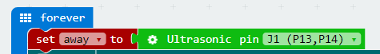
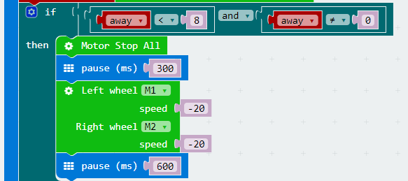
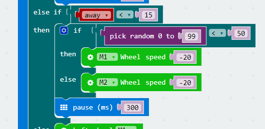
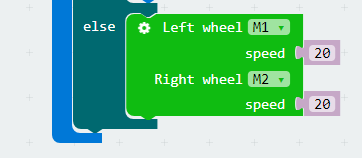

# case 02 Ultrasonic Obstacle Avoidance

## Our Goal 
---

Make mBot car (controlled by robit) avoid obstacle. 

## Material Needed
---

- 1 x Robit
- 1 x Mbot Car

## Introduction
---

In our last chapter Ultrasonic Distance Measurement, we have realized measuring distance in real time with ultrasonic module. In this chapter, we are going to use it to make mBot car avoid obstacles. 

## Hardware Assembly
---

Connect the left motor to port M1 and the right motor to port M2. Same to the last chapter, the ultrasonic module shall be connected to J1 port. 

## Software
---

[Microsoft Makecode](https://makecode.microbit.org/#)

## Programming
---

### Step 1

Click **Advanced** in the code drawer to see more code options. 

To program for the ultrasonic module, we have to add a package. Find **Add Package** in the bottom of code drawer, and click it. This will pop up a dialogue box. Search **Robit** and then click it to download this package.

**Note:** 
If you get a hint  that some packages will be deleted due to the problem of incompatibility, you can either follow the prompts, or create a new project in the project menue.

### Step 2

At the beginning of our program, we have defined an variable--away, which is used to represent the measured distance from the obstacle and set this distance to be 0. 

Assign the speed of both M1 and M2 to be 20. 

### Step 3

Create a forever loop so that it can read the reflected ultrasonic data from J1 port in real time and assign values to away. 

#### Stop to Prevent Collision

When the measured distance (away) is smaller than 8cm, stop the car. After 300ms, set a negative number to M1 and M2 respectively to realize reversing, and delay time for 600ms. 

#### Steer to Avoid Obstacle

When the measured distance(away) is smaller than 15cm, a random number within 0 to 100 is generated. 

When the random number is smaller than 50, the motor speed of M1 is negative, the left wheel runs oppositely to complete a left turn.  

When the random number is beyond 50, the motor speed of M2 is negative, the right wheel runs oppositely to complete a left turn. 

When the measured distance(away) is beyond 10cm and not equal to 0, set the speed of M1 and M2 to be 20, then the car will move forward.  

### Programming

You can refer to the program from the link here: [https://makecode.microbit.org/_X2g8PfeebXqv](https://makecode.microbit.org/_X2g8PfeebXqv) .

Or, you can download the program directly from the page below. 

<iframe style="position:absolute;top:0;left:0;width:100%;height:100%;" src="https://makecode.microbit.org/#pub:_X2g8PfeebXqv" frameborder="0" sandbox="allow-popups allow-forms allow-scripts allow-same-origin"></iframe>
  

**Note:** Setting the speed too low will cause the motor to operate abnormally.  

### Result

The mBot car automatically turns when it detects that there is an obstacle at the distance of 20cm. And if it is too close to the obstacle after turning, it will automatically reverse the car.

## Think 
---

Why we have to judge if the distance is 0 during the procedure of stop to prevent collision?

## FAQ
---

**Why it can't realize obstacle avoidance after the 5x5 dot screen is turned on?**

Because the LED dot metrix will greatly decrease the running speed of the program, which will make obstacle detect become more slowly. 
