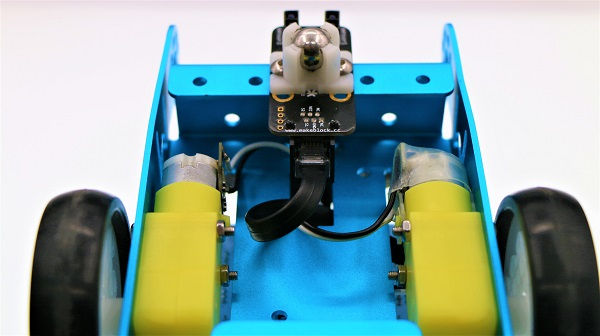
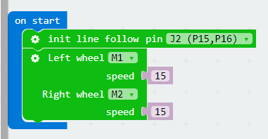

# case 04 Line Tracking 

## Our Goal   
---  

- Make mBot car(controlled by Robit) run around with its line tracking module.   

## Material Needed  
---  

- 1 x Robit
- 1 x Mbot Car   

## Hardware Assembly  
---  

Like the previous chapter, connect motors to port M1 and M2. 
Using RJ25 wire to connect the line tracking module to port J2 on Robit just as pictures below.

  

  

  

## Software
---

[Microsoft Makecode](https://makecode.microbit.org/#)

## Programming  
---

### Step 1

Click **Advanced** in the code drawer of Makecode to see more options. 

To program for line tracking module, we have to add a package. Find **Add Package** at the bottom of code drawer and click it. This will pop up a dialogue box. Search **Robit**, and then click to download this package.

**Note:**
If you get a hint that some packages will be deleted due to the problem of incompatibility, you can either follow the prompts, or create a new project in the project menue.

### Step 2

The initial line tracking module port at the beginning of our program is J2(P15,P16). Set the motor speed of M1 and M2 to be 15.

Set the return value of the left and right infrared sensor to be variables: left and right. These variables can read the return parameters of the infrared sensors.

If the right infrared sensor has detected derailment from the black line, set the speed of left wheel to be 5 and the speed of right wheel to be 25, making the car turn left. And then create a loop to check if the car has returned to the black line. If not, then continue to turn left until return to the black line.

If the left infrared sensor has detected derailment from the black line, then the car will turn right to return to the black line. 

### Programming 

You can refer to the whole program from the link here: [https://makecode.microbit.org/_9WECsHJmpDxM](https://makecode.microbit.org/_9WECsHJmpDxM).

Or you can directly download from the page below. 

<iframe style="position:absolute;top:0;left:0;width:100%;height:100%;" src="https://makecode.microbit.org/#pub:_9WECsHJmpDxM" frameborder="0" sandbox="allow-popups allow-forms allow-scripts allow-same-origin"></iframe>
  

**Note:** Objects that can absorb infrared light are considered as black lines.

## Result  
---   

The mBot car will move forward along the planned black line.

## Think 
---

## FAQ
---

